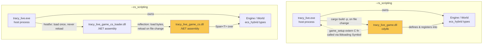
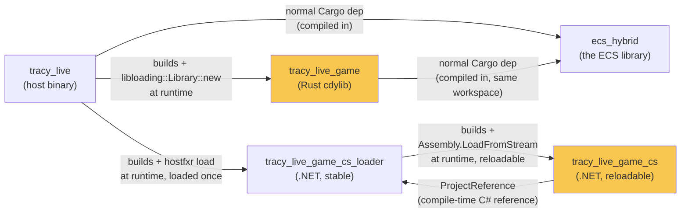
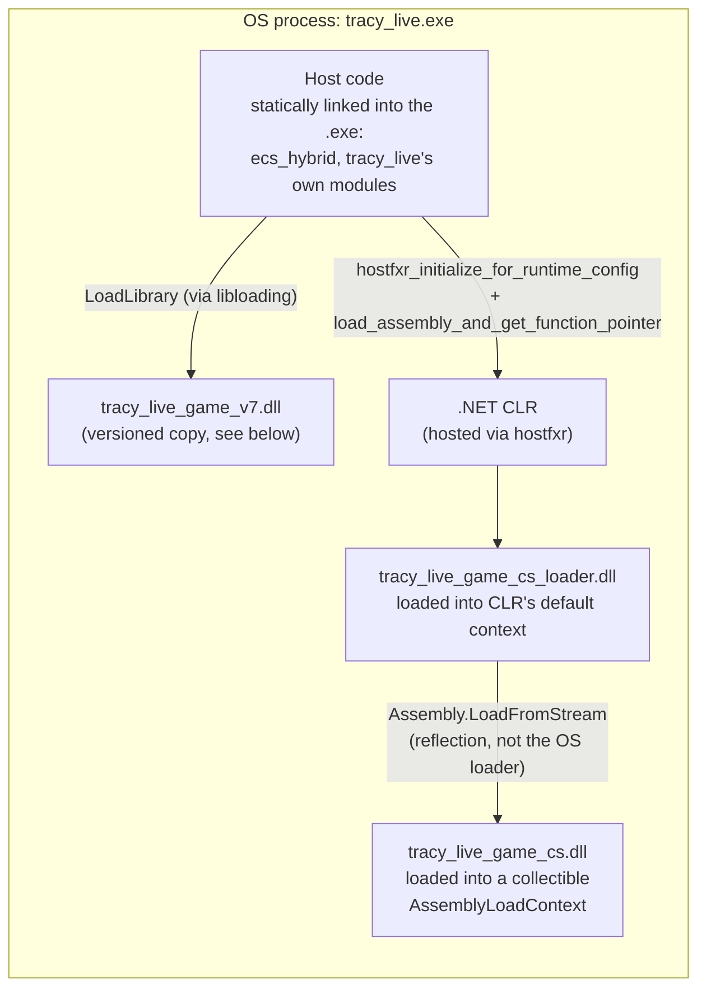
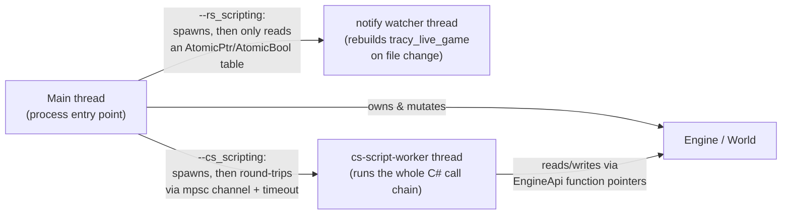
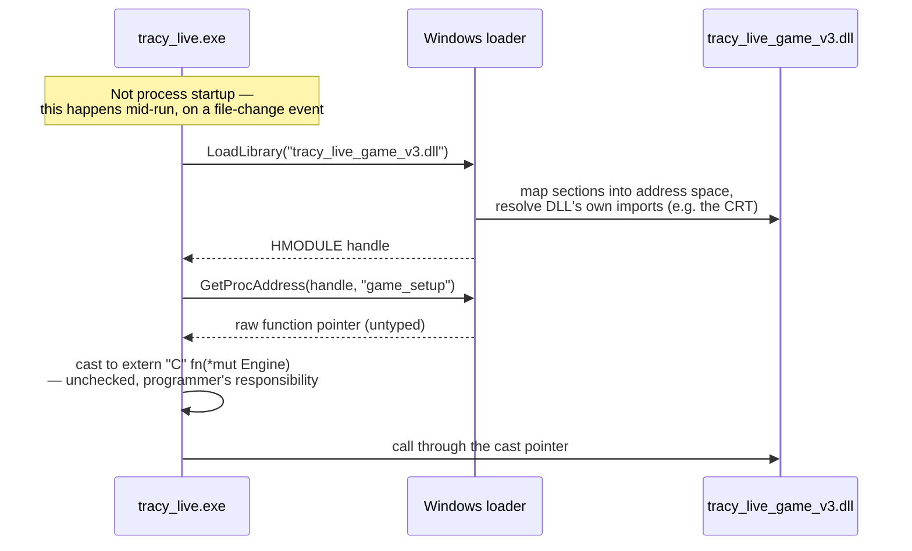
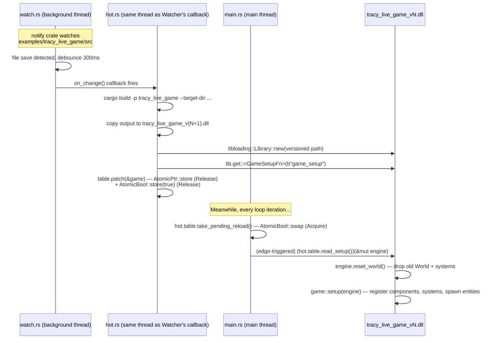
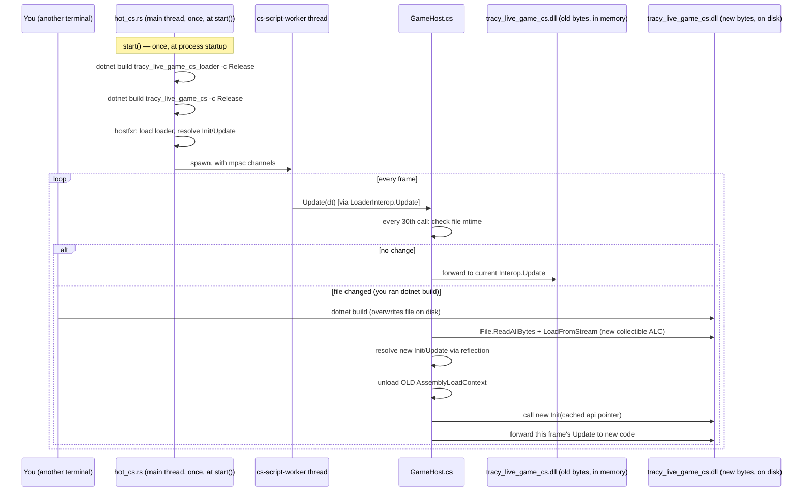
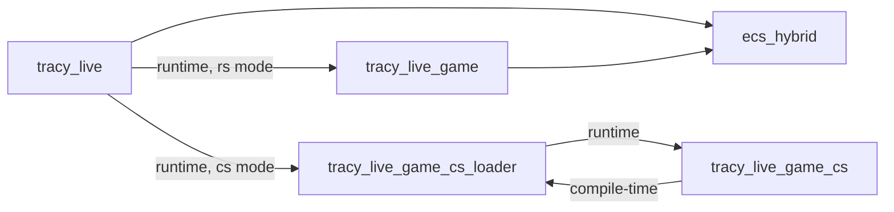

# Tracy Live — Runtime Scripting Architecture

**The single source of truth for the `tracy_live` example's runtime scripting system: how it's built, how it works, why it works that way, and how to extend it safely.**

This guide starts from first principles (what a DLL even is) and builds up to the exact code in this repository. You should not need to open a source file to understand what the system does — only to change it.

---

## Zero: scope note — please read this first

This guide was written against a request that also asked for documentation of **Unreal Engine integration**: `UBT`, `UHT`, `RunUAT`, Unreal modules, `StartupModule`/`ShutdownModule`, the Game Thread vs Render Thread as Unreal defines them, `UObject` lifetime and Unreal's garbage collector, Unreal's reflection system, Play-In-Editor, Unreal Live Coding, and Unreal's Hot Reload.

**None of that exists in this repository.** `Rust-Hybrid-ECS` is a standalone Rust ECS library with two build tools involved: **Cargo** (Rust) and the **.NET SDK** (C#). There is no Unreal Engine dependency, no `.uproject`, no `.build.cs` file, no `UBT`/`UHT`/`RunUAT`, and no editor. Writing a section that described Unreal module loading here would be fabricating documentation about a system that does not exist — actively harmful for a "single source of truth," so instead of inventing it, this note explains the substitution:

| Requested topic (Unreal-specific) | What this project actually has instead |
| --- | --- |
| Unreal Modules, `StartupModule`/`ShutdownModule` | A single Rust binary (`tracy_live`) that owns process lifetime; see [Module Reference](#module-reference) |
| `UBT` (Unreal Build Tool) | `cargo build` / `dotnet build` — see [Command Reference](#command-reference) |
| `UHT` (Unreal Header Tool) | Not applicable — no reflection code generation is used anywhere in this project |
| `RunUAT` / packaging / cooking | Not applicable — this is a developer example, not a shippable game; see [Future Extensions](#future-extensions) for what packaging would even mean here |
| Game Thread / Render Thread | One "main" thread plus one dedicated worker thread (`cs-script-worker`) — see [Threading](#threading) |
| `UObject` lifetime / Unreal's Garbage Collector | Rust's ownership system (no GC) on the native side; the .NET CLR's GC on the managed side — see [Memory Management](#memory-management) |
| Unreal reflection (`UCLASS`, `UPROPERTY`) | Not applicable — this project's "reflection" equivalent is Rust's `TraitAccessible`/`TypeId` machinery inside `ecs_hybrid`, unrelated to Unreal's UHT-generated reflection |
| Play-In-Editor (PIE) | Not applicable — there is no editor |
| Unreal Live Coding / Unreal Hot Reload | This project's *own* hot-reload systems — one for Rust, one for C# — which is the actual subject of this guide, and which exist for reasons directly comparable to why Unreal built Live Coding (see [Runtime Scripting 101](#runtime-scripting-101) and [Design Decisions](#design-decisions)) |

Every other topic in the original brief — dynamic libraries, linking, ABI, FFI, memory ownership, threading, hot reload, debugging, troubleshooting, and design trade-offs — is covered in full below, grounded in the real code in this repository.

---

## Table of contents

1. [Overview](#overview)
2. [Getting Started](#getting-started)
3. [Architecture](#architecture)
4. [Runtime Scripting 101](#runtime-scripting-101)
5. [Dynamic Libraries 101](#dynamic-libraries-101)
6. [Linking](#linking)
7. [ABI (Application Binary Interface)](#abi-application-binary-interface)
8. [FFI (Foreign Function Interface)](#ffi-foreign-function-interface)
9. [Rust Integration](#rust-integration)
10. [C# Integration](#c-integration)
11. [Module Reference](#module-reference)
12. [Build System](#build-system)
13. [Command Reference](#command-reference)
14. [Examples & Walkthroughs](#examples--walkthroughs)
15. [API Reference](#api-reference)
16. [Memory Management](#memory-management)
17. [Threading](#threading)
18. [Debugging Guide](#debugging-guide)
19. [Troubleshooting](#troubleshooting)
20. [Best Practices](#best-practices)
21. [FAQ](#faq)
22. [Design Decisions](#design-decisions)
23. [Future Extensions](#future-extensions)
24. [Glossary](#glossary)

Related documents in this repository:
- [`HOT_RELOADING_101.md`](../HOT_RELOADING_101.md) — a shorter, narrower write-up of just the Rust hot-reload mechanism (this guide supersedes and subsumes it, but that one is a good five-minute read).
- [`CS_SCRIPTING_PROPOSAL.md`](../CS_SCRIPTING_PROPOSAL.md) — the original design proposal for the C# path, including alternatives that were considered and rejected.
- [`CS_SCRIPTING_IMPLEMENTATION.md`](../CS_SCRIPTING_IMPLEMENTATION.md) — the implementation plan, including two real bugs found and fixed while building it.

---

## Overview

`tracy_live` is a headless, continuously-running ECS stress-test/profiling demo. It spawns 30,000 entities and runs a handful of systems on them every frame (movement, health decay, gravity), forever, while optionally streaming profiling data to the [Tracy profiler](https://github.com/wolfpld/tracy). It has no window, no rendering, no player input — its entire purpose is to be a stable, observable target for two things: performance measurement, and this scripting architecture.

The interesting part, and the reason this document exists, is that **the actual simulation logic — the components and the systems that operate on them — is not compiled into the `tracy_live` binary**. It lives in a separate, swappable unit of code that is loaded, and *re*-loaded, at runtime, while `tracy_live` keeps running. You edit that code, save, and within about half a second the running process is executing your new code — no restart, no dropped Tracy connection, no lost simulation state (in one of the two modes; see below).

There are **two independent, mutually exclusive implementations of this idea**, selected with a command-line flag:

| Flag | Scripting language | Reloadable unit | Reload trigger |
| --- | --- | --- | --- |
| `--rs_scripting` | Rust | `tracy_live_game` (a `cdylib`) | Automatic — a file-system watcher rebuilds and reloads on every save |
| `--cs_scripting` | C# | `tracy_live_game_cs` (a .NET assembly) | Semi-automatic — you run `dotnet build` yourself, and a background poller picks up the new file within ~0.5s |

Both let you edit gameplay-affecting code while the process runs. Neither is "the scripting system" on its own — together they demonstrate two different, valid answers to the same problem, with different trade-offs (see [Design Decisions](#design-decisions) for the full comparison). If you take one thing from this document, take this: **hot-reloading a running process is fundamentally a question of "how do I load new code into an already-running address space, and how do I make sure old code and new code never step on each other's feet." Rust and C# answer that question with completely different mechanisms**, and understanding both, side by side, is what this guide is for.

### Why two implementations exist in one demo

Not because the project needs two production scripting languages. Because the ECS's core API (`Query<T>`, `Commands`, `Component`) is a set of Rust generics that only Rust can express — a C# script cannot write `Query<(&mut Position, &Velocity)>`. So "add C# scripting" could not mean "let C# write the same kind of code Rust writes." It had to mean something adapted to what actually crosses a language boundary safely and fast. Working through that constraint — documented in depth in [`CS_SCRIPTING_PROPOSAL.md`](../CS_SCRIPTING_PROPOSAL.md) — is itself a worked example of the central problem in all runtime scripting: **the scripting language's capabilities are always bounded by what the FFI boundary can carry**, not by what the language can theoretically express.

---

## Getting Started

### Prerequisites

- **Rust toolchain** (stable), installed via [rustup](https://rustup.rs/). This repository was built and tested with a recent stable release; no nightly features are used.
- **.NET 8 SDK** — required only for `--cs_scripting`. Check with:
  ```sh
  dotnet --list-sdks
  ```
  You need at least one `8.0.x` SDK listed. A newer SDK (9.x, 10.x) installed alongside is fine and does not interfere — see [C# Integration § hostfxr version resolution](#hostfxr-and-runtime-resolution) for why.
- **Windows.** The hot-reload mechanisms in this repository (`libloading` for the Rust path, `hostfxr` for the C# path) are written and tested on Windows. The concepts transfer to Linux/macOS but the exact file names (`.dll` vs `.so`/`.dylib`) and a few OS-specific details (see [Dynamic Libraries 101](#dynamic-libraries-101)) would need porting.
- Optional: [**Tracy** profiler GUI](https://github.com/wolfpld/tracy/releases) if you want to see the live profiling data this demo exists to produce.

### Building and running

```sh
cd Rust-Hybrid-ECS

# Rust scripting path — no .NET SDK needed
cargo run --example tracy_live --release --features tracy -- --rs_scripting

# C# scripting path — needs the .NET SDK; builds both C# projects on first run
cargo run --example tracy_live --release -- --cs_scripting
```

`--features tracy` is optional in both modes — without it, all `profile_*!` macro calls compile to no-ops and the demo just runs standalone (see [`src/profiling.rs`](../src/profiling.rs)). `--release` is strongly recommended; this is a 30,000-entity workload and debug builds are noticeably slower, especially on the C# path (see [Threading](#threading) for why C# is inherently slower here regardless of build mode).

You'll see output like:

```
=== Tracy Live Profiling Demo (Rust hot-reload) ===
6 systems, 30000 entities, parallel ON
Edit examples/tracy_live_game/src/game.rs and save to hot-reload.

Connect Tracy now. Press Ctrl+C to stop.

[hot] tracy_live_game loaded (v1)
    428 FPS | 30000 entities
    445 FPS | 30000 entities
```

Passing neither flag, or both, is a startup error by design (see [Rust Integration § CLI validation](#the-cli-flags-are-a-runtime-choice-not-a-cargo-feature)):

```sh
$ cargo run --example tracy_live --release
error: pass one of --rs_scripting or --cs_scripting

$ cargo run --example tracy_live --release -- --rs_scripting --cs_scripting
error: pass exactly one of --rs_scripting / --cs_scripting, not both
```

### Your first hot-reload

**Rust path**: with `--rs_scripting` running, open [`examples/tracy_live_game/src/game.rs`](tracy_live_game/src/game.rs), change `health_decay_system`'s `0.1` to something else, save. Watch the console:

```
[hot] change detected — rebuilding tracy_live_game...
[hot] PATCHED (v2)
[hot] applying reload...
```

**C# path**: with `--cs_scripting` running, open [`examples/tracy_live_game_cs/src/Systems.cs`](tracy_live_game_cs/src/Systems.cs), make the equivalent edit, then in **another terminal**:

```sh
dotnet build examples/tracy_live_game_cs -c Release
```

Watch the first terminal for:

```
[tracy_live_game_cs_loader] reloaded tracy_live_game_cs.dll
```

Full walkthroughs with explanations of what happened under the hood are in [Examples & Walkthroughs](#examples--walkthroughs).

---

## Architecture

### The two topologies, side by side



The yellow boxes are the pieces you edit while the process runs. Everything else is stable for the process's whole lifetime.

### Component/data ownership: the key architectural difference

This is the single most important thing to internalize before reading anything else in this document:

- **`--rs_scripting`**: the reloadable unit (`tracy_live_game`) defines the component *types themselves* (`struct Position { x: f32, y: f32 }`, etc.) and owns the whole `World`. Every reload **resets the world from scratch** — new components, new systems, freshly re-spawned entities. See [§ Reload model: reset, not persist](#rust-hot-reload-mechanism) for exactly why this is unavoidable, not a shortcut.
- **`--cs_scripting`**: the component types are defined **once, in the host** ([`examples/tracy_live/cs_components.rs`](tracy_live/cs_components.rs)) and never change. The reloadable unit (`tracy_live_game_cs`) only contains *systems* — functions that read/write those components through a stable API. So a C# reload **does not reset anything** — the entity population, positions, health values, all of it survives, because none of the data it lives in ever gets rebuilt.

Put another way: the Rust path reloads *data and behavior together*; the C# path reloads *only behavior*, over data that's pinned in place. Neither is "better" in the abstract — they're different answers to different constraints (Rust's `TypeId` instability across rebuilds vs. C#'s ability to share a stable, host-defined memory layout). Both are explained in full in [Rust Integration](#rust-integration) and [C# Integration](#c-integration).

### Module dependency graph



Note the arrow direction between the two C# projects: `tracy_live_game_cs` (reloadable) has a compile-time reference *to* `tracy_live_game_cs_loader` (stable) — the opposite of what you might expect, and load-bearing for correctness. Explained fully in [C# Integration § why the dependency points "backwards"](#why-the-c-dependency-points-backwards).

### DLL/assembly relationships at runtime



Why "versioned copy" for the Rust DLL, and why reflection instead of the OS loader for the C# game assembly — both are answers to the same underlying problem (Windows won't let you overwrite a loaded DLL file), solved two different ways. See [Dynamic Libraries 101 § the file-locking problem](#the-file-locking-problem-and-why-both-paths-solve-it-differently).

### Thread topology



Full explanation, including exactly which operations are safe to call from which thread and why, in [Threading](#threading).

---

## Runtime Scripting 101

### What "scripting" actually means

At the most basic level, a computer program is a sequence of machine instructions the CPU executes directly. "Scripting" means: some part of that program's *behavior* is not fixed at compile time — it's determined by something read and interpreted (or compiled and loaded) while the program is already running.

That "something" can be:
- A text file interpreted line-by-line (classic scripting: Lua, Python, shell scripts).
- A separate compiled unit of native code, loaded into the running process's address space (this repository's `--rs_scripting` path).
- A separate compiled unit of managed/VM bytecode, loaded into a hosted runtime inside the process (this repository's `--cs_scripting` path).

All three share the same defining property: **the behavior wasn't baked into the original executable — it was added after the process started.** That's the entire definition. Everything else (which language, which loading mechanism, whether it can be swapped again without restarting) is an implementation choice layered on top.

### Why games (and game-adjacent tools) use scripting

Three independent motivations, often confused with each other:

1. **Iteration speed.** Recompiling and relinking an entire native executable can take anywhere from seconds to tens of minutes depending on project size. If gameplay tuning (a jump height, an AI behavior, a damage formula) requires a full rebuild every time, the person doing that tuning — often not a programmer — waits. Scripting (especially *hot-reloadable* scripting) collapses that iteration loop to "save the file."
2. **Safety/sandboxing.** A scripting language can restrict what untrusted or semi-trusted code is allowed to do — no raw pointers, no manual memory management, exceptions instead of memory corruption. This matters more the less you trust the author of the script (modders, other teams, non-engineers). See [FFI § panic and exception safety](#panic-safety-and-exception-safety-across-the-boundary) and this project's own answer to that exact question in [C# Integration § sandboxing](#sandboxing-containing-a-hung-or-buggy-script).
3. **Separation of concerns.** Even with a fully trusted, fully competent team, it's often architecturally useful to keep "engine code" (rarely changes, performance-critical, compiled once) separate from "content code" (changes constantly, per-level or per-feature, doesn't need to be as fast). Scripting formalizes that boundary as a real, enforced interface instead of a convention.

This project's `tracy_live` demo is motivated by all three, in miniature: (1) tuning a system's constants without a multi-second `cargo build` of the whole workspace, (2) demonstrating what a genuinely sandboxed scripting surface looks like (the C# path, see [§ sandboxing](#sandboxing-containing-a-hung-or-buggy-script)), and (3) drawing a hard, explicit line between `ecs_hybrid` (the engine) and the systems that run on top of it (the "game").

### Compile-time vs. runtime

| | Compile-time | Runtime |
| --- | --- | --- |
| When code is fixed | Before the process starts, as part of building the executable | While the process is already running |
| What can change it | Editing source + rebuilding + relaunching | Loading new compiled code, or new script text, into the live process |
| Type checking | Full — the compiler sees everything | Only what the loading mechanism checks (a mismatched function signature across an FFI boundary is *not* caught by either language's compiler — see [ABI](#abi-application-binary-interface)) |
| This project's Rust path | `ecs_hybrid`, `tracy_live` itself | `tracy_live_game` |
| This project's C# path | `ecs_hybrid`, `tracy_live` itself, `tracy_live_game_cs_loader` (loaded once, but *which* build of it is fixed at process start) | `tracy_live_game_cs` (can change *while the loader that hosts it keeps running*) |

The subtlety worth internalizing: "runtime" doesn't mean "interpreted" or "unsafe" or "slow." Both this project's scripting paths are **compiled** code (Rust to native machine code, C# to CIL then JIT-compiled to native machine code) — the "runtime" part is entirely about *when the code is loaded into the process*, not how it executes once loaded.

### Native execution vs. "runtime" execution — there is no meaningful difference here

A common misconception is that "native code" and "runtime-loaded code" are opposites. They're not — they're orthogonal. This project's `tracy_live_game.dll` is 100% native machine code, executing exactly as fast as if it had been statically linked into `tracy_live.exe` — the only difference is *when* the OS mapped its instructions into the process's address space (at `LoadLibrary` time instead of at process-start time). The C# path is the one with a genuine execution-model difference: C# is JIT-compiled by the CLR, which has its own (small, one-time) warm-up cost and different codegen characteristics than `rustc`'s LLVM backend — covered in [C# Integration](#c-integration) and its performance implications in [Threading § why C# is measurably slower here](#why-c-is-measurably-slower-here).

### Why hot reload specifically (not just "runtime loading")

Runtime loading (load a plugin once, at startup) solves "add capabilities without recompiling the base executable." **Hot reload** solves a stricter problem: "swap the *already-loaded* code for a *new version* of itself, without stopping the process, without losing whatever state matters, and without crashing." That's strictly harder, because now you need to answer:

- Where does the *old* code's memory go when the new code takes over? (Answer for this project's Rust path: the whole `World` is thrown away and rebuilt — see [§ reset, not persist](#rust-hot-reload-mechanism). Answer for the C# path: nothing is thrown away, because the reloadable unit never owned that memory in the first place — see [§ C# reload mechanism](#c-hot-reload-mechanism).)
- What happens to in-flight calls into the old code while the swap happens? (Both paths in this project answer this by only ever touching "which version is current" from one thread at a time — see [Threading](#threading).)
- What happens if the new code doesn't load, or crashes on first use? (Both paths keep the old, working version resident and simply log the failure — see [Troubleshooting § build failures](#build-failures).)

### Common scripting architectures, and where this project's two paths sit among them

| Architecture | Example | Reload cost | Type safety across the boundary | Performance | Used here? |
| --- | --- | --- | --- | --- | --- |
| Text interpreter (tree-walking) | Early Lua implementations, most shell scripts | None (interpret fresh each time) | None (dynamically typed) | Slow | No |
| Bytecode VM | Lua (modern), Python, standard C# (before considering native hosting) | Recompile-to-bytecode, usually fast | Partial (VM enforces some invariants) | Medium | Partially — see below |
| Native plugin, loaded once | Most Unreal/Unity native plugins, most "modding SDKs" | Requires process restart | None beyond what the ABI happens to catch | Fast (native speed) | No — this project always hot-reloads |
| Native plugin, hot-reloaded | This project's Rust path; tools like `dexterous_developer`, `hot-lib-reloader` | Rebuild + relink, seconds | None — an ABI mismatch is a silent bug or a crash | Fast (native speed) | **Yes — `--rs_scripting`** |
| Hosted managed runtime, hot-reloaded | This project's C# path; Unity's Mono/IL2CPP scripting (conceptually) | Recompile (fast, incremental) + reload | Strong within C#, none across the FFI boundary itself | Fast (JIT-compiled, near-native for numeric code) but not identical to native — see [Threading](#threading) | **Yes — `--cs_scripting`** |

The C# path is best understood as sitting *between* "native plugin" and "bytecode VM": it's compiled ahead-of-time by `dotnet build` into CIL, then JIT-compiled to native code inside the hosted CLR the first time each method runs — not interpreted the way a naive scripting language is.

### Why this project chose the architecture it chose

Covered in exhaustive comparative detail in [Design Decisions](#design-decisions), but the one-sentence version: neither Lua nor Python nor AngelScript can operate on `ecs_hybrid`'s archetype-based component storage without either (a) losing the performance the whole ECS exists to provide, or (b) a large amount of hand-written marshaling glue that a native-code or hosted-managed-runtime approach gets closer to for free. Rust hot-reload gives *zero-overhead* access to the real API at the cost of no safety net; C# hot-reload gives a *near-zero-overhead*, genuinely sandboxed subset of that access (`Span<T>` over the same memory) at the cost of losing Rust's compile-time guarantees and gaining a JIT warm-up.

---

## Dynamic Libraries 101

This section explains, from scratch, the mechanism both scripting paths ultimately rest on: a **dynamic library** — a `.dll` on Windows (`.so` on Linux, `.dylib` on macOS) — being loaded into a running process.

### What a compiled executable actually is

When you compile a program, the compiler and linker produce a file in a platform-specific binary format — on Windows, the **Portable Executable (PE)** format (the same format for both `.exe` and `.dll` files — the only difference is a flag in the header saying which one it is). A PE file is, at a high level:

```
┌─────────────────────────────────────┐
│ DOS header (legacy compatibility)    │
├─────────────────────────────────────┤
│ PE header (machine type, timestamp)  │
├─────────────────────────────────────┤
│ Section table (where each section is)│
├─────────────────────────────────────┤
│ .text   — the actual machine code    │
│ .rdata  — read-only data, and the    │
│           import/export tables       │
│ .data   — mutable global data        │
│ .pdata  — exception-handling tables  │
│ .reloc  — base relocation info       │
└─────────────────────────────────────┘
```

The OS loader (`ntdll.dll`'s loader code, invoked by `CreateProcess` for an `.exe` or by `LoadLibrary` for a `.dll`) reads this file, maps its sections into the process's virtual address space with the right memory protections (`.text` executable-and-read-only, `.data` read-write, etc.), and — critically for this document — resolves any **imports**: names of functions this file calls but doesn't itself define.

### Import tables, export tables, and symbol lookup

A `.dll` that *provides* functions for others to call lists them in its **export table** — a name (or ordinal number) paired with an address (relative to the DLL's base). A `.dll` or `.exe` that *calls* functions defined elsewhere lists them in its **import table** — a name, and which DLL it expects to find that name in.

When the OS loader loads a file with imports, for each entry it:
1. Ensures the named DLL is loaded (loading it first, recursively, if not already resident).
2. Looks up the requested name in that DLL's export table.
3. Writes the resolved address into the importing file's **Import Address Table (IAT)** — a small table of function pointers the compiled code was written to call through.

This is exactly the same mechanism whether the import is `kernel32.dll!CreateFileW` (something almost every Windows program imports) or, in principle, one of this project's own DLLs importing from another — except this project's DLLs **do not use this mechanism at all** for the game-logic boundary. That's the crucial, deliberate choice explained next.

### Static (load-time) linking vs. dynamic (runtime) loading — the distinction this whole project rests on

There are two fundamentally different ways a program can end up calling a function that lives in a `.dll`:

**1. Load-time (implicit) linking.** You compile against an **import library** (a `.lib` file on Windows that contains *only* the import-table metadata, no code) and the resulting `.exe`/`.dll` has that DLL's name baked into its import table. The OS loader resolves and loads it *automatically*, before your `main()`/entry point even runs. If the DLL is missing, the process fails to start at all, with an OS-level error — you never get a chance to catch or work around it. This is how, e.g., a normal Rust binary links against `ecs_hybrid` when it's a normal Cargo path dependency compiled into an `rlib` — except an `rlib` isn't even a DLL, it's statically linked, so there's no runtime loading step at all for that case (see [Linking](#linking) for the rlib/dylib distinction).

**2. Runtime (explicit) loading.** Your code calls an OS API — `LoadLibrary`/`LoadLibraryEx` on Windows — **while already running**, passing a file path as a plain string. You get back an opaque handle (or an error you can catch and handle in your own code). You then call `GetProcAddress` with that handle and a function name (a string) to get a raw function pointer, which you then have to **cast to the correct function-pointer type yourself** — nothing checks that the signature you're casting to actually matches what the DLL exports. Get it wrong and you get undefined behavior, not a compile error (see [ABI](#abi-application-binary-interface)).

**This project uses exclusively option 2, for both scripting paths**, because option 1 cannot be hot-reloaded at all: a DLL loaded via implicit linking is resolved once, before `main()`, and there is no supported way to tell the OS "now resolve it again, to a different file, without restarting the process." Runtime loading is not an optimization or a stylistic choice here — it is the *only* mechanism capable of expressing "swap this code while running" in the first place.



In this project, `libloading` (a Rust crate) wraps steps 2-4 of this diagram in a small safe-looking API (`Library::new`, `Library::get::<T>`) — see [Rust Integration](#rust-integration). The C# path uses a conceptually equivalent but mechanically different runtime-loading API — `hostfxr`'s component-hosting entry points for the *stable* loader assembly, and `AssemblyLoadContext.LoadFromStream` (reflection-based, not the Windows PE loader at all) for the *reloadable* game assembly — see [C# Integration](#c-integration).

### The Windows loader's search path (and why it doesn't matter much here)

When a DLL name is looked up (either at load-time or via `LoadLibrary` with a bare filename instead of a full path), Windows searches, in order: the directory the `.exe` lives in, the system directories, then `PATH`. This project sidesteps the search path question entirely by always passing **fully-qualified paths** computed from `env!("CARGO_MANIFEST_DIR")` (Rust) — see [`hot.rs`](tracy_live/hot.rs)'s `workspace_dir()` — so there's no ambiguity about which copy of a DLL gets loaded. This matters because a project with multiple stale copies of a same-named DLL scattered across `PATH` is a classic, hard-to-diagnose source of "why is it running the old code" bugs — see [Troubleshooting § DLL not found / wrong version loaded](#dll-not-found--wrong-version-loaded).

### The file-locking problem, and why both paths solve it differently

Windows, by default, keeps an open file handle to a DLL for as long as it's mapped into any process — which means **you cannot overwrite a `.dll` file on disk while it's loaded**, not even from the same process that loaded it, not even to write an identical copy. If your build step writes to the exact same path a running process has mapped, the write fails (or, worse on some setups, silently succeeds against a different underlying file while the mapped view keeps serving stale bytes — the specifics depend on caching behavior, which is exactly why this project doesn't rely on that path at all).

This project's two paths hit this problem and solve it in two different, instructive ways:

- **Rust path**: [`hot.rs`](tracy_live/hot.rs)'s `versioned_lib_name` gives every successful build a **new file name** — `tracy_live_game_v1.dll`, `tracy_live_game_v2.dll`, and so on, forever incrementing. `load_game` copies `cargo build`'s output (always the same path, `target/release/tracy_live_game.dll`) to that new versioned name, *then* loads the versioned copy. The original build output is free to be overwritten by the next `cargo build` because nothing ever has it loaded.
- **C# path**: doesn't rename files at all. Instead, [`GameHost.cs`](tracy_live_game_cs_loader/src/GameHost.cs)'s `Load()` reads the **entire file into a byte array** (`File.ReadAllBytes`) and loads *that byte array* via `AssemblyLoadContext.LoadFromStream` — the OS-level file handle is closed the instant the read completes, so the file on disk is never held open, and `dotnet build` can freely overwrite it moments later. This is a fundamentally different technique (reflection-based loading from memory, not the OS's PE loader) — only available because .NET assemblies can be loaded from an in-memory byte stream at all; native DLLs on Windows generally cannot (there exist manual-PE-mapping tricks to do this for native code too, but this project doesn't need them, since the versioned-filename trick above is simpler and sufficient).

Both are answers to the identical underlying constraint, chosen based on what each platform's loading APIs actually offer.

### Manual loading vs. everything else — a summary table

| | Static linking | Load-time dynamic linking | Runtime (explicit) loading |
| --- | --- | --- | --- |
| When resolved | Link time (build) | Process start, before `main()` | Whenever your code calls `LoadLibrary`/equivalent |
| Can fail gracefully | N/A — build fails instead | No — OS terminates the process | Yes — you get an error value/exception |
| Can be hot-reloaded | No | No | **Yes — this is the only option that can** |
| Used in this project for... | `tracy_live` ↔ `ecs_hybrid`; `tracy_live_game` ↔ `ecs_hybrid` (same workspace) | Not used anywhere in this project | `tracy_live` ↔ `tracy_live_game`; `tracy_live` ↔ `tracy_live_game_cs_loader`; `tracy_live_game_cs_loader` ↔ `tracy_live_game_cs` |

---

## Linking

### Compilation and object files

Compiling a single source file produces an **object file** (`.o` on Linux, `.obj` on Windows) — machine code plus metadata, but not yet a runnable program. Crucially, an object file's machine code contains **unresolved references** to any symbol (function or global) it uses but doesn't define itself — a placeholder that says "there is a function called `foo` somewhere, fill in its address later."

### What the linker does

The **linker** takes one or more object files (plus any libraries) and produces either a final executable or a library. Its core job is **symbol resolution**: matching every unresolved reference in every object file against a symbol *definition* found in one of the other inputs, and patching the generated machine code (or, for dynamic linking, building an import table — see [Dynamic Libraries 101](#dynamic-libraries-101)) so those placeholders become real addresses or real import-table entries.

**Linker errors** ("undefined reference to `foo`", "unresolved external symbol") happen precisely when this matching fails: a symbol is referenced somewhere but the linker cannot find a definition for it in anything it was given. Common root causes: forgetting to link a library that provides the symbol, a name-mangling mismatch (see below) between how the symbol was declared and how it was defined, or (specific to this project's kind of DLL boundary) forgetting `#[no_mangle]`/`extern "C"` on the Rust side so the exported name doesn't match what the loading code asks for by string.

### Static libraries vs. dynamic libraries

- A **static library** (`.a` on Linux, `.lib`/Rust's `.rlib` on Windows) is just an archive of object files. Linking against one **copies** the relevant object code directly into your final executable/DLL at link time. There is no separate file needed at runtime, and no dynamic-loading step at all.
- A **dynamic library** (`.dll`/`.so`/`.dylib`) is a *separate, runnable-ish* file, loaded by the OS at process-start (implicit linking) or explicitly (`LoadLibrary`) — see [Dynamic Libraries 101](#dynamic-libraries-101).

This project uses both, deliberately, in different places:
- `ecs_hybrid` is compiled as an **`rlib`** (Rust's static library format) and *statically linked* into both `tracy_live` (the host) and `tracy_live_game` (the Rust hot-reload cdylib) — each of them gets its own **copy** of `ecs_hybrid`'s compiled code and, critically, its own copy of any of its `static` variables (this is exactly why the Tracy client can't be shared between them — see [§ the Tracy double-client problem](#the-tracy-double-client-problem)).
- `tracy_live_game` is compiled as a **`cdylib`** (Rust's C-compatible dynamic library format) specifically so it *can* be loaded at runtime via `LoadLibrary` — see its `Cargo.toml`: `crate-type = ["cdylib"]`.

#### The Tracy double-client problem

A concrete consequence of "each statically-linked copy gets its own copy of every `static` variable," worth spelling out because it directly explains a real line in `tracy_live_game`'s `Cargo.toml`. `ecs_hybrid`'s optional `tracy` feature wraps a single, lazily-initialized `tracy_client::Client` behind a process-wide `OnceLock` ([`src/profiling.rs`](../src/profiling.rs)). "Process-wide," here, silently means "one per statically-linked copy of `ecs_hybrid`'s compiled code," not "one per OS process" — because a `cdylib` bundles its own copy of every `rlib` dependency's code and data into itself at link time (see [Linking § static libraries](#static-libraries-vs-dynamic-libraries)). If `tracy_live_game`'s `Cargo.toml` also enabled the `tracy` feature, the *host's* copy of `ecs_hybrid` and `tracy_live_game`'s *own separate copy* would each lazily construct and start their own independent `tracy_client::Client`, each trying to open its own connection to the Tracy profiler — two Tracy clients genuinely running inside one OS process, neither aware of the other.

`tracy_live_game`'s `Cargo.toml` avoids this by simply never enabling the `tracy` feature for that crate's own build — so its copy of `profile_scope!`/`profile_message!` compile to their zero-cost no-op form instead ([`src/profiling.rs`](../src/profiling.rs)'s `#[cfg(not(any(feature = "tracy", ...)))]` branch), and only the host's copy of `ecs_hybrid` ever actually talks to Tracy. You still get full visibility into every system's timing in the Tracy GUI, because `Engine::process_frame`'s own per-system zone (`"system: {name}"`, in [`src/engine.rs`](../src/engine.rs)) wraps every system call *regardless of which compiled copy of the system's code is running* — that instrumentation lives entirely in the host's `ecs_hybrid` copy, not in `tracy_live_game`'s.

### Export macros: `__declspec(dllexport)` / `__declspec(dllimport)`, and Rust's equivalent

On Windows, a symbol inside a DLL is **not** automatically visible to code outside it — by default, the linker treats everything as internal. A symbol must be explicitly marked for export with `__declspec(dllexport)` (in C/C++) when compiling the DLL, and code that wants to *import* it (for load-time linking) marks it `__declspec(dllimport)`.

Rust abstracts this away almost entirely: `#[no_mangle] pub extern "C" fn game_setup(...)` on a function inside a crate compiled with `crate-type = ["cdylib"]` is automatically exported — the Rust compiler emits the equivalent of `dllexport` for you. There is no `dllimport`-equivalent needed on the loading side in this project, because nothing here uses load-time (implicit) linking against these DLLs — everything goes through `GetProcAddress`-equivalent runtime lookup by string name (`libloading`'s `Library::get(b"game_setup")`), which doesn't need an import declaration at all, just the DLL's export table (which `#[no_mangle]` populated) and the right string.

### Name mangling

C++ (and Rust, by default) **mangle** function names — encoding argument types, namespaces/modules, and generic parameters into the exported symbol name, so overloads and generics don't collide. A Rust function `fn foo<T>(x: T)` might be exported as something like `_ZN6crate3foo17h9f2e1a2b3c4d5e6fE` — utterly unusable as a stable string to look up at runtime.

`#[no_mangle]` (used on every FFI entry point in this project — `game_setup`, and every `extern "C" fn` in [`hot_cs.rs`](tracy_live/hot_cs.rs)) disables this, exporting the function under its literal Rust name instead. This is **required**, not optional, for any function looked up by string at runtime: `libloading`'s `lib.get(b"game_setup")` and hostfxr's `get_unmanaged_fn(..., "Init")` both look up an exact string, and a mangled name would never match (and would also change on every compiler version, making it doubly useless for this purpose).

C#'s equivalent problem is solved differently: `[UnmanagedCallersOnly]` methods (used on every C# FFI entry point in this project — `Interop.Init`, `Interop.Update`, `LoaderInterop.Init`, `LoaderInterop.Update`) are resolved by **type-qualified name** (e.g., `"TracyLive.Loader.LoaderInterop, tracy_live_game_cs_loader"` + method name `"Init"`) through the .NET reflection/hosting APIs, not through name mangling at all — .NET method names are never mangled in the C-symbol sense; the CLR's own metadata tables carry full type information natively.

### LTO (Link-Time Optimization) and incremental linking — as used in this project

`ecs_hybrid`'s `[profile.release]` in [`Cargo.toml`](../Cargo.toml) sets `lto = "thin"` and `codegen-units = 1`. **LTO** lets the compiler optimize *across* what would otherwise be separate compilation-unit boundaries (inlining a function from one object file into a call site in another, which normally only happens within a single compilation unit) — "thin" LTO is a faster-to-compile, slightly-less-aggressive variant of "fat" LTO. `codegen-units = 1` forces the whole crate through a single codegen unit, maximizing what the optimizer can see at the cost of parallel-compilation speed. Both exist purely as release-profile performance knobs; neither affects the FFI boundary's correctness (a `#[no_mangle] extern "C" fn`'s exported symbol and calling convention are unaffected by LTO settings) — but see [Troubleshooting § build failures](#build-failures) for a subtlety: this profile also sets `panic = "abort"`, which is *not* just an optimization knob and has real consequences for [crash safety](#rust-panic-in-the-hot-reloaded-cdylib).

"Incremental linking" (relinking only the changed parts of a binary rather than the whole thing) is a `rustc`/Cargo build-caching concern, not something this project configures explicitly — Cargo's default incremental compilation already makes repeat `cargo build -p tracy_live_game` calls (the ones [`hot.rs`](tracy_live/hot.rs) shells out to on every file-change event) fast after the first build, which is exactly what makes sub-second-feeling Rust hot-reload practical at all.

---

## ABI (Application Binary Interface)

### What an ABI is, and how it differs from an API

An **API** (Application Programming Interface) is a *source-level* contract: function names, parameter types, what a function does — the thing you read in documentation or a header file, and the thing the compiler checks for you.

An **ABI** (Application Binary Interface) is the *compiled, binary-level* contract underneath that: exactly which CPU register or stack slot each argument goes in, how the return value comes back, how a `struct`'s fields are laid out in memory (padding, alignment, order), how exceptions/panics propagate (or don't) across a call boundary. **None of this is checked by any compiler** once you cross a dynamic-loading boundary like this project's `LoadLibrary`/`GetProcAddress` or hostfxr's reflection-based function-pointer resolution — the compiler that builds the caller has no visibility into the compiler that (possibly, at a much later time, with a possibly-different compiler version) built the callee.

This is the single most important fact underlying every design decision in this project's FFI boundaries: **crossing a dynamically-loaded boundary means leaving the compiler's type-checking behind entirely, and it is the programmer's job to keep the ABI contract by hand.**

### Calling conventions

A **calling convention** specifies, concretely, how a function call is implemented at the machine-code level: which registers hold which arguments, which register holds the return value, who saves/restores which registers, how the stack is cleaned up after the call. Different conventions exist (`cdecl`, `stdcall`, `fastcall`, Microsoft's `x64` convention, System V's `x86-64` convention, and more) and **a call compiled under one convention cannot correctly call a function compiled under a different one** — the arguments would simply be in the wrong place.

This project pins down the calling convention explicitly at every FFI boundary, rather than leaving it to a default that might differ between compilers or targets:
- Rust: `extern "C" fn(...)` — `"C"` here selects the platform's standard C calling convention (Microsoft x64 on Windows), the same one every C compiler on that platform uses. This is what makes it possible for `libloading` (which knows nothing about this project's specific functions) to safely call through a `Symbol<T>` as long as `T`'s Rust type correctly describes an `extern "C" fn`.
- C#: `delegate* unmanaged[Cdecl]<...>` — the `[Cdecl]` is the explicit calling-convention annotation, matching Rust's `extern "C"` on the other side of the same call. See [`EngineApi.cs`](tracy_live_game_cs_loader/src/EngineApi.cs) — every single function pointer field is annotated this way, on purpose, not left to a default.

Get this wrong (e.g., a C# `[Cdecl]` calling into a Rust function accidentally compiled with a different convention — not something Rust's `extern "C"` would ever produce, but a real risk if hand-writing C headers for a C++ counterpart) and the result is not a compile error on either side — it's silent stack corruption, because the caller and callee disagree about where arguments live.

### Struct layout, padding, and alignment

Every one of this project's shared data types — `Position`, `Velocity`, `Health`, `Mass`, `GravityForce` (defined once, in [`cs_components.rs`](tracy_live/cs_components.rs)) — is marked `#[repr(C)]` on the Rust side and `[StructLayout(LayoutKind.Sequential)]` on the C# side (see [`Components.cs`](tracy_live_game_cs_loader/src/Components.cs)). Both annotations mean the same thing: **lay out the fields in declaration order, using the platform C compiler's normal padding/alignment rules**, instead of whatever layout-optimizing order the language's default representation would otherwise choose (Rust's un-annotated `repr(Rust)` is explicitly *unspecified* and may reorder fields for better packing; C#'s default `LayoutKind.Auto` likewise permits reordering). Without `#[repr(C)]`/`LayoutKind.Sequential`, there is **no guarantee whatsoever** that `Position { x: f32, y: f32 }` on the Rust side and `struct Position { float X, Y; }` on the C# side put `x`/`X` at the same byte offset — and a mismatch here is silent memory corruption, not an error.

Concretely, for `Position { x: f32, y: f32 }` under `#[repr(C)]`: `x` at byte offset 0, `y` at byte offset 4, total size 8 bytes, alignment 4 bytes (both fields are 4-byte `f32`s, so no padding is needed here — but `Health(pub f32)`, a Rust tuple struct with one field, is likewise 4 bytes under `repr(C)`, matching C#'s `struct Health { public float Value; }`). **Padding** would appear if fields of different sizes/alignments were mixed (e.g., a `bool` next to an `f64`) — the compiler inserts unused bytes so each field starts at an address that's a multiple of its own alignment requirement, which is why field *order* in a `#[repr(C)]` struct can change its total size, and why both sides of an FFI boundary must declare fields in the exact same order, not just with the same types.

### What this project deliberately does *not* cross the boundary

None of the following appear anywhere in this project's FFI surface, and that is a design choice, not an oversight:

- **VTables / dynamic dispatch (`dyn Trait`, C++ virtual functions).** A vtable's layout (which function pointer is at which offset) is an *implementation detail* of a specific compiler version, never part of any stable ABI, even within the same language. Every function this project passes across a boundary is either a plain `extern "C" fn` pointer (no vtable at all) or reached by well-known string name (hostfxr/reflection) — never a trait object.
- **RTTI (Run-Time Type Information).** C++'s `typeid`/`dynamic_cast` machinery, and anything conceptually similar, depends on compiler- and even build-specific metadata layouts. Not used or needed here — every type crossing the boundary is a plain data struct or a raw pointer, identified by the (Rust or C#) *source-level* type the programmer wrote on both sides, checked by nothing but code review and testing.
- **Exceptions/panics propagating across the boundary.** Neither a Rust panic nor a C# exception is allowed to unwind across an `extern "C"`/`[UnmanagedCallersOnly]` call in this project — see [FFI § panic and exception safety](#panic-safety-and-exception-safety-across-the-boundary) for exactly what happens instead (short version: C# catches everything with try/catch before it would unwind; the Rust side currently does **not** do the equivalent, which is a real, documented gap — see [Troubleshooting § Rust panic in the hot-reloaded cdylib](#rust-panic-in-the-hot-reloaded-cdylib)).
- **The C++ Standard Template Library, or Rust's `Vec`/`String`/`Option`/etc., passed by value across the boundary.** None of `Vec<T>`, `String`, `HashMap`, etc. have a stable, documented ABI — their internal layout is free to change between compiler/standard-library versions with no notice. Every type this project passes across a boundary is either a `#[repr(C)]` plain-data struct, a raw pointer, a primitive integer/float, or a raw pointer + length pair standing in for a slice (see [FFI § arrays and buffers](#arrays-and-buffers)) — never a standard-library container by value.

### Why ABI stability is hard, in general

Put the previous few subsections together and the general difficulty becomes clear: an ABI is an enormous, largely *implicit* contract (calling convention, struct layout, exception model, and more) that most languages' compilers are free to change at any point unless a type/function is *explicitly* annotated to opt out of that freedom (`extern "C"`, `#[repr(C)]`, `[UnmanagedCallersOnly]`, `[StructLayout(LayoutKind.Sequential)]`). Two builds of the *same* source code, with two different compiler versions, are not guaranteed to produce ABI-compatible output for anything not explicitly pinned down this way. This is precisely why this project's Rust-to-Rust boundary (`tracy_live` ↔ `tracy_live_game`) leans on a *different, stronger* guarantee than "the ABI is stable" — see the next paragraph — rather than trying to hand-pin every type in `ecs_hybrid`'s large, generic, frequently-changing public API.

### This project's actual ABI-stability strategy: same-workspace, same-compiler builds, not a frozen ABI

The Rust-to-Rust boundary (`tracy_live` calling into `tracy_live_game`) does **not** attempt to define a stable, hand-written ABI for `ecs_hybrid`'s types (`Engine`, `World`, `Query<T>`, etc.) the way the C# boundary does for `Position`/`Velocity`/etc. Instead, it relies on a different, equally valid guarantee: **both sides are built from the same source, by the same `rustc` invocation's toolchain version, from the same Cargo workspace, moments apart** — so whatever layout `rustc` happens to choose for `Engine` today is *identical* on both sides, even though that layout is unspecified and could differ for a different `rustc` version or optimization setting. The *only* hand-pinned part of that boundary is the single exported function, `game_setup(engine: *mut Engine)` — a raw pointer and nothing else crosses as a "real" FFI value; everything downstream of that pointer is accessed by calling real Rust methods compiled from the identical source. This is exactly the technique used by real Rust hot-reload crates like `hot-lib-reloader` and is explained at length, with its actual risk (`TypeId` instability — a *different* hazard than struct-layout instability) in [Rust Integration § why linking `ecs_hybrid` directly is safe here](#why-tracy_live_game-links-ecs_hybrid-directly).

---

## FFI (Foreign Function Interface)

**FFI** is the general term for "code written in one language calling code written in another (or, in this project's case, the *same* language but compiled separately and loaded dynamically)." ABI ([previous section](#abi-application-binary-interface)) is the low-level binary contract; FFI is the practice, on top of that contract, of actually designing a usable, safe(ish) boundary.

### Why the C calling convention is the universal common denominator

Virtually every language that supports FFI at all supports it by targeting **the C ABI** specifically — not because C is special or superior, but because it is the oldest, simplest, most universally-implemented convention, and every OS's own APIs are already exposed through it. Rust's `extern "C"`, C#'s `[UnmanagedCallersOnly]` + `[Cdecl]`, Python's `ctypes`, and this project's own boundary all converge on the same convention for the same reason: it's the one thing every relevant toolchain agrees on. "FFI" in practice almost always means "the C ABI," even when neither side is C.

### Function pointers

A **function pointer** is a value that holds the memory address of executable code — calling through it invokes whatever's at that address, exactly as if you'd called it by name, provided the call site and the actual function agree on the calling convention and signature (see [ABI](#abi-application-binary-interface)). This project's entire runtime-loading mechanism, on both scripting paths, boils down to: obtain a function pointer at runtime (via `GetProcAddress`-equivalent lookup), store it somewhere, call through it later.

Concretely:
- Rust: `libloading::Symbol<GameSetupFn>` in [`hot.rs`](tracy_live/hot.rs), where `type GameSetupFn = extern "C" fn(*mut Engine);` — `Symbol<T>` is a thin wrapper that derefs to `T`, so `*setup` where `setup: Symbol<GameSetupFn>` gives you a plain, callable `GameSetupFn` value.
- C#: `delegate* unmanaged[Cdecl]<...>` fields throughout [`EngineApi.cs`](tracy_live_game_cs_loader/src/EngineApi.cs), [`GameHost.cs`](tracy_live_game_cs_loader/src/GameHost.cs) — C#'s syntax for "an unmanaged function pointer," directly callable like any delegate but without the heap allocation a normal C# delegate would need.

### Handles and opaque types

An **opaque type** (or **handle**) is something the caller is given a pointer/reference to, but is not expected to inspect or construct itself — only to pass back into the API that gave it out. This project uses this pattern for `Engine`:

- The Rust hot-reload path's `game_setup(engine: *mut Engine)` hands the reloaded code a raw pointer to the host's real `Engine` — but `tracy_live_game` doesn't need to know `Engine`'s layout as an opaque blob, because (per [ABI § same-workspace strategy](#this-projects-actual-abi-stability-strategy-same-workspace-same-compiler-builds-not-a-frozen-abi)) it has the *real* Rust type definition available and calls real methods on it.
- The C# path's `EngineApi` is closer to the classic "opaque handle" pattern in spirit: C# never sees `Engine` at all, only ever a set of function pointers that, on the Rust side, dereference a `static AtomicPtr<Engine>` ([`hot_cs.rs`](tracy_live/hot_cs.rs)'s `ENGINE_PTR`) that C# has no way to construct, inspect, or corrupt directly.

### Memory ownership across the boundary

**The single most important question for any value crossing an FFI boundary is: who allocated it, and who is responsible for freeing it?** Get this wrong and you get a leak (nobody frees it) or a **double free** / **use-after-free** (both sides think they own it, or one side frees it while the other still holds a reference) — see [Memory Management](#memory-management) and [Troubleshooting § use-after-free / double free](#use-after-free--double-free) for the concrete failure modes.

This project's rule, applied consistently everywhere: **the host (`tracy_live`) allocates every long-lived thing that crosses a boundary, and nothing that crosses a boundary is ever freed by the side that didn't allocate it.** Concretely:
- `Engine` is stack-allocated in `main.rs` and lives for the whole process; only a raw, non-owning pointer to it ever crosses either boundary.
- Every `EngineApi` getter (e.g. `ffi_get_positions` in [`hot_cs.rs`](tracy_live/hot_cs.rs)) hands C# a pointer *into* memory Rust's `Vec<Position>` already owns (inside the ECS archetype storage) — C# never allocates or frees that memory, it only reads and writes through the pointer for the duration of one `Update()` call (see [§ arrays and buffers](#arrays-and-buffers) below for exactly why "for the duration of one call" is a hard rule, not a suggestion).
- The `EngineApi` struct itself is heap-allocated once (`Box<EngineApi>` in `hot_cs.rs::start()`) and kept alive for the whole process by being stored in `CsGame::_api` — C# holds a raw pointer to it (via `IntPtr`/`EngineApi*`) but never owns or frees it.

### String ownership — and why this project mostly avoids passing strings across the boundary at all

Passing a string across an FFI boundary means agreeing on: encoding (UTF-8? UTF-16? platform-dependent?), null-termination vs. an explicit length, and — the ownership question again — who allocated the buffer and who's responsible for it living long enough. The reference implementation this project is modeled on (`flappy`'s C# path, in `Scripting-Language-Tests/hot_reloading`) does pass strings (drawing text), and its `Interop.cs`/`ffi.rs` show the pattern in full: UTF-8 byte arrays with a manually-appended trailing NUL byte, read on the Rust side via `CStr::from_ptr`.

**This project's `tracy_live` demo passes zero strings across either FFI boundary** — every value crossing a boundary is either a raw pointer to plain-data structs, a primitive integer/float, or a function pointer. This isn't an oversight; it's a direct consequence of the demo being headless (no text to draw) and its `EngineApi` being deliberately minimal (see [API Reference](#api-reference)). If you extend this project to need strings (say, a log message from a script back to the host), the `flappy` example's pattern above is the correct one to copy.

### Arrays and buffers

The core mechanism the C# scripting path is built on: instead of copying data across the boundary element-by-element (which would mean one FFI call per entity, hopelessly slow at 30,000 entities — see [FFI § why not marshal element-by-element](#why-not-marshal-element-by-element)), this project passes a **pointer + length pair**, standing in for a contiguous array, and lets the receiving side construct a *view* over the same memory rather than a copy.

Concretely, [`hot_cs.rs`](tracy_live/hot_cs.rs)'s `component_getter!` macro expands to functions like:
```rust
extern "C" fn ffi_get_positions(out_ptr: *mut *mut Position, out_len: *mut u32) {
    match engine_mut().world_mut().component_slice_mut::<Position>() {
        Some(slice) => unsafe {
            *out_ptr = slice.as_mut_ptr();
            *out_len = slice.len() as u32;
        },
        None => unsafe { *out_ptr = std::ptr::null_mut(); *out_len = 0; },
    }
}
```
which writes a pointer and a count through two "out" parameters (double-pointer for the pointer-to-a-pointer, since the function itself needs to *write* the resulting pointer somewhere the caller can read it back — this is the standard C idiom for "return a pointer by reference"). On the C# side, [`Engine.cs`](tracy_live_game_cs_loader/src/Engine.cs) wraps this in `Span<Position>`:
```csharp
public static Span<Position> Positions()
{
    Position* ptr; uint len;
    _api.GetPositions(&ptr, &len);
    return new Span<Position>(ptr, (int)len);
}
```
`Span<T>` is .NET's type for "a bounds-checked view over a contiguous range of `T`, that does not own the memory it points into" — exactly the right abstraction for this. Every index into it (`positions[i]`) is bounds-checked by the runtime; there is no way for buggy `Systems.cs` code to read or write outside the actual array through a `Span<T>` obtained this way, *without* using `unsafe` — which, per [C# Integration § the unsafe-forbidden split](#the-unsafe-forbidden-split--the-core-sandboxing-mechanism), the reloadable project is not allowed to compile at all.

#### Why not marshal element-by-element

An alternative, "safer-looking" design would copy each `Position` value across the boundary individually (`GetPosition(int index) -> Position`) instead of exposing a bulk pointer. This project deliberately rejected that (documented as "Option B: batched marshaled copy" and "Option D: per-entity callback bridge" in [`CS_SCRIPTING_PROPOSAL.md`](../CS_SCRIPTING_PROPOSAL.md)'s alternatives table) because at 30,000 entities × 3+ systems × 60+ FPS, that's millions of cross-boundary calls per second — call overhead alone dominates. The pointer-plus-length pattern pays the FFI cost exactly **once per system per frame** regardless of entity count, which is the entire performance case for this project's design.

### Callbacks

A **callback** is a function pointer passed in the *other* direction — from the code being called back *into* the caller — so the callee can invoke code the caller supplied, without either side needing to know about the other's other internals. **This project does not currently use callbacks in either direction** on the `tracy_live_game`/`tracy_live_game_cs` boundaries (the reference `flappy` example this was modeled on doesn't use them either — its `EngineApi` function-pointer table is conceptually a *batch of callbacks*, one per engine operation, but always called synchronously within the same call, never stored and invoked asynchronously later). If you extend this project to need, say, a native callback triggered by a C# event, the design would look like: an extra field in `EngineApi` of type `extern "C" fn(...)`, populated by the host and never modified after `Init`, following the same "host allocates/owns, script only calls through" rule as everything else in [§ memory ownership](#memory-ownership-across-the-boundary).

### Error propagation across the boundary

Neither Rust's `Result<T, E>` nor C#'s exceptions have any defined FFI representation — you cannot pass either type by value across an `extern "C"` boundary and have it mean anything (see [ABI § what this project deliberately does not cross](#what-this-project-deliberately-does-not-cross-the-boundary)). This project's actual error-propagation strategy is layered, by boundary:

- **Within a single Rust process (build step, not a runtime FFI call)**: `hot.rs::build_and_load` returns a plain `Result<LoadedGame, String>` — this crosses no boundary, it's called and consumed entirely within `tracy_live`'s own Rust code, so `Result` works completely normally here.
- **At the actual `extern "C"` call boundary**: no error is ever returned *through* the FFI call itself. `game_setup` returns `()` (nothing); every `EngineApi` getter returns `()` and signals "no data" by writing a null pointer / zero length instead of returning an error code (see [`component_getter!`](tracy_live/hot_cs.rs) above — the `None` branch). This is the simplest form of the common C idiom "use a sentinel value to mean failure," chosen because this project's FFI surface is small enough that a full error-code convention would be overkill.
- **From C# back to the host, at the *process/thread* level rather than the call level**: a C# exception inside `Systems.cs` is caught by `Interop.cs`'s try/catch and logged — the *call* still "succeeds" (returns normally) from Rust's point of view, just having done nothing that frame. See [FFI § panic and exception safety](#panic-safety-and-exception-safety-across-the-boundary) immediately below.

### Panic safety and exception safety across the boundary

**A Rust panic or a C# exception unwinding across an `extern "C"`/`[UnmanagedCallersOnly]` boundary is undefined behavior (Rust) or a guaranteed process-terminating failure (C#) — never something that "just works" the way it would within a single language.**

- **C# side, handled correctly, already in this project**: every `[UnmanagedCallersOnly]` method in this project ([`Interop.cs`](tracy_live_game_cs/src/Interop.cs), [`LoaderInterop.cs`](tracy_live_game_cs_loader/src/LoaderInterop.cs)) wraps its entire body in try/catch. This is not defensive-programming boilerplate — it is a **correctness requirement**: the CLR does not support an exception unwinding across a reverse-P/Invoke-style native call boundary; letting one escape terminates the process. Catching it and logging turns "a bug in `Systems.cs`" into "a logged error and a skipped frame" instead of a crash. This is the foundation of this project's [sandboxing story](#sandboxing-containing-a-hung-or-buggy-script).
- **Rust side, a known, documented gap in this project**: no equivalent `std::panic::catch_unwind` wrapper exists around the call into `game_setup`. Worse, `ecs_hybrid`'s `[profile.release]` sets `panic = "abort"`, meaning a panic anywhere inside the hot-reloaded `tracy_live_game` cdylib — even an ordinary `.unwrap()` on a `None` — calls `abort()` immediately, with no unwinding and no way to catch it at all, even if the host tried. This asymmetry between the two scripting paths is deliberate and documented, not an oversight — see [Troubleshooting § Rust panic in the hot-reloaded cdylib](#rust-panic-in-the-hot-reloaded-cdylib) and [Design Decisions](#design-decisions) for the full reasoning on why native code fundamentally cannot be sandboxed the way managed code can.

### Marshaling

**Marshaling** is the general term for converting a value's representation as it crosses a language/runtime boundary — e.g., converting a .NET `string` (UTF-16, length-prefixed, garbage-collected) to a C-style `char*` (arbitrary encoding, null-terminated, unowned), or converting a `Span<T>` to a raw pointer and back. This project's marshaling is minimal by design (see [§ arrays and buffers](#arrays-and-buffers) and [§ string ownership](#string-ownership--and-why-this-project-mostly-avoids-passing-strings-across-the-boundary-at-all)): because every shared type is already `#[repr(C)]`/`LayoutKind.Sequential` and blittable (see [ABI § struct layout](#struct-layout-padding-and-alignment)), there is no conversion step at all for the data itself — a `Position` in Rust's `Vec<Position>` and a C# `Span<Position>` element pointing at the same bytes are bit-for-bit identical, with zero marshaling overhead. This is a deliberate design choice: **blittable types need no marshaling**, which is exactly why this project defines its shared components as plain, `#[repr(C)]`, no-reference-fields structs rather than anything richer.

### Lifetime management across the boundary

Neither Rust's borrow checker nor C#'s garbage collector has any visibility across the FFI boundary — a `Span<Position>` in C# does not extend the lifetime of the `Vec<Position>` it points into, and Rust's compiler has no idea C# is holding a pointer at all. This project's actual lifetime guarantee is a **convention**, not a compiler-enforced one, stated explicitly in [`Systems.cs`](tracy_live_game_cs/src/Systems.cs)'s doc comment: **every span must be re-fetched every `Update()` call, never cached across frames.** This mirrors, almost exactly, the rule `ecs_hybrid`'s own `system.rs` states for Rust's `SystemParam` ("must not escape the system function") — the same underlying reason (the population can be restructured between calls, invalidating old pointers) enforced by the type system on one side of the boundary and by convention/documentation on the other. See [Memory Management § dangling pointers](#dangling-pointers-and-this-projects-actual-defenses-against-them) for the concrete failure mode if this rule is violated.

---

## Rust Integration

### The Cargo workspace

`Rust-Hybrid-ECS`'s [`Cargo.toml`](../Cargo.toml) is both a normal package manifest (for `ecs_hybrid`, the library) *and* a workspace root:

```toml
[workspace]
resolver = "2"
members = [".", "examples/tracy_live_game"]
```

A **Cargo workspace** is a set of crates that share a single `Cargo.lock` (so every member resolves to the exact same version of every shared dependency) and a single `target/` build-output directory (so building one member can reuse another's already-compiled dependencies instead of duplicating work). `"."` (the root package, `ecs_hybrid`) and `examples/tracy_live_game` are the two members — note that `examples/tracy_live_game_cs` and `examples/tracy_live_game_cs_loader` are **not** Cargo members at all, because they're C# projects; Cargo doesn't know they exist, and they're built by shelling out to `dotnet build` instead (see [Build System](#build-system)).

`resolver = "2"` selects Cargo's modern feature-resolution algorithm, under which features requested by one workspace member (e.g. `tracy_live`'s dev-dependency on `ecs_hybrid` via `--features tracy`) are **not** automatically unified with a *different* build of the same dependency for a different member — this matters a great deal here, see [§ why `tracy_live_game` doesn't enable the `tracy` feature](#the-tracy-double-client-problem) below.

### Build profiles

```toml
[profile.release]
opt-level = 3
lto = "thin"
codegen-units = 1
strip = true
panic = "abort"

[profile.release-with-debug]
inherits = "release"
debug = true
```

`opt-level = 3` is the highest LLVM optimization level. `lto`/`codegen-units` are explained in [Linking § LTO](#lto-link-time-optimization-and-incremental-linking--as-used-in-this-project). `strip = true` removes debug symbols from the final binary (smaller file, but see [Debugging Guide](#debugging-guide) for why you'd want `release-with-debug` instead when investigating a crash). `panic = "abort"` is the one with real consequences for this project's scripting architecture specifically: it means a Rust panic anywhere in the process — including inside the hot-reloaded `tracy_live_game` cdylib — terminates the whole process immediately, with no unwinding and no chance for the host to catch it. This is the single biggest asymmetry between this project's two scripting paths' crash resilience; see [Troubleshooting § Rust panic](#rust-panic-in-the-hot-reloaded-cdylib).

### `cdylib` and `crate-type`

[`tracy_live_game/Cargo.toml`](tracy_live_game/Cargo.toml):
```toml
[lib]
crate-type = ["cdylib"]
```

Rust supports several `crate-type` values, each producing a different kind of build output:

| `crate-type` | Output | Use case |
| --- | --- | --- |
| `bin` | An executable | `tracy_live` itself (an example binary) |
| `lib`/`rlib` | Rust's native static library format | `ecs_hybrid`, statically linked into both `tracy_live` and `tracy_live_game` |
| `dylib` | A dynamic library using Rust's *own* (unstable, version-specific) ABI | Not used in this project — unsuitable for cross-version hot-reload |
| `cdylib` | A dynamic library using the **C ABI** for its exports, suitable for loading by non-Rust code (or Rust code that treats it as an opaque C library, which is exactly what `tracy_live` does here) | **`tracy_live_game`** |

`cdylib` is the correct choice here specifically *because* the host (`tracy_live`) loads it via `libloading` (a generic, ABI-level mechanism) rather than as a normal Rust dependency — see [Dynamic Libraries 101 § static vs. dynamic](#static-load-time-linking-vs-dynamic-runtime-loading--the-distinction-this-whole-project-rests-on"). Note that despite being loaded through a C-ABI boundary, `tracy_live_game`'s *internals* (`game.rs`) use the full, unrestricted Rust `ecs_hybrid` API — the C-ABI requirement applies only to the small set of functions actually marked `#[no_mangle] extern "C"`, not to the whole crate.

### `extern "C"` and `#[no_mangle]`

Covered in depth in [ABI § calling conventions](#calling-conventions) and [Linking § name mangling](#name-mangling). The pattern, used identically for every exported Rust function in this project:

```rust
#[no_mangle]
pub extern "C" fn game_setup(engine: *mut Engine) {
    if engine.is_null() { return; }
    let engine = unsafe { &mut *engine };
    engine.reset_world();
    game::setup(engine);
}
```

Every FFI entry point in this project follows the same three rules: (1) `#[no_mangle]` so the exported symbol name is predictable and lookup-by-string works; (2) `extern "C"` so the calling convention matches what the loading side expects; (3) **null-check every raw pointer parameter before dereferencing it** — the loading side is trusted code in this project (it's `tracy_live`'s own code calling into a DLL it just built), but the null-check costs nothing and turns "loading failed and gave us garbage" into "silently do nothing" instead of a crash.

### No `bindgen`/`cbindgen` — and why

`bindgen` generates Rust FFI declarations *from* a C/C++ header; `cbindgen` generates a C/C++ header *from* Rust FFI declarations. Neither is used anywhere in this project. Reason: there are no C/C++ headers involved at all — both sides of every boundary in this project are either Rust-calling-Rust (through the same-workspace strategy in [ABI](#this-projects-actual-abi-stability-strategy-same-workspace-same-compiler-builds-not-a-frozen-abi), no header needed at all) or Rust-calling-C#/C#-calling-Rust (where the "header" equivalent is simply two hand-written, kept-in-sync struct/delegate declarations — [`hot_cs.rs`](tracy_live/hot_cs.rs)'s `EngineApi` struct and [`EngineApi.cs`](tracy_live_game_cs_loader/src/EngineApi.cs)'s mirror of it). For a project this size (six function-pointer fields), hand-writing both sides and keeping them in sync by discipline is simpler than introducing a code-generation tool — see [Best Practices § when to introduce cbindgen](#when-would-this-project-actually-need-cbindgen) for when that trade-off would flip.

### Ownership and borrowing across FFI

Rust's borrow checker enforces ownership and aliasing rules *within* a single compilation, but has **no visibility across an FFI boundary** — once a raw pointer crosses into (or out of) `extern "C"` territory, the compiler can no longer verify anything about it; the `unsafe` blocks in [`hot_cs.rs`](tracy_live/hot_cs.rs) exist precisely at those points, marking "the compiler cannot check this, a human has verified it by hand." Every raw-pointer dereference in this project's FFI code is paired with a specific, statable safety argument:
- `engine_mut()`'s `unsafe { &mut *ptr }`: sound because `ENGINE_PTR` is only ever set once, before any code that could call this function runs, and the pointee (`Engine`, owned by `main.rs`'s stack frame) outlives the entire program.
- `component_getter!`'s writes through `out_ptr`/`out_len`: sound because these are `*mut` out-parameters the *caller* (C#, via the `EngineApi` struct) allocated space for on its own stack — writing to them is exactly what the function contract promises to do.

### Panics, and why `Result` doesn't help at this boundary

Covered from the FFI side in [§ error propagation](#error-propagation-across-the-boundary) and [§ panic safety](#panic-safety-and-exception-safety-across-the-boundary). The Rust-integration-specific detail: this project's exported functions return `()`, not `Result<(), E>` — because, again, `Result` (an enum with no stable ABI) cannot be passed across an `extern "C"` boundary by value in any well-defined way. Internal, non-FFI Rust code in this project (e.g. `hot.rs::build_and_load`, `hot_cs.rs::load_managed`, `hot_cs.rs::start`) uses `Result` completely normally — the rule is specifically "not across the `extern "C"` line," not "never in this codebase."

### Allocation, and the cross-DLL allocator hazard this project avoids

A subtle, classic FFI hazard: if two separately-compiled binaries (say, `tracy_live.exe` and `tracy_live_game.dll`) each statically link their *own* copy of an allocator, memory allocated by one and freed by the other can corrupt the heap — the freeing allocator doesn't recognize the memory as belonging to it. This project avoids the hazard entirely by construction: **nothing allocated inside `tracy_live_game` is ever freed by `tracy_live`, or vice versa, across the FFI boundary** — the *only* thing that crosses is a `*mut Engine` pointing at memory `tracy_live` allocated (on its own stack) and will itself deallocate (when `main` returns, which in practice never happens — this is an infinite loop). See [Memory Management § cross-DLL allocation](#cross-dll-allocation) for the general version of this rule and how it would apply if this project ever needed to allocate memory *inside* the reloaded code and hand it back.

### Thread safety of this project's Rust FFI surface

`ENGINE_PTR` ([`hot_cs.rs`](tracy_live/hot_cs.rs)) is an `AtomicPtr<Engine>`, not a plain `*mut Engine` static, specifically so that setting it once (`Ordering::Release`, on the main thread, before the worker thread is spawned) and reading it later (`Ordering::Acquire`, from the `cs-script-worker` thread) has a well-defined happens-before relationship under Rust's memory model — without this, a data race on a plain pointer-sized static would technically be undefined behavior even though in practice it would "probably work" on most real hardware. See [Threading](#threading) for the full protocol this is part of, including exactly which thread is allowed to be "holding the baton" at any moment.

### Why `unsafe` appears where it does, and nowhere else

Every `unsafe` block in this project's FFI code corresponds to exactly one of: dereferencing a raw pointer received from across a boundary, writing through a raw out-pointer, or calling an `extern` function. Nothing else in this project uses `unsafe` — `ecs_hybrid`'s own internals have their own, separately-justified `unsafe` code (documented in its own source, e.g. `system.rs`'s lifetime-transmutation `SystemParam` machinery), which is out of scope for this document but worth knowing exists if you're auditing `unsafe` usage project-wide.

### Why `tracy_live_game` links `ecs_hybrid` directly

Referenced several times above; stated fully here. `tracy_live_game`'s [`Cargo.toml`](tracy_live_game/Cargo.toml) has `ecs_hybrid = { path = "../.." }` as a completely ordinary Cargo path dependency — not an FFI boundary at all from Rust's point of view, just a normal crate dependency, statically linked into the `cdylib`. This works — despite `tracy_live_game` being rebuilt and reloaded independently of `tracy_live` — because both are built from the **same workspace**, so Cargo reuses the identical compiled `ecs_hybrid` artifact (same `rustc` invocation, same flags) for both, guaranteeing identical struct layouts for every `ecs_hybrid` type on both sides (see [ABI § same-workspace strategy](#this-projects-actual-abi-stability-strategy-same-workspace-same-compiler-builds-not-a-frozen-abi)).

The one genuine hazard this *doesn't* solve, and the reason the [Rust hot-reload mechanism resets the whole world on every reload](#rust-hot-reload-mechanism) instead of trying to preserve entities across a reload: Rust's `TypeId` (the runtime type identifier `ecs_hybrid`'s component registry keys off) is derived in part from a per-compilation "crate disambiguator" hash that is **not** guaranteed stable across separate `rustc` invocations of the *same* source — even though the struct *layout* is stable (same compiler, same flags), the `TypeId` a freshly-recompiled `Position` gets is not guaranteed to equal the `TypeId` the *previous* build's `Position` got. If old entities' component data were kept around after a reload under the old `TypeId`, they'd become silently unreachable under the new build's `Position` `TypeId`. Resetting the whole world on every reload sidesteps this specific hazard entirely — see [§ Rust hot-reload mechanism](#rust-hot-reload-mechanism) for the full mechanism this motivates.

### Rust hot-reload mechanism

The complete, annotated flow, referencing the actual files:



[`watch.rs`](tracy_live/watch.rs) is a small, generic "watch a directory, debounce, call back" helper shared conceptually with — but not literally the same code as — [`hot_reloading/flappy/src/watch.rs`](../../Scripting-Language-Tests/hot_reloading/flappy/src/watch.rs), which this project's version was ported from.

**Why the old DLL is never unloaded**: `HotGame::_old_libraries` ([`hot.rs`](tracy_live/hot.rs)) is an ever-growing `Vec<Library>` — every successfully-loaded version is kept alive *forever*, never dropped, for the life of the process. This is a deliberate, conservative choice, not an oversight: once `clear_systems()`/`reset_world()` (inside the *new* `game_setup` call) has dropped every `Box<dyn System>` created from the *old* DLL, nothing should still be executing that old code — but keeping the `Library` handle alive costs only a small, bounded amount of leaked address space per reload (fine for a development tool that runs for minutes, not something you'd want in a production server that reloads thousands of times) and removes any risk of a subtle "is anything still using this" mistake becoming a crash. See [Memory Management § leaks](#leaks) for when this trade-off would need revisiting.

---

## C# Integration

### The .NET runtime and the CLR

The **CLR** (Common Language Runtime) is .NET's virtual machine: it loads assemblies (compiled `.dll`/`.exe` files containing CIL — Common Intermediate Language, .NET's bytecode — plus metadata), JIT-compiles CIL methods to native machine code the first time each is called, and manages a garbage-collected heap for all managed objects. This project **hosts** the CLR inside `tracy_live.exe` (a plain native Rust process) rather than running a separate `dotnet.exe` process — a technique called **CLR hosting**, exposed through the `hostfxr` native library that ships with every .NET SDK/runtime installation.

### Why hosting, not a separate process, and not `dotnet run`

Three real alternatives were available for "how does a native Rust process run some C# code," and this project picked the third:

1. **Separate process, IPC.** Run C# in its own `dotnet` process, talk to it over a socket or shared memory. Rejected — this was Option E in [`CS_SCRIPTING_PROPOSAL.md`](../CS_SCRIPTING_PROPOSAL.md)'s alternatives table, and it's fundamentally incompatible with the zero-copy `Span<T>` design (see [FFI § arrays and buffers](#arrays-and-buffers)): a pointer is only meaningful within the process that owns the memory it points to.
2. **Shell out to `dotnet run`/`dotnet exec`** and communicate via stdin/stdout or files. Would work, but reintroduces the IPC problem in a slower, less structured form, and still can't share memory directly.
3. **Host the CLR in-process, via `hostfxr`.** What this project actually does. The C# code runs in the *same OS process* as the Rust host, sharing the same address space — so a raw pointer really does mean the same thing on both sides, which is exactly what makes the `Span<T>` design possible at all.

### `hostfxr` and runtime resolution

`hostfxr.dll` is a small native library, installed with every .NET SDK, whose entire job is: given a `.runtimeconfig.json` (which names a target framework version, e.g. `net8.0`), find and load a *compatible* CLR runtime, then hand you delegates to load managed assemblies and get raw, callable function pointers to specific `[UnmanagedCallersOnly]` methods inside them.

[`hostfxr.rs`](tracy_live/hostfxr.rs) (ported near-verbatim from the reference `flappy` example, since it's fully generic and needed no project-specific changes) implements exactly this: `HostfxrContext::new` calls `hostfxr_initialize_for_runtime_config`, and `get_unmanaged_fn::<T>` calls `hostfxr_get_runtime_delegate` (requesting the `LoadAssemblyAndGetFunctionPointer` delegate type) followed by that delegate itself, passing the assembly path, a type-qualified name, and a method name, and getting back a raw function pointer which is `transmute`d to the caller-specified type `T` — the exact same "cast an untyped pointer to the type you assert it is" pattern as [Dynamic Libraries 101](#dynamic-libraries-101)'s `GetProcAddress`, just through a .NET-specific API instead of the raw Windows loader.

`find_hostfxr` (inside `hostfxr.rs`) picks the **newest installed** `hostfxr.dll` version it can find (checking `DOTNET_ROOT` then the default install path) — this is safe and correct even when the newest installed SDK is much newer than the `net8.0` this project's `.csproj` files target, because a newer `hostfxr` (and CLR) is designed to host older-targeted apps via .NET's roll-forward policy, as long as *some* compatible `8.0.x` runtime is also installed. This is why the [Getting Started](#getting-started) prerequisites say "at least one `8.0.x` SDK" rather than "exactly `8.0`."

### Assembly loading and `AssemblyLoadContext`

An **`AssemblyLoadContext`** (ALC) is .NET's unit of assembly isolation — a boundary within which a given assembly name can only be loaded once, and (if created as **collectible**) can be **unloaded** as a unit, freeing every type and object that only exists within it (once nothing outside the ALC still references them — see [Memory Management § GC](#garbage-collection-on-the-c-side)). Every .NET process has one always-present **`Default`** ALC (non-collectible, holds the base class library and whatever assemblies were loaded through the "normal" hosting path).

This project uses exactly one collectible ALC, created and owned by [`GameHost.cs`](tracy_live_game_cs_loader/src/GameHost.cs)'s nested `GameContext` class, and re-created on every single reload:
```csharp
private sealed class GameContext : AssemblyLoadContext
{
    public GameContext() : base(isCollectible: true) { }
    protected override Assembly? Load(AssemblyName assemblyName) { ... }
}
```
`Load()`'s override is the ALC's custom resolution logic for any assembly `tracy_live_game_cs.dll` references but doesn't itself define — see [§ why the dependency points "backwards"](#why-the-c-dependency-points-backwards) below for exactly what this needs to do and why the naive version (returning `null` for everything, matching the reference `flappy` example) doesn't work here.

### Why the C# dependency points "backwards"

`tracy_live_game_cs.csproj` has:
```xml
<ProjectReference Include="../tracy_live_game_cs_loader/tracy_live_game_cs_loader.csproj" />
```
— the *reloadable* project references the *stable* one, not the other way around. This looks backwards compared to the natural mental model ("the stable loader drives the reloadable game"), but it's required because `Systems.cs` needs to call `Engine.Positions()`, `Engine.Velocities()`, etc. — and `Engine` (the safe `Span<T>` facade) lives in `tracy_live_game_cs_loader` (see [§ where each piece lives](#the-unsafe-forbidden-split--the-core-sandboxing-mechanism) below for why `Engine` couldn't just live in the reloadable project instead).

**A real bug found while building this** (documented in full in [`CS_SCRIPTING_IMPLEMENTATION.md`](../CS_SCRIPTING_IMPLEMENTATION.md)'s corrections note): the naive `GameContext.Load` — return `null` for everything, exactly like the reference `flappy` example's `game_cs_loader` does — throws `FileNotFoundException` for `tracy_live_game_cs_loader` specifically, because `hostfxr`'s component-hosting mode does **not** load the assembly it hosts into `AssemblyLoadContext.Default` (verified by instrumenting it: `AssemblyLoadContext.Default.Assemblies` never lists it). The `flappy` reference example never hits this, because its `game_cs.dll` has zero custom dependencies of its own. The fix, in the actual shipped `GameHost.cs`:
```csharp
protected override Assembly? Load(AssemblyName assemblyName)
{
    if (assemblyName.Name == "tracy_live_game_cs_loader")
    {
        return typeof(GameHost).Assembly;
    }
    return null;
}
```
`typeof(GameHost).Assembly` sidesteps the question of *which* underlying context hostfxr actually used — it's always, by definition, exactly the assembly this very code is currently executing as, regardless of what that context is called. This is also what **correctness**, not just loading, requires: if a second, separately-loaded copy of `tracy_live_game_cs_loader` were loaded into the collectible `GameContext` instead, `TracyLive.Engine`'s static `_api` field (bound once by `LoaderInterop.Init`, which runs against the *first* loaded copy) would be a **different static** than the one `Systems.cs`'s calls would resolve against (in the *second* copy) — the whole `Init`/`Update` hand-off would silently do nothing, with no error at all. See [Troubleshooting § assembly load failure](#assembly-load-failure) for the symptom this produces if the fix is ever reverted.

### Reflection-based function-pointer resolution

Two different mechanisms resolve "a function pointer for a named method" in this project, and the difference matters:
- **`tracy_live` → `tracy_live_game_cs_loader`** (once, at startup): via `hostfxr`'s `load_assembly_and_get_function_pointer`, which requires the target method to be `[UnmanagedCallersOnly]` and uses hostfxr's own internal resolution (not raw .NET reflection).
- **`tracy_live_game_cs_loader` → `tracy_live_game_cs`** (every reload): via plain .NET reflection — [`GameHost.cs`](tracy_live_game_cs_loader/src/GameHost.cs)'s `GetExport`:
  ```csharp
  private static nint GetExport(Type type, string methodName)
  {
      var method = type.GetMethod(methodName, BindingFlags.Public | BindingFlags.Static)
          ?? throw new MissingMethodException(type.FullName, methodName);
      return method.MethodHandle.GetFunctionPointer();
  }
  ```
  `MethodInfo.MethodHandle.GetFunctionPointer()` returns a raw native function pointer for an already-JIT-compiled (or JIT-on-first-call) method — this is how `GameHost` gets a callable pointer to `TracyLive.Interop.Init`/`Update` *without* going through hostfxr a second time (hostfxr's component-hosting path is only usable for the assembly initially loaded that way — the stable loader — not for arbitrarily reloading a different assembly later, which is exactly why the reloadable game assembly needs this different mechanism).

### `[UnmanagedCallersOnly]` and delegates

`[UnmanagedCallersOnly]` marks a C# `static` method as callable directly from unmanaged (native) code, with an explicit calling convention, without needing a managed delegate wrapper or the marshaling overhead that implies. It is the direct C# counterpart to Rust's `#[no_mangle] extern "C" fn` — both exist to make a function safely, predictably callable from outside their own runtime. Every native-callable C# entry point in this project (`Interop.Init`, `Interop.Update`, `LoaderInterop.Init`, `LoaderInterop.Update`) uses it. Methods marked this way have hard restrictions that shape this project's design: no instance methods (must be `static`), and every parameter/return type must be *blittable* (see [ABI § struct layout](#struct-layout-padding-and-alignment)) — which is exactly why `Interop.Init` takes `IntPtr` rather than a managed reference type, and why every shared data type is a plain `#[repr(C)]`/`LayoutKind.Sequential` struct.

### `Span<T>` as marshaling

Covered fully in [FFI § arrays and buffers](#arrays-and-buffers). The C#-integration-specific point: `Span<T>` is a `ref struct` — it can never be boxed, stored in a field of a non-`ref struct`, captured by a lambda, or `await`ed across — the C# compiler enforces all of this at compile time. That set of restrictions is precisely what makes it safe to construct from a raw pointer at all: the compiler guarantees a `Span<T>` cannot outlive the stack frame it was created in by more than one method call deep, which lines up well with (though does not, by itself, *enforce*) this project's "re-fetch every frame" convention from [FFI § lifetime management](#lifetime-management-across-the-boundary).

### The unsafe-forbidden split — the core sandboxing mechanism

The single most consequential C#-integration decision in this project. Two `.csproj` files, two different values for one MSBuild property:

```xml
<!-- tracy_live_game_cs_loader.csproj — stable, rarely edited -->
<AllowUnsafeBlocks>true</AllowUnsafeBlocks>

<!-- tracy_live_game_cs.csproj — reloadable, edited constantly -->
<!-- AllowUnsafeBlocks deliberately omitted (defaults to false) -->
```

Every raw pointer in the entire C# side is confined to `tracy_live_game_cs_loader`'s `EngineApi.cs` (the P/Invoke struct declaration itself) and `Engine.cs` (which binds the raw `EngineApi*` once and, from then on, exposes only `Span<T>`-returning static methods). `tracy_live_game_cs` — the project containing `Systems.cs`, the file you're expected to edit on every iteration — **cannot compile a single line of `unsafe` code**, because the C# compiler itself rejects it for that project, regardless of what the author intended to write. `Interop.cs`'s `Init(IntPtr api)` (not `Init(EngineApi* api)`) exists specifically so that project never needs an `unsafe` block even at the one point that binds the API table — the actual pointer cast happens inside `Engine.Bind(IntPtr)`, in the trusted project.

This is what makes the sandboxing claim in [Runtime Scripting 101 § why games use scripting](#why-games-and-game-adjacent-tools-use-scripting) concrete rather than aspirational: it is not "please don't write unsafe code," it is "the compiler will not let you." See [§ sandboxing](#sandboxing-containing-a-hung-or-buggy-script) below for the full picture, including what this mechanism does *not* cover.

### Sandboxing: containing a hung or buggy script

Three independent layers, stacked, each covering a different failure mode:

1. **try/catch at the native boundary** (covered in [FFI § panic and exception safety](#panic-safety-and-exception-safety-across-the-boundary)): catches ordinary exceptions (null ref, bad index — though a `Span<T>` index is already bounds-checked so this specifically manifests as `IndexOutOfRangeException`, div-by-zero, any custom exception a script throws).
2. **The unsafe-forbidden split** (just above): prevents memory corruption at the source — the reloadable project cannot construct a bad pointer even if it wanted to.
3. **The watchdog thread** (below): the one failure mode neither of the above can catch — an infinite loop or otherwise-hung `Update()` call, which never throws and never returns.

[`hot_cs.rs`](tracy_live/hot_cs.rs)'s `CsGame` runs every `Update(dt)` call on a dedicated `cs-script-worker` thread, and the main thread waits for a response with a **1-second timeout**:
```rust
pub fn update(&mut self, dt: f32) {
    if self.disabled { return; }
    if self.request_tx.send(dt).is_err() { self.disabled = true; return; }
    match self.response_rx.recv_timeout(UPDATE_TIMEOUT) {
        Ok(()) => {}
        Err(RecvTimeoutError::Timeout) => {
            eprintln!("[cs] Update() did not return within {:?} — assuming a hang. ...", UPDATE_TIMEOUT);
            self.disabled = true;
        }
        Err(RecvTimeoutError::Disconnected) => { self.disabled = true; }
    }
}
```
On a timeout, `disabled` is set permanently — every future `update()` call becomes a no-op, forever, for the rest of the process's life. The worker thread is **never killed** — .NET (like most managed runtimes) provides no safe way to forcibly terminate a thread mid-operation (the old `Thread.Abort()` API was removed specifically because it could leave shared state, including the very memory `Span<T>`s point into, in a half-written state). The thread is simply abandoned, still running, forever, consuming one CPU core.

**Why this is safe enough despite the abandoned thread still running**: after `disabled` is set, nothing else in this project's `--cs_scripting` mode ever touches the component arrays the zombie thread might still be writing into — there is zero registered Rust system in this mode, and no further spawn/destroy happens after startup, so those `Vec<T>` buffers never get reallocated. The zombie thread's writes are confined entirely within memory nothing else reads or relies on being coherent — a real, technically-undefined-behavior data race by the strict letter of the memory model, but one that (by construction) cannot corrupt anything *outside* those specific buffers or crash the process. This is a documented, deliberate trade-off, not an accident — see [`CS_SCRIPTING_PROPOSAL.md`](../CS_SCRIPTING_PROPOSAL.md)'s "Sandboxing" section for the original reasoning, and [Troubleshooting § watchdog fired](#watchdog-timeout-fired-c-scripting-permanently-disabled) for what you'll observe if this happens.

**What this three-layer stack does *not* cover, on purpose, because no mechanism in any language can**: a **stack overflow** (e.g. unbounded recursion) always terminates the .NET process immediately — the CLR cannot safely run any handler, including this project's watchdog (which lives on a *different* thread and has no way to intervene in an already-overflowing one), with no stack space left. If you need protection against this specific failure mode too, the only real answer is running the script in a separate OS process (Option E in [`CS_SCRIPTING_PROPOSAL.md`](../CS_SCRIPTING_PROPOSAL.md)'s alternatives), which — as noted in [§ why hosting](#why-hosting-not-a-separate-process-and-not-dotnet-run) — this project deliberately does not do, trading that last increment of isolation for the zero-copy `Span<T>` performance model.

### C# hot-reload mechanism

The complete, annotated flow, mirroring the Rust one in [§ Rust hot-reload mechanism](#rust-hot-reload-mechanism) for direct comparison:



Contrast with the Rust path: there is **no file-system watcher on the Rust side at all** for this mode — the polling happens *inside* the already-running C# code (`GameHost.Update`'s `MaybeReload`), checked every 30 frames rather than via an OS file-change notification, and *you* are responsible for running `dotnet build` yourself (or set up `dotnet watch build` for automatic rebuilding — the polling loop doesn't care which triggered the file change). And critically, per [Architecture § component/data ownership](#componentdata-ownership-the-key-architectural-difference), **no world reset happens** — `GameHost.Load()`'s `_init(_api)` call re-binds the API table, but the entity data behind that table is the same Rust-owned memory it always was.

---

## Module Reference

### Dependency graph (repeated from Architecture, for reference while reading this section)



### `ecs_hybrid`

| | |
| --- | --- |
| **Purpose** | The archetype-based Entity Component System library this entire example exists to exercise and demonstrate scripting for. |
| **Responsibilities** | Component storage (`archetype.rs`), entity identity (`entity.rs`), the query API (`query/`), the deferred-command system (`commands.rs`), the parallel scheduler (`scheduler.rs`), the `Engine`/`World` types that own all of the above (`engine.rs`, `world.rs`), and Tracy profiling glue (`profiling.rs`). |
| **Public API this guide relies on** | `Engine`, `World`, `Query<Q, F>`, `Commands`, `Component`, `Entity`, plus the two methods added specifically to support this scripting architecture: `Engine::clear_systems`/`Engine::reset_world` (for the Rust path's reset-on-reload — see [§ Rust hot-reload mechanism](#rust-hot-reload-mechanism)) and `World::component_slice_mut::<T>()` (for the C# path's `Span<T>` exposure — see [FFI § arrays and buffers](#arrays-and-buffers)). |
| **Internal implementation** | Out of scope for this document — see the crate's own doc comments in [`src/`](../src/) and [`ARCHITECTURE.md`](../ARCHITECTURE.md) at the repository root. |
| **Dependencies** | `rayon` (parallel system execution), `parking_lot`, `trait_type_map` (the sibling crate providing the type-erased component storage machinery — see [ABI](#struct-layout-padding-and-alignment) for why `VecStorage<T, Dyn>`'s `data` field being `pub` is what let `component_slice_mut` avoid needing any change to that crate at all), `tracy-client` (optional, behind the `tracy` feature). |
| **Lifetime** | Compiled once per build; its code is resident for the whole process lifetime in both scripting modes (it's statically linked into `tracy_live` always, and additionally into `tracy_live_game` in Rust mode — two separate copies, see [Linking § static vs dynamic](#static-libraries-vs-dynamic-libraries)). |
| **Threading** | None of its own — it runs on whichever thread calls into it (`Engine::process_frame` on the main thread in both modes; individual `World` accessor methods on the `cs-script-worker` thread when called through `EngineApi` getters). |
| **Memory ownership** | Owns every entity and component's storage (`Vec<T>` per component type per archetype). Nothing outside `ecs_hybrid` ever allocates or frees this memory directly — see [Memory Management](#memory-management). |
| **Communication** | Called by `tracy_live`, `tracy_live_game`, and (indirectly, through `hot_cs.rs`'s `EngineApi` functions) by `tracy_live_game_cs`. Calls nothing outside itself except `rayon`/`parking_lot`/`tracy-client`. |
| **Build output** | `ecs_hybrid.rlib` (statically linked, never shipped as a standalone file) when built as a library dependency; `ecs_hybrid.exe`/`.pdb` when built as the `[[bin]]` target ([`src/main.rs`](../src/main.rs), unrelated to `tracy_live` — a separate demo binary this project's `Cargo.toml` also defines). |

### `tracy_live`

| | |
| --- | --- |
| **Purpose** | The host process. Owns the `Engine`, parses the `--rs_scripting`/`--cs_scripting` flag, and runs whichever scripting backend was selected, forever, until killed. |
| **Responsibilities** | CLI validation ([§ CLI flag validation](#the-cli-flags-are-a-runtime-choice-not-a-cargo-feature)); the main frame loop and FPS/entity-count reporting; owning and starting each scripting backend's harness (`hot::start`/`hot_cs::start`); Tracy initialization (`profile_init!`/`profile_thread!`). |
| **Public API** | None — it's a binary (`[[bin]]`/example target), not a library; nothing links against it. |
| **Internal implementation** | [`main.rs`](tracy_live/main.rs) (entry point, CLI parsing, both `run_*_scripting` loops), [`hot.rs`](tracy_live/hot.rs) (Rust hot-reload harness), [`watch.rs`](tracy_live/watch.rs) (generic file watcher), [`hostfxr.rs`](tracy_live/hostfxr.rs) (hostfxr wrapper), [`hot_cs.rs`](tracy_live/hot_cs.rs) (C# hot-reload harness + `EngineApi`), [`cs_components.rs`](tracy_live/cs_components.rs) (component definitions + world setup for the C# path only). |
| **Dependencies** | `ecs_hybrid` (path dependency, statically linked); `libloading` and `notify` (dev-dependencies — only examples need them, not the library itself, which is why they're under `[dev-dependencies]` in the root `Cargo.toml` rather than `[dependencies]`). |
| **Lifetime** | Starts at `main()`, runs until `Ctrl+C` (there is no graceful shutdown path implemented — see [Future Extensions](#future-extensions)). |
| **Threading** | The main thread runs the frame loop and owns `Engine`. It spawns exactly one background thread per scripting mode: a `notify` watcher thread (Rust mode) or a `cs-script-worker` thread (C# mode) — never both in the same run, since the modes are mutually exclusive. See [Threading](#threading). |
| **Memory ownership** | Owns `Engine` (stack-allocated in `main`, or rather in `run_rs_scripting`/`run_cs_scripting`) for the whole process lifetime. |
| **Communication** | Calls into `ecs_hybrid` directly; calls into `tracy_live_game` (Rust mode) or `tracy_live_game_cs_loader` (C# mode) via the mechanisms described in [Rust Integration](#rust-integration)/[C# Integration](#c-integration). Nothing calls into `tracy_live` — it's the top of the call graph. |
| **Build output** | `target/{debug,release}/examples/tracy_live.exe` + matching `.pdb` (debug symbols, present unless `strip = true` in the active profile — see [Debugging Guide](#debugging-guide)). |

### `tracy_live_game`

| | |
| --- | --- |
| **Purpose** | The hot-reloadable Rust "game" for `--rs_scripting`: components, systems, and initial entity spawning. The file you edit in this mode is [`src/game.rs`](tracy_live_game/src/game.rs) inside this module. |
| **Responsibilities** | Defining `Position`/`Velocity`/`Health`/`Enemy`/`Mass`/`GravityForce`; defining `movement_system`/`health_decay_system`/`gravity_system`/`cleanup_system` (and two unregistered-but-present systems, `collision_damage_system`/`enemy_ai_system`, kept for parity with the original non-hot-reloadable version of this demo); spawning the 30,000-entity population; exposing the single `game_setup` FFI entry point. |
| **Public API (FFI surface)** | Exactly one function: `#[no_mangle] pub extern "C" fn game_setup(engine: *mut Engine)` ([`src/lib.rs`](tracy_live_game/src/lib.rs)) — see [API Reference](#api-reference) for its full contract. |
| **Internal implementation** | [`src/lib.rs`](tracy_live_game/src/lib.rs) (the thin FFI wrapper — null-check, then `engine.reset_world()`, then `game::setup(engine)`), [`src/game.rs`](tracy_live_game/src/game.rs) (everything else). |
| **Dependencies** | `ecs_hybrid` (path dependency — see [Rust Integration § why this links directly](#why-tracy_live_game-links-ecs_hybrid-directly)), `trait_type_map` (needed for the `impl_trait_accessible!` macro). |
| **Lifetime** | Rebuilt and reloaded on every save to its `src/` directory, for as long as `tracy_live --rs_scripting` runs. Each successive build is loaded as a new versioned `.dll` and never unloaded (see [§ why the old DLL is never unloaded](#rust-hot-reload-mechanism)). |
| **Threading** | Its code runs entirely on `tracy_live`'s main thread (the file-watching and rebuild step happens on a separate thread, but the *build output* — actually calling `game_setup` — is only ever invoked from the main thread, edge-triggered on `take_pending_reload()`). |
| **Memory ownership** | Owns nothing beyond the process's lifetime by itself — every entity/component it spawns is stored inside the `World` it was handed a pointer to, which `tracy_live` owns. |
| **Communication** | Called by `tracy_live` (via `libloading`); calls into `ecs_hybrid` directly (normal Rust calls, not FFI, since it's statically linked in). |
| **Build output** | `target/{debug,release}/tracy_live_game.dll` + `.pdb`, then copied by `hot.rs` to `tracy_live_game_v{N}.dll` before loading (see [Dynamic Libraries 101 § the file-locking problem](#the-file-locking-problem-and-why-both-paths-solve-it-differently)). |

### `tracy_live_game_cs_loader`

| | |
| --- | --- |
| **Purpose** | The stable, never-reloaded half of the C# scripting path. Hosts the reload machinery and the only unsafe/pointer-touching C# code in the whole project. |
| **Responsibilities** | Defining the shared component structs ([§ why the dependency points "backwards"](#why-the-c-dependency-points-backwards) explains why they live here); defining `EngineApi` (the P/Invoke struct mirror); defining `Engine` (the safe `Span<T>` facade — the sandboxing boundary); owning `GameHost` (the reload-polling + `AssemblyLoadContext` logic); exposing the two stable native entry points via `LoaderInterop`. |
| **Public API (FFI surface)** | `[UnmanagedCallersOnly] LoaderInterop.Init(IntPtr api)`, `[UnmanagedCallersOnly] LoaderInterop.Update(float dt)` — resolved once by `tracy_live` via hostfxr and never re-resolved. See [API Reference](#api-reference). |
| **Internal implementation** | [`src/Components.cs`](tracy_live_game_cs_loader/src/Components.cs), [`src/EngineApi.cs`](tracy_live_game_cs_loader/src/EngineApi.cs), [`src/Engine.cs`](tracy_live_game_cs_loader/src/Engine.cs), [`src/GameHost.cs`](tracy_live_game_cs_loader/src/GameHost.cs), [`src/LoaderInterop.cs`](tracy_live_game_cs_loader/src/LoaderInterop.cs). |
| **Dependencies** | None beyond the .NET base class library (`System.Runtime.Loader`, `System.Reflection`). No `ProjectReference` to anything. |
| **Lifetime** | Loaded once, via hostfxr, at `tracy_live` startup (in C# mode only), and never reloaded for the life of the process — this is the whole point of it being "stable." |
| **Threading** | Everything in this module runs on the `cs-script-worker` thread `hot_cs.rs` spawns — never the main thread, and never any other thread. |
| **Memory ownership** | Owns the `EngineApi` struct's *managed-side copy* (`Engine._api`, a value-type field, copied by value from the pointer Rust handed it — see [`Engine.Bind`](tracy_live_game_cs_loader/src/Engine.cs)). Owns the collectible `GameContext` (`AssemblyLoadContext`) that `tracy_live_game_cs` gets loaded into. |
| **Communication** | Called by `tracy_live` (via hostfxr, at startup only) and, every frame, forwards into whichever build of `tracy_live_game_cs` is currently loaded (via reflection-obtained function pointers). Calls back into `tracy_live`'s `EngineApi` function pointers whenever `Engine.cs`'s facade methods are invoked (by the *currently-loaded* `tracy_live_game_cs`, not by this module itself). |
| **Build output** | `examples/tracy_live_game_cs_loader/bin/Release/net8.0/tracy_live_game_cs_loader.dll` + `.pdb` + `.runtimeconfig.json` (hostfxr needs this to know which framework version to host — see [C# Integration § hostfxr](#hostfxr-and-runtime-resolution)) + `.deps.json`. |

### `tracy_live_game_cs`

| | |
| --- | --- |
| **Purpose** | The hot-reloadable C# "game" for `--cs_scripting`: systems only (no component definitions, no world setup — both live in the host, see [Architecture § component/data ownership](#componentdata-ownership-the-key-architectural-difference)). The file you edit in this mode is [`src/Systems.cs`](tracy_live_game_cs/src/Systems.cs). |
| **Responsibilities** | Defining `MovementSystem`/`HealthDecaySystem`/`GravitySystem` (each a static `Run()` method operating on `Span<T>`s obtained from `Engine`); exposing the two reloadable native entry points via `Interop`. |
| **Public API (FFI surface)** | `[UnmanagedCallersOnly] Interop.Init(IntPtr api)`, `[UnmanagedCallersOnly] Interop.Update(float dt)` — resolved fresh, via reflection, on every reload by `GameHost`. See [API Reference](#api-reference). |
| **Internal implementation** | [`src/Systems.cs`](tracy_live_game_cs/src/Systems.cs), [`src/Interop.cs`](tracy_live_game_cs/src/Interop.cs). |
| **Dependencies** | `tracy_live_game_cs_loader` (`ProjectReference` — see [§ why the dependency points "backwards"](#why-the-c-dependency-points-backwards)). |
| **Lifetime** | Rebuilt whenever *you* run `dotnet build` against it; reloaded by `GameHost` the next time it polls (at most every 30 frames) after the file's last-write time changes. Never automatically rebuilt — see [§ C# hot-reload mechanism](#c-hot-reload-mechanism). |
| **Threading** | Runs entirely on the `cs-script-worker` thread. |
| **Memory ownership** | Owns nothing beyond the current call — every `Span<T>` it obtains points into memory `ecs_hybrid`/`tracy_live` owns, and it must not retain any of it past the current `Update()` call (see [FFI § lifetime management](#lifetime-management-across-the-boundary)). |
| **Communication** | Called by `tracy_live_game_cs_loader` (via reflection); calls `Engine`'s static methods (defined in the loader project) to obtain `Span<T>`s, which in turn call through `EngineApi`'s function pointers into `hot_cs.rs`. |
| **Build output** | `examples/tracy_live_game_cs/bin/Release/net8.0/tracy_live_game_cs.dll` + `.pdb` + `.runtimeconfig.json` + `.deps.json`. Only the `.dll`'s bytes are ever read by `GameHost` (via `File.ReadAllBytes`) — the `.pdb` is used only if you attach a managed debugger (see [Debugging Guide](#debugging-guide)). |

---

## Build System

### The two build tools, and why there's no unified one

This project has **no single build command** that builds everything — `cargo build` builds the Rust workspace (`ecs_hybrid`, `tracy_live`, `tracy_live_game`) but knows nothing about the two C# projects; `dotnet build` builds a C# project (and, transitively, its `ProjectReference`s) but knows nothing about Cargo. This is a deliberate consequence of [§ CLI flags are runtime, not compile-time](#the-cli-flags-are-a-runtime-choice-not-a-cargo-feature) below: because the choice of scripting backend is a runtime flag rather than a Cargo feature, there was never a design that required a single build system to know about both toolchains at once — each one only gets invoked (by `tracy_live`'s own code, as a subprocess, at runtime) if and when its corresponding mode is actually selected.

### The CLI flags are a runtime choice, not a Cargo feature

Worth calling out explicitly, since the reference `flappy` example this project is modeled on does the opposite: `flappy` selects its C# path via a **Cargo feature** (`cargo run --features cs`), decided at *compile* time, with a `build.rs` that runs `dotnet build` unconditionally whenever that feature is active. This project instead reads `--rs_scripting`/`--cs_scripting` from `std::env::args()` at **runtime** (see [`main.rs`](tracy_live/main.rs)'s `parse_mode`), specifically so a single compiled `tracy_live.exe` can run in either mode without recompiling — and so that `dotnet build` is only ever invoked (by [`hot_cs.rs`](tracy_live/hot_cs.rs)'s `load_managed`, as an ordinary subprocess call, not a Cargo `build.rs`) when `--cs_scripting` is actually chosen at that particular invocation. One concrete benefit: **a developer who only ever uses `--rs_scripting` never needs the .NET SDK installed at all** — nothing in the Cargo build graph depends on it.

### Initial build

```sh
cargo build --workspace                       # builds ecs_hybrid + tracy_live_game
cargo build --example tracy_live              # builds the host binary too
```
The very first `cargo build` in a fresh checkout will also fetch and compile every crate dependency (`rayon`, `parking_lot`, `libloading`, `notify`, etc.) — expect this to take longer than subsequent builds. Nothing C#-related happens here; the first `dotnet build` for the C# projects only happens the first time you actually run `--cs_scripting` (triggered by [`hot_cs.rs`](tracy_live/hot_cs.rs)'s `load_managed`), or if you invoke `dotnet build` on them yourself ahead of time (see [Command Reference](#command-reference)).

### Incremental build

Every subsequent `cargo build`/`cargo run` recompiles only what changed, using Cargo's normal dependency-graph-based incremental compilation — this is what makes the Rust hot-reload path's rebuild-on-save feel fast (a `game.rs`-only change recompiles in well under a second on a warm cache, since `ecs_hybrid` and every external dependency are already built and cached). `dotnet build` has the equivalent behavior for the C# projects (MSBuild's own incremental build, based on input/output file timestamps).

### Full rebuild / clean

```sh
cargo clean                                          # wipes target/ entirely
dotnet clean examples/tracy_live_game_cs             # wipes that project's bin/ and obj/
dotnet clean examples/tracy_live_game_cs_loader
```
`cargo clean` removes the *entire* `target/` directory, including every crate's build artifacts, not just this workspace's — expect the next build after this to take as long as the very first one. There is no single "clean everything" command spanning both toolchains in this project (see [§ the two build tools](#the-two-build-tools-and-why-theres-no-unified-one)) — run both `cargo clean` and the two `dotnet clean` invocations if you want a truly from-scratch state.

### Debug vs. release builds

| | Debug (`cargo build`, no flag) | Release (`cargo build --release`) |
| --- | --- | --- |
| Optimization | None (`opt-level = 0` implicitly) | `opt-level = 3`, thin LTO, single codegen unit (see [Linking § LTO](#lto-link-time-optimization-and-incremental-linking--as-used-in-this-project)) |
| `panic` behavior | Unwinds normally (catchable in principle, though this project doesn't currently catch any) | **Aborts the process immediately** — `panic = "abort"` in `[profile.release]` |
| Debug symbols | Full, always | Stripped (`strip = true`) — use `--profile release-with-debug` instead if you need symbols in an optimized build, see [Debugging Guide](#debugging-guide) |
| Performance | Slow — not representative of real behavior for a 30,000-entity workload | The mode this demo is designed to be run in |
| Rust hot-reload path build flag | [`hot.rs`](tracy_live/hot.rs)'s `build_game_lib(release: bool)` matches whatever profile the *host* was built with (`main.rs`'s `let is_release = !cfg!(debug_assertions);`) — deliberately, to avoid any risk of a debug/release struct-layout mismatch even though in practice `repr(C)`/plain Rust struct layouts don't actually vary by optimization level; matching profiles removes the question entirely rather than relying on that being true | |
| C# hot-reload path build flag | [`hot_cs.rs`](tracy_live/hot_cs.rs) always builds both C# projects with `-c Release` regardless of the host's own build profile — the .NET SDK's debug/release distinction is orthogonal to Rust's, and there's no equivalent risk to hedge against on the C# side since the ABI (`[Cdecl]`/`[UnmanagedCallersOnly]`) is unaffected by .NET build configuration | |

### Rebuilding individual pieces

```sh
cargo build -p ecs_hybrid                      # library only
cargo build -p tracy_live_game --release       # exactly what hot.rs shells out to
dotnet build examples/tracy_live_game_cs -c Release          # C# game only
dotnet build examples/tracy_live_game_cs_loader -c Release   # C# loader only
```
Rebuilding `tracy_live_game_cs` alone does **not** rebuild `tracy_live_game_cs_loader` unless the loader's own source changed — MSBuild's `ProjectReference` incremental logic handles this the same way Cargo's dependency graph does.

### "Regenerating" anything — and why there's nothing to regenerate

This project has no code generation step at all: no `bindgen`/`cbindgen` output (see [Rust Integration § no bindgen/cbindgen](#no-bindgencbindgen--and-why)), no reflection-generated headers (there is no UHT-equivalent — see [§ Zero: scope note](#zero-scope-note--please-read-this-first)), no `.proto`/IDL files, nothing produced by a build step that isn't also just "the compiled output." If you find yourself wanting to add code generation (e.g., to keep `EngineApi`'s Rust struct and its C# mirror in sync automatically instead of by hand), see [Best Practices § when to introduce cbindgen](#when-would-this-project-actually-need-cbindgen).

---

## Command Reference

### Cargo

| Command | Purpose | Notes for this project |
| --- | --- | --- |
| `cargo build` | Compile without running | Add `--release` for a representative build; `-p <name>` to target one workspace member |
| `cargo check` | Type-check without producing a runnable binary | Fastest way to verify Rust edits compile; doesn't produce a `.dll`/`.exe`, so it won't help you test hot-reload |
| `cargo run --example tracy_live` | Build (if needed) and run the host | Append `--release --features tracy -- --rs_scripting`/`-- --cs_scripting` as needed; everything after the bare `--` is passed to `tracy_live`'s own `main`, not to Cargo |
| `cargo clean` | Delete `target/` | See [§ full rebuild / clean](#full-rebuild--clean) |
| `cargo test` | Run tests | `ecs_hybrid` has its own test suite (see [`src/query/tests.rs`](../src/query/tests.rs) and friends) — the scripting examples in this document have no automated tests of their own; see [Best Practices § testing](#testing) for why and what to do about it |
| `cargo bench` | Run the Criterion benchmarks defined via `[[bench]]` in `Cargo.toml` | Unrelated to `tracy_live` specifically — these benchmark `ecs_hybrid` itself |

### `dotnet`

| Command | Purpose | Notes for this project |
| --- | --- | --- |
| `dotnet build <project> -c Release` | Compile a C# project (and its `ProjectReference`s) | Exactly what [`hot_cs.rs`](tracy_live/hot_cs.rs) shells out to, and exactly what you run by hand to trigger a C# hot-reload — see [Getting Started § your first hot-reload](#your-first-hot-reload) |
| `dotnet build <project>` (no `-c`) | Same, but Debug configuration | Not used by this project's automation — `hot_cs.rs` always requests `Release` — but works fine if you run it by hand; `GameHost`'s file-watch logic only cares about the `.dll`'s timestamp, not which configuration produced it, so mixing configurations between manual runs is harmless, just make sure you know which one is currently loaded (check the console's `[tracy_live_game_cs_loader] reloaded ...` timestamp against your build) |
| `dotnet clean <project>` | Remove that project's `bin/`/`obj/` | See [§ full rebuild / clean](#full-rebuild--clean) |
| `dotnet publish` | Produce a self-contained/framework-dependent deployment | Not used anywhere in this project — there is no deployment/packaging step, see [Future Extensions](#future-extensions) |
| `dotnet watch build <project>` | Automatically rebuild on file save | Not wired into this project's own tooling, but works as a drop-in replacement for manually re-running `dotnet build` after every `Systems.cs` edit — `GameHost`'s polling loop doesn't care what triggered the file to change |
| `dotnet --list-sdks` | List installed SDKs | Use this to verify the [Getting Started](#getting-started) prerequisite (at least one `8.0.x` SDK) |

### Tools explicitly not used by this project

Per the [scope note](#zero-scope-note--please-read-this-first): `UBT`, `RunUAT`, `GenerateProjectFiles` (all Unreal-specific, no Unreal here), `CMake` (this project uses Cargo/MSBuild exclusively, no C/C++ build step at all), `bindgen`/`cbindgen` (see [Rust Integration](#no-bindgencbindgen--and-why)). There are also **no custom PowerShell/batch/Python scripts** anywhere in this repository's build process — every build step shown in this document is a direct `cargo`/`dotnet` invocation, either typed by hand or issued as a subprocess from [`hot.rs`](tracy_live/hot.rs)/[`hot_cs.rs`](tracy_live/hot_cs.rs).

---

## Examples & Walkthroughs

Each walkthrough is self-contained and safe to try against your own checkout — none of them require anything beyond what [Getting Started](#getting-started) already set up.

### Walkthrough 1: "Hello World" — your first edit, Rust path

1. Run `cargo run --example tracy_live --release -- --rs_scripting` and let it reach steady state (you'll see `FPS | entities` lines).
2. Open [`examples/tracy_live_game/src/game.rs`](tracy_live_game/src/game.rs). Find `movement_system`:
   ```rust
   fn movement_system(mut query: Query<(&mut Position, &Velocity)>) {
       for (mut pos, vel) in query.iter_mut() {
           pos.x += vel.x;
           pos.y += vel.y;
       }
   }
   ```
3. Change the last line to `pos.y += vel.y * 10.0;` and save.
4. Watch the console: `[hot] change detected — rebuilding tracy_live_game...` then `[hot] PATCHED (v2)` then `[hot] applying reload...`. The FPS/entity-count line keeps printing — the world was reset (30000 entities respawned) and is now running your edited code.

This is the whole loop. Every other Rust-side change in this project follows exactly this pattern: edit `game.rs`, save, watch the three log lines, done.

### Walkthrough 2: "Hello World" — your first edit, C# path

1. Run `cargo run --example tracy_live --release -- --cs_scripting` and let it reach steady state.
2. Open [`examples/tracy_live_game_cs/src/Systems.cs`](tracy_live_game_cs/src/Systems.cs). Find `MovementSystem.Run()` and make the equivalent change:
   ```csharp
   positions[i].Y += velocities[i].Y * 10f;
   ```
3. Save, then in a **second terminal**, from the repository root:
   ```sh
   dotnet build examples/tracy_live_game_cs -c Release
   ```
4. Within about half a second, the first terminal prints `[tracy_live_game_cs_loader] reloaded tracy_live_game_cs.dll`. Unlike the Rust path, entity positions did **not** reset — the same 30000 entities, with whatever positions they'd already reached, are now being updated by your new code.

### Walkthrough 3: adding a new Rust system

Goal: add a system that clamps every entity's `y` position to `±500`.

1. In [`game.rs`](tracy_live_game/src/game.rs), add the function (anywhere near the other `*_system` functions, by convention):
   ```rust
   fn clamp_y_system(mut query: Query<&mut Position>) {
       for mut pos in query.iter_mut() {
           pos.y = pos.y.clamp(-500.0, 500.0);
       }
   }
   ```
2. Register it in `setup`, alongside the others:
   ```rust
   engine.register_system("clamp_y", clamp_y_system);
   ```
3. Save. The existing `--rs_scripting` process picks this up exactly like Walkthrough 1 — no other file needs to change, because `register_system` (an `ecs_hybrid` API, taking any function whose parameters implement `SystemParam`) is a normal Rust generic call resolved entirely at compile time, within `tracy_live_game`'s own build. Nothing about the FFI boundary changed at all — you only ever export *one* function (`game_setup`); adding, removing, or reordering systems inside it is invisible to the host.

### Walkthrough 4: adding a new C# system

Goal: the same y-clamp, in C#.

1. In [`Systems.cs`](tracy_live_game_cs/src/Systems.cs), add:
   ```csharp
   public static class ClampYSystem
   {
       public static void Run()
       {
           var positions = Engine.Positions();
           for (int i = 0; i < positions.Length; i++)
           {
               positions[i].Y = Math.Clamp(positions[i].Y, -500f, 500f);
           }
       }
   }
   ```
2. Call it from `Interop.Update`:
   ```csharp
   MovementSystem.Run();
   HealthDecaySystem.Run();
   GravitySystem.Run();
   ClampYSystem.Run();
   ```
3. `dotnet build examples/tracy_live_game_cs -c Release`. Same reasoning as Walkthrough 3: `Engine.Positions()` already exists (nothing new needed on the Rust side, since `Position` was already exposed), so this is a pure C#-side change.

### Walkthrough 5: adding a genuinely new exported API — a new component, both paths

This is the walkthrough that actually touches the FFI boundary, and the one to read carefully if you're extending this project for real. Goal: add a `Rotation(pub f32)` component, usable from both scripting paths.

**Rust path** — no FFI change needed at all, because the Rust path's boundary is a single opaque `*mut Engine`, not a per-component API:
1. Add `struct Rotation(f32); impl Component for Rotation {}` to `game.rs`, add it to the `impl_trait_accessible!` list, `register_component::<Rotation>()` in `setup`, add `.with(Rotation(0.0))` to the spawn loop, write a system using `Query<&mut Rotation>`. Save. Done — same reasoning as Walkthrough 3.

**C# path** — this one requires changes on both sides of a real FFI boundary, in a specific order to avoid a broken intermediate state:
1. **Rust side first** ([`cs_components.rs`](tracy_live/cs_components.rs)): define the component, `#[repr(C)]`, and register it:
   ```rust
   #[repr(C)]
   #[derive(Debug, Clone, Copy)]
   pub struct Rotation(pub f32);
   impl Component for Rotation {}
   ```
   add it to `impl_trait_accessible!`, `register_component::<Rotation>()` in `setup`, `.with(Rotation(0.0))` in the spawn loop.
2. **Rust side, `hot_cs.rs`**: add a getter, following the existing `component_getter!` pattern exactly:
   ```rust
   pub struct EngineApi {
       // ...existing fields...
       pub get_rotations: extern "C" fn(*mut *mut Rotation, *mut u32),
   }
   // in EngineApi::new():
   get_rotations: ffi_get_rotations,
   // ...
   component_getter!(ffi_get_rotations, Rotation);
   ```
   **Append the new field to the end of the struct — never insert it in the middle or reorder existing fields.** See [§ versioning APIs safely](#walkthrough-6-versioning-the-engineapi-struct-safely) for why this specific rule matters.
3. **C# side, `Components.cs`** (in `tracy_live_game_cs_loader` — remember, [component structs live in the loader project, not the reloadable one](#why-the-c-dependency-points-backwards)):
   ```csharp
   [StructLayout(LayoutKind.Sequential)]
   public struct Rotation { public float Value; }
   ```
4. **C# side, `EngineApi.cs`** — mirror the new field, in the **same position** (last):
   ```csharp
   public delegate* unmanaged[Cdecl]<Rotation**, uint*, void> GetRotations;
   ```
5. **C# side, `Engine.cs`** — add the facade method:
   ```csharp
   public static Span<Rotation> Rotations()
   {
       Rotation* ptr; uint len;
       _api.GetRotations(&ptr, &len);
       return new Span<Rotation>(ptr, (int)len);
   }
   ```
6. Now `Systems.cs` can call `Engine.Rotations()` from any system, exactly like every other component.
7. Rebuild everything (`cargo build --example tracy_live` — the loader/game C# projects get rebuilt automatically the next time `--cs_scripting` starts, or run `dotnet build` on both by hand right away) and restart the process (this particular change needs a **restart**, not a hot-reload — see the note below).

**Why this one needs a restart and Walkthroughs 3/4 didn't**: adding a new component changes the *shape* of `EngineApi` and the *shape* of the `World`'s registered components — both are fixed at `cs_components::setup`/`hot_cs::start` time, which only runs once, at process startup, for the C# path (there is no world-reset-on-reload in this mode — see [Architecture § component/data ownership](#componentdata-ownership-the-key-architectural-difference)). Walkthroughs 3 and 4 only added *behavior* (a new system, a new C# method) using *already-exported* data — that's exactly what hot-reload in this project is for. Changing the *exported surface itself* is a build-and-restart change, in both modes, always.

### Walkthrough 6: versioning the `EngineApi` struct safely

The rule from Walkthrough 5, generalized: `EngineApi` (both the Rust `#[repr(C)] struct` and its C# mirror) must be treated as an **append-only** binary layout for as long as you want old and new builds to have any chance of interoperating. Concretely:

- **Safe**: adding a new field at the end. Every existing field keeps the same offset; old code that doesn't know about the new field simply never reads it.
- **Unsafe, silent corruption**: inserting a field in the middle, removing a field, or reordering fields. Every field *after* the change shifts to a different byte offset on one side but not the other (if the two sides aren't rebuilt and reloaded together) — every subsequent function-pointer call reads/writes through the *wrong* field, which for function pointers specifically means **calling through garbage as if it were a valid code address** — one of the worst-case FFI failure modes, because it doesn't reliably crash *at* the mistake, just at some unrelated, confusing point later. See [Troubleshooting § ABI mismatch](#abi-mismatch) and [§ calling convention mismatch](#calling-convention-mismatch).
- In this project specifically, both sides of the `EngineApi` boundary are *always* rebuilt together in practice (the loader and the host are only ever loaded once per process start, at which point both are freshly built) — so this rule matters most as **discipline for future changes**, not as a currently-live cross-version compatibility requirement. If this project ever needed the Rust host to stay running across a C#-side rebuild that changes `EngineApi`'s shape (not just `Systems.cs`'s behavior), append-only would become a hard runtime requirement, not just good practice.

### Walkthrough 7: passing a struct across the boundary (recap, pointer to the authoritative explanation)

Already covered in full, with the actual code, in [ABI § struct layout](#struct-layout-padding-and-alignment) and [FFI § arrays and buffers](#arrays-and-buffers). The one-paragraph summary: define the struct once conceptually, declare it with matching field order/types on both sides (`#[repr(C)]` / `[StructLayout(LayoutKind.Sequential)]`), and either pass a single instance by pointer or a run of them as a pointer+length pair — never by value through a register-passing calling convention unless the struct is small and you've verified both sides agree on how small structs get passed in registers (this project avoids that question entirely by *always* passing structs by pointer, never by value, specifically to avoid needing to reason about it).

### Walkthrough 8: safe handles (this project's actual pattern, and what a "real" safe-handle wrapper would add)

This project's `Engine`/`EngineApi` boundary already follows the *spirit* of the "safe handle" pattern from [FFI § handles and opaque types](#handles-and-opaque-types) — C# never constructs, inspects, or frees the pointer behind `Engine._api`'s function pointers. It stops short of .NET's formal `SafeHandle` base class (which adds automatic finalization/disposal and a P/Invoke-friendly marshaling contract) because nothing in this project's `EngineApi` needs to be *released* — it's alive for the whole process, never individually freed. If you extend this project with a handle that genuinely needs a lifetime shorter than the whole process (e.g., a per-request or per-level resource), wrapping it in a real `SafeHandle` subclass on the C# side, paired with an explicit `extern "C" fn free_thing(handle: *mut Thing)` on the Rust side, is the correct next step — see [Best Practices § stable APIs](#stable-apis) for the general shape.

---

## API Reference

Every function that crosses an FFI boundary in this project, documented completely. (Non-FFI internal functions — e.g. `game::setup`, `Systems.cs`'s individual `Run()` methods called from `Interop.Update` — are covered in [Module Reference](#module-reference) and the walkthroughs above instead, since they're ordinary same-language calls with no ABI contract of their own.)

### `game_setup` (Rust, `tracy_live_game`)

```rust
#[no_mangle]
pub extern "C" fn game_setup(engine: *mut Engine)
```
| | |
| --- | --- |
| **Purpose** | Reset the `World` and re-register every component, system, and the initial entity population. Called once at process startup and again after every successful Rust-side hot-reload. |
| **Parameters** | `engine: *mut Engine` — a non-owning pointer to the host's `Engine`, guaranteed valid and non-dangling by `tracy_live`'s calling convention (it lives on `main`'s stack frame for the whole process). |
| **Ownership** | Borrowed, not transferred. `tracy_live_game` must not retain this pointer past the end of this call (and does not — it's used only within `game_setup`'s own body and whatever it calls synchronously). |
| **Thread safety** | Must only be called from the thread that owns `Engine` (`tracy_live`'s main thread, by construction — see [Threading](#threading)). Not safe to call concurrently with anything else touching `Engine`. |
| **Lifetime** | Synchronous, blocking; returns once the world has been fully rebuilt. |
| **Failure cases** | If `engine` is null, returns immediately without doing anything (defensive null-check; in practice `tracy_live` never passes null). Any Rust panic inside this call, or anything it calls, **aborts the whole process** (`panic = "abort"` — see [Troubleshooting § Rust panic](#rust-panic-in-the-hot-reloaded-cdylib)) — there is no error return path. |
| **Example call site** | [`main.rs`](tracy_live/main.rs)'s `run_rs_scripting`: `(hot.table.read_setup())(&mut engine as *mut Engine)`. |
| **Performance notes** | Rebuilds 30,000 entities from scratch every call — this is a genuine, visible cost (the entity count in the console output resets and climbs back to 30000 over the next reporting interval), not something to call more often than "once per reload." |

### `EngineApi.entity_count` (Rust `extern "C" fn` / C# `delegate*`)

```rust
pub entity_count: extern "C" fn() -> u32
```
| | |
| --- | --- |
| **Purpose** | Returns the current number of live entities in the world. |
| **Parameters** | None. |
| **Ownership** | N/A — returns a plain value, not a pointer. |
| **Thread safety** | Safe to call only from the thread `EngineApi` was bound on (`cs-script-worker` in practice — see [Threading](#threading)); reads `ENGINE_PTR` and calls `World::entity_count()`, both cheap, non-mutating operations. |
| **Lifetime** | Synchronous, immediate. |
| **Failure cases** | None — always succeeds (barring the process-wide `ENGINE_PTR`-not-yet-set precondition, which `assert!`s rather than silently misbehaving; see [`hot_cs.rs`](tracy_live/hot_cs.rs)'s `engine_mut()`). |
| **Example call site** | [`Engine.cs`](tracy_live_game_cs_loader/src/Engine.cs)'s `EntityCount()`. Not currently called from `Systems.cs` in the shipped demo, but available. |
| **Performance notes** | O(1) — `World::entity_count()` is a `Vec::len()`-equivalent, not a scan. |

### `EngineApi.get_positions` / `get_velocities` / `get_healths` / `get_masses` / `get_gravity_forces` (Rust `extern "C" fn` / C# `delegate*`)

All five share an identical contract, differing only in which component type they expose — documented once:

```rust
pub get_positions: extern "C" fn(*mut *mut Position, *mut u32)
// (get_velocities / get_healths / get_masses / get_gravity_forces: same shape, different T)
```
| | |
| --- | --- |
| **Purpose** | Expose every entity's `T` component as a contiguous, mutable array — the zero-copy `Span<T>` mechanism at the center of the whole C# scripting design (see [FFI § arrays and buffers](#arrays-and-buffers)). |
| **Parameters** | `out_ptr: *mut *mut T` — an out-parameter; the callee writes the array's base address here. `out_len: *mut u32` — an out-parameter; the callee writes the element count here. |
| **Ownership** | The returned pointer is **borrowed**, into memory `ecs_hybrid`'s archetype storage owns. The caller (C#) must not free it, and must not retain it past the current `Update()` call — see [FFI § lifetime management](#lifetime-management-across-the-boundary). |
| **Thread safety** | Same as `entity_count` above — safe only from the thread `EngineApi` was bound on. **Not** safe to call concurrently with anything else mutating the same component's storage (nothing else does, in this project's current design — see [Threading](#threading) for exactly why that invariant holds). |
| **Lifetime** | The returned pointer is valid until the next structural change to the `World` (entity spawn/destroy, which — per [Module Reference § `tracy_live_game_cs`](#tracy_live_game_cs) — never happens after startup in this mode) or, more conservatively, until the next call to *any* `EngineApi` function; always re-fetch fresh, every call, per [FFI § lifetime management](#lifetime-management-across-the-boundary). |
| **Failure cases** | If `World::component_slice_mut::<T>()` returns `None` (which per [`ecs_hybrid`'s doc comment](#module-reference) happens if `T`'s entities are split across more than one archetype — never true in this project's fixed component set, but checked defensively anyway), writes a null pointer and zero length rather than a dangling/garbage pointer. C#'s `Span<T>` constructed from a null pointer with length 0 is a valid, empty span — safe to iterate (zero times), not a crash. |
| **Example call site** | [`Engine.cs`](tracy_live_game_cs_loader/src/Engine.cs)'s `Positions()`/`Velocities()`/etc.; consumed by every system in [`Systems.cs`](tracy_live_game_cs/src/Systems.cs). |
| **Performance notes** | O(1) — no copying, no per-entity cost. The entire point of this design; see [FFI § why not marshal element-by-element](#why-not-marshal-element-by-element). |

### `LoaderInterop.Init` / `Interop.Init` (C# `[UnmanagedCallersOnly]`)

```csharp
[UnmanagedCallersOnly] public static void Init(IntPtr api)
```
| | |
| --- | --- |
| **Purpose** | `LoaderInterop.Init`: called once, by `tracy_live`, to hand the stable loader its `EngineApi*` and trigger the first load of `tracy_live_game_cs`. `Interop.Init`: called by `GameHost` every time a (re)load happens, to re-bind `Engine`'s static `_api` field for the currently-loaded code. |
| **Parameters** | `api: IntPtr` — the address of the `EngineApi` struct `hot_cs.rs::start()` allocated (`Box<EngineApi>`) and keeps alive for the process's lifetime. Passed as `IntPtr` rather than a typed pointer specifically so `Interop.cs` (the unsafe-forbidden project) can declare this method at all — see [C# Integration § the unsafe-forbidden split](#the-unsafe-forbidden-split--the-core-sandboxing-mechanism). |
| **Ownership** | Borrowed. Neither `LoaderInterop` nor `Interop` ever frees this pointer. |
| **Thread safety** | Called only from the `cs-script-worker` thread (`LoaderInterop.Init` once, at `hot_cs::start()`; `Interop.Init` on every reload, from inside `GameHost.Load()`, itself only ever called from that same thread). |
| **Lifetime** | Synchronous; `LoaderInterop.Init` additionally performs the *first* file load of `tracy_live_game_cs.dll` inline. |
| **Failure cases** | Wrapped in try/catch in both `LoaderInterop.cs` and `Interop.cs` — any exception is logged to `Console.Error` and swallowed, never allowed to unwind across the native boundary (see [FFI § panic and exception safety](#panic-safety-and-exception-safety-across-the-boundary)). |
| **Example call site** | [`hot_cs.rs`](tracy_live/hot_cs.rs)'s `start()`: `init(api.as_ref() as *const EngineApi);` (calling `LoaderInterop.Init`, resolved via hostfxr). |
| **Performance notes** | Called at most once per process start (`LoaderInterop.Init`) or once per reload (`Interop.Init`, at most every ~30 frames if you're actively rebuilding) — not a hot-path concern. |

### `LoaderInterop.Update` / `Interop.Update` (C# `[UnmanagedCallersOnly]`)

```csharp
[UnmanagedCallersOnly] public static void Update(float dt)
```
| | |
| --- | --- |
| **Purpose** | `LoaderInterop.Update`: the stable entry point `hot_cs.rs` calls every frame; forwards to `GameHost.Update`, which polls for a new build (every 30th call) and then forwards to the *currently loaded* `Interop.Update`. `Interop.Update`: runs `MovementSystem.Run()`, `HealthDecaySystem.Run()`, `GravitySystem.Run()` in order. |
| **Parameters** | `dt: float` — seconds elapsed since the previous frame, computed by `main.rs`'s `run_cs_scripting` via `std::time::Instant`. |
| **Ownership** | N/A — a plain value parameter. |
| **Thread safety** | Called only from the `cs-script-worker` thread, once per frame, never concurrently with itself. |
| **Lifetime** | Synchronous. **This is the call the watchdog in `hot_cs.rs` wraps with a timeout** — see [C# Integration § sandboxing](#sandboxing-containing-a-hung-or-buggy-script). If the call never returns, the main thread gives up waiting after 1 second and permanently stops issuing new calls, but this specific call, on this specific thread, may still be running (and, if truly hung, running forever). |
| **Failure cases** | An exception inside any of the three systems is caught by `Interop.Update`'s try/catch, logged, and the remaining systems in that call are skipped for that frame only (a `catch` around the whole three-call sequence, not per-system — a throw in `MovementSystem.Run()` currently prevents `HealthDecaySystem.Run()`/`GravitySystem.Run()` from running that frame; see [Best Practices § error handling](#error-handling) for whether that's the right granularity for your use case). An infinite loop is caught by the Rust-side watchdog instead, not by anything in this function itself — see [API Reference § `CsGame::update`](#csgameupdate-rust-internal--not-ffi-but-directly-relevant) below. |
| **Example call site** | [`hot_cs.rs`](tracy_live/hot_cs.rs)'s worker thread closure: `update(dt)` (the `update` here is the resolved `LoaderInterop.Update` function pointer). |
| **Performance notes** | This is the hot path — called once per frame, at whatever FPS the process is running (thousands of times per second at steady state). Every system it calls iterates the full entity population; see [Threading § why C# is measurably slower here](#why-c-is-measurably-slower-here) for the performance comparison against the Rust path. |

### `CsGame::update` (Rust, internal — not FFI, but directly relevant)

```rust
pub fn update(&mut self, dt: f32)
```
Not an FFI function itself (it's a plain Rust method, called only from `tracy_live`'s own `main.rs`), but documented here because it's the thing that *calls* `LoaderInterop.Update` above and implements the watchdog. See [C# Integration § sandboxing](#sandboxing-containing-a-hung-or-buggy-script) for its full behavior; summarized: sends `dt` to the worker thread over an `mpsc` channel, waits up to one second for a response, and permanently disables all future calls on timeout.

### `World::component_slice_mut<T>` (Rust, `ecs_hybrid`)

```rust
pub fn component_slice_mut<T: Component + 'static>(&mut self) -> Option<&mut [T]>
```
| | |
| --- | --- |
| **Purpose** | The engine-level primitive every `EngineApi` component getter is built on. Returns a mutable slice over every entity's `T` component. |
| **Parameters** | `&mut self` (the `World`); `T` (the component type, as a generic parameter — this function itself is **not** part of any FFI boundary, it's called from within `hot_cs.rs`'s Rust code, which is why it can be a normal, safe, generic Rust function despite ultimately backing an FFI-facing feature). |
| **Ownership** | Returns a borrow (`&mut [T]`), not a new allocation — points directly into the archetype's existing `Vec<T>` storage. |
| **Thread safety** | Requires `&mut World`, so Rust's normal borrow-checking rules apply to any *Rust* caller; there is nothing about this function itself that's thread-safe or not — safety at the actual FFI boundary is enforced by the "only ever one thread active at a time" protocol described in [Threading](#threading), not by this function. |
| **Lifetime** | The returned slice borrows from `self` — standard Rust lifetime rules, checked by the compiler for any purely-Rust caller. The FFI wrapper (`component_getter!` in `hot_cs.rs`) is where that compile-time guarantee gets converted into a raw pointer with no lifetime tracking at all, which is exactly why the "re-fetch every frame" *convention* exists on the C# side — the guarantee doesn't survive the trip across the boundary. |
| **Failure cases** | Returns `None` if zero or more-than-one archetype contains `T` — a defensive check for a case this project's fixed component set never actually triggers, documented in the function's own doc comment in [`src/world.rs`](../src/world.rs). |
| **Example call site** | [`hot_cs.rs`](tracy_live/hot_cs.rs)'s `component_getter!` macro. |
| **Performance notes** | O(1) — a `HashMap` lookup plus a linear scan over the (small, fixed) set of archetypes, not over entities. |

### `Engine::reset_world` / `Engine::clear_systems` (Rust, `ecs_hybrid`)

```rust
pub fn clear_systems(&mut self)
pub fn reset_world(&mut self)
```
| | |
| --- | --- |
| **Purpose** | `clear_systems`: drops every registered system and resets the scheduler. `reset_world`: calls `clear_systems`, then replaces the `World` and command queue with fresh, empty ones — the whole mechanism behind [§ Rust hot-reload mechanism](#rust-hot-reload-mechanism)'s "reset, not persist" model. |
| **Parameters** | `&mut self` (the `Engine`) — no other parameters. |
| **Ownership** | Drops (frees) the old `Vec<RegisteredSystem>`/`World`/`CommandQueue` in place; nothing is returned for the caller to manage. |
| **Thread safety** | Requires `&mut Engine` — same as any other Rust method, enforced by the borrow checker for any Rust caller; not itself an FFI function. |
| **Lifetime** | Synchronous; the old `Box<dyn System>` trait objects (whose vtables/code may point into a DLL about to be superseded) are dropped as part of this call, *before* the new DLL's `game_setup` re-registers fresh ones — this ordering (drop old, then register new, all within the *new* DLL's `game_setup` call) is what makes it safe to never explicitly unload the old DLL (see [§ why the old DLL is never unloaded](#rust-hot-reload-mechanism)). |
| **Failure cases** | None — these are simple, infallible container-replacement operations. |
| **Example call site** | [`tracy_live_game/src/lib.rs`](tracy_live_game/src/lib.rs)'s `game_setup`. |
| **Performance notes** | `clear_systems` is O(number of systems) — trivial. `reset_world`'s replacement `World::new()` is O(1) (empty containers); the *cost* users actually observe is `game::setup`'s subsequent 30,000-entity spawn loop, not `reset_world` itself. |

---

## Memory Management

### Allocators

Neither scripting path in this project uses a custom allocator — both the Rust side (the system default allocator, unless `ecs_hybrid`'s `Cargo.toml` were changed to opt into `jemalloc`/`mimalloc`, which it doesn't) and the C# side (the CLR's own generational GC heap, described below) use whatever their runtime provides out of the box. This is worth stating explicitly because [§ cross-DLL allocation](#cross-dll-allocation) below only avoids trouble *because* no custom per-module allocator is in play — if this project ever introduced one, the rule "never free memory with a different allocator than the one that allocated it" would become a live concern rather than a moot point.

### Heap vs. stack ownership in this project

| Data | Where it lives | Owned by |
| --- | --- | --- |
| `Engine` (and the `World` inside it) | Stack frame of `run_rs_scripting`/`run_cs_scripting` in `main.rs` | `tracy_live`, for the whole process |
| Every entity's component data (`Vec<Position>`, etc.) | Heap, inside `ecs_hybrid`'s archetype storage | `ecs_hybrid`'s `World`, transitively `tracy_live` |
| The `EngineApi` struct (C# path only) | Heap (`Box<EngineApi>`) | `CsGame`, for the whole process |
| `Span<T>` values on the C# side | Never own anything — always a view over Rust-owned heap memory | Nobody; a `Span<T>` is not an owning type at all |
| The collectible `AssemblyLoadContext` (C# path) | .NET-managed heap, holding the currently-loaded `tracy_live_game_cs` assembly's types/JIT-compiled code | `GameHost`, replaced (old one `Unload()`ed) on every reload |
| Loaded Rust `Library` handles (Rust path) | Heap, inside a `Vec<Library>` | `HotGame::_old_libraries`, forever, never freed — see [§ why the old DLL is never unloaded](#rust-hot-reload-mechanism) |

### Borrowing, references, and why this project has almost no shared/weak/reference-counted ownership

Rust's `&`/`&mut` references and the borrow checker enforce, at compile time, that this project's *internal* Rust code (within `ecs_hybrid`, within `tracy_live_game`) never has two mutable references to the same data alive at once, and never a reference outliving its target. This eliminates the need for `Rc`/`Arc`/`Weak` (reference counting) almost entirely in this codebase — the one place `Arc` *does* appear is [`hot.rs`](tracy_live/hot.rs)'s `HotFnTable`/`Vec<Library>`, specifically because those need to be shared between the main thread and the file-watcher's background-thread closure, which is a genuine case of "two threads need to keep the same heap allocation alive for however long either of them needs it" — exactly what `Arc` (atomic reference counting) exists for. C#'s `Engine._api` is conceptually similar but doesn't need explicit reference counting because it's a single, process-lifetime-long static field, never shared in a way that needs a count.

### Garbage collection on the C# side

The .NET CLR's garbage collector automatically reclaims managed objects once nothing reachable still references them — no manual `free`, no explicit lifetime tracking for ordinary C# objects. This matters for this project in one specific, important way: **every collectible `AssemblyLoadContext` this project creates (one per C# reload) becomes eligible for garbage collection only after `Unload()` is called *and* every managed object created within it becomes unreachable** — `GameHost.Load()`'s `_context?.Unload()` call (right before swapping in the new context) triggers this, but the *actual* memory reclamation happens on the GC's own schedule, not synchronously at `Unload()` time. This is normal, expected GC behavior, not a leak — but if you're inspecting memory usage while testing repeated hot-reloads, don't be surprised to see it climb somewhat before a GC pass reclaims the old assemblies' memory.

`Span<T>` itself, being a `ref struct`, is **never** garbage-collected or heap-allocated at all — it's a stack-only value (a pointer + length, nothing more), which is part of why it's the right tool for this project's zero-copy design (see [FFI § arrays and buffers](#arrays-and-buffers)).

### Leaks

Two deliberate, bounded, accepted "leaks" exist in this project, both already mentioned above and both worth restating here under this heading specifically:

1. **Every Rust hot-reload's `Library` handle, forever** ([`hot.rs`](tracy_live/hot.rs)'s `_old_libraries`). Bounded by how many times you save `game.rs` during one run — for a development session, this is at most a few dozen small mappings; not something to worry about, but not something to copy into a long-running production service without reconsidering, either (see [Best Practices](#best-practices)).
2. **The abandoned `cs-script-worker` thread after a watchdog timeout** ([C# Integration § sandboxing](#sandboxing-containing-a-hung-or-buggy-script)). Bounded to *one* leaked thread for the rest of the process's life (the watchdog only ever fires once — after that, `disabled` is permanently `true` and no new work is ever handed to any thread), consuming one CPU core if it's truly spinning forever. Not a growing leak, but also not something that ever recovers without a full process restart.

### Dangling pointers and this project's actual defenses against them

A **dangling pointer** points at memory that has been freed, reused, or otherwise no longer represents what the pointer's holder believes it represents. This project's specific dangling-pointer risk, already covered in [FFI § lifetime management](#lifetime-management-across-the-boundary) and [ABI § why the same-workspace strategy is safe](#this-projects-actual-abi-stability-strategy-same-workspace-same-compiler-builds-not-a-frozen-abi), boils down to one concrete scenario worth spelling out fully here:

**Why spans must be re-fetched every frame.** `Vec<T>::push` (or anything that grows a `Vec` past its current capacity) may **reallocate** — moving every existing element to a new, larger heap allocation and freeing the old one. If C# held onto a `Span<Position>` obtained on frame N, and frame N+1's Rust-side code caused that `Vec<Position>` to grow (it doesn't, in this project's current design — no spawning happens after startup in `--cs_scripting` mode — but *if it did*), the old `Span<Position>` would now point at freed memory: a dangling pointer, and using it would be undefined behavior, not a checked error. This is exactly why [`Systems.cs`](tracy_live_game_cs/src/Systems.cs)'s doc comment states the re-fetch-every-call rule as a hard requirement rather than an optimization suggestion — it is the entire defense against this failure mode, and it currently holds *only* because nothing in this project's C# mode ever triggers a reallocation. If you extend this project to allow entity spawning from C#, you must either keep re-fetching every call (already the existing discipline — no change needed) or, if you ever cache a span across calls (which you should not), you would need an entirely different, much more careful design.

### Double frees

Not currently reachable anywhere in this project's design, because — per [Rust Integration § allocation](#allocation-and-the-cross-dll-allocator-hazard-this-project-avoids) — nothing that crosses an FFI boundary in this project is ever freed by the side that didn't allocate it. A double-free would require two different pieces of code both believing they own the same allocation and both calling `free`/`Drop`/`Dispose` on it — this project's ownership rule ("host allocates, host frees, nothing else ever frees anything that crossed a boundary") makes that structurally impossible as long as the rule is followed. If you add a new API that *does* need to transfer ownership across a boundary (e.g., a `create_thing`/`destroy_thing` pair), the discipline to maintain is: exactly one `destroy_*` call per `create_*` call, and document unambiguously which side is responsible for making that call — see [Best Practices § stable APIs](#stable-apis).

### Allocator mismatches

Would occur if, e.g., `tracy_live_game` were compiled with a different global allocator than `tracy_live` and then freed memory the *host* had allocated (or vice versa). Not reachable in this project today, for the same reason as double-frees above: no ownership transfer of heap-allocated memory happens across the Rust FFI boundary at all — only a single, never-freed-by-the-callee pointer (`*mut Engine`) is passed, and it's never freed *at all* while the process runs (the process exits by being killed, not by `main` returning and running Rust's normal drop glue).

### Cross-DLL allocation

The general form of the previous few sections' specific cases: **if code in DLL A allocates memory, and code in DLL B is the one that eventually frees it, both DLLs must be using an allocator that's actually the same underlying allocator instance** (not just "the same allocator *library*, statically linked twice" — two separately-linked copies of even the identical allocator code maintain separate internal bookkeeping and are not interchangeable). This project's rule ("only the allocating side ever frees anything," stated in [Rust Integration § allocation](#allocation-and-the-cross-dll-allocator-hazard-this-project-avoids)) is the simplest possible way to make this a non-issue: since nothing is ever freed by a different module than the one that allocated it, it doesn't matter that `tracy_live` and `tracy_live_game` each statically link their *own* copy of `ecs_hybrid` (and, transitively, the system allocator) — see [Linking § static vs dynamic libraries](#static-libraries-vs-dynamic-libraries) for why each gets its own copy at all.

---

## Threading

### The thread topology, precisely

Exactly two threads exist at any given time in this project, and which second thread exists depends entirely on which scripting mode is active (never both, since the modes are mutually exclusive):

| Thread | Exists in | Created by | Purpose |
| --- | --- | --- | --- |
| Main thread | Always | The OS, at process start | Owns `Engine`; runs the frame loop (`run_rs_scripting`/`run_cs_scripting`); the *only* thread that ever mutates `Engine` directly |
| `notify` watcher thread | `--rs_scripting` only | [`watch.rs`](tracy_live/watch.rs)'s `spawn` (called from `hot.rs::start`) | Watches `examples/tracy_live_game/src` for file changes; on a change, rebuilds and reloads the DLL, then atomically publishes the new function pointer — **never calls into the DLL's code itself**, only prepares the pointer for the main thread to call |
| `cs-script-worker` thread | `--cs_scripting` only | [`hot_cs.rs`](tracy_live/hot_cs.rs)'s `start` | Runs the *entire* C# call chain (`LoaderInterop.Update` → `GameHost.Update` → possibly a reload → `Interop.Update` → the three systems) every frame |

There is no render thread, no separate worker-thread pool, and no equivalent of Unreal's Game Thread/Render Thread split (see the [scope note](#zero-scope-note--please-read-this-first)) — this is a headless demo with a single simulation loop.

### Why the watcher thread never calls into the DLL, but the worker thread runs the whole C# chain

This asymmetry is the key to understanding both paths' concurrency safety, and it comes directly from the different reload semantics established in [Architecture § component/data ownership](#componentdata-ownership-the-key-architectural-difference):

- **Rust path**: because a reload means *rebuilding the whole world*, and that must happen exactly once per reload event, on a thread that's guaranteed not to be racing with anything else touching `Engine` — the main thread is the only such thread, so `hot.rs`'s watcher thread only ever prepares a fresh function pointer (via lock-free atomics) and *flags* that a reload is pending; the main thread picks that flag up on its own schedule (once per loop iteration, via `take_pending_reload()`) and does the actual, potentially-expensive `game_setup` call itself.
- **C# path**: because a reload means *nothing structural changes* (the `World` isn't touched), there's no equivalent "must happen exactly once, on the right thread" constraint for the reload step itself — `GameHost.Update`'s polling-and-reloading logic can safely run on the same worker thread as every other frame's `Update` call, because it's just as safe (or unsafe) as any other frame's call into the currently-loaded code.

### Synchronization primitives used, and exactly what each one guarantees

| Primitive | Where | What it guarantees |
| --- | --- | --- |
| `AtomicPtr<()>` + `Ordering::Release`/`Acquire` | [`hot.rs`](tracy_live/hot.rs)'s `HotFnTable::setup` | The watcher thread's `patch()` (a `Release` store) happens-before the main thread's `read_setup()` (an `Acquire` load) sees the *new* pointer — this is what makes it safe to publish a freshly-loaded function pointer from one thread and consume it on another without a lock |
| `AtomicBool` + `Ordering::Release`/`Acquire` | [`hot.rs`](tracy_live/hot.rs)'s `HotFnTable::pending`, [`hot_cs.rs`](tracy_live/hot_cs.rs) doesn't use one directly (see below) | Same happens-before guarantee, applied to "is a reload waiting to be applied" rather than to the pointer itself; `take_pending_reload()`'s `swap(false, Acquire)` is what makes the edge-triggered "apply exactly once" behavior correct even if the watcher thread patches again while the main thread hasn't yet consumed the previous patch (the `AtomicU32` version counter, `PATCH_VERSION`, means each patch still gets logged distinctly even if the main thread only ever "sees" the latest one) |
| `AtomicPtr<Engine>` + `Ordering::Release`/`Acquire` | [`hot_cs.rs`](tracy_live/hot_cs.rs)'s `ENGINE_PTR` | The main thread's one-time `store` (before spawning the worker thread) happens-before every subsequent `load` from the worker thread — necessary even though the pointer is only ever written once, because without it, the *worker thread* has no guarantee it would ever observe the write at all under Rust's memory model (a plain, non-atomic static would technically permit the compiler/CPU to assume the value never changes and cache a stale read) |
| `std::sync::mpsc::channel` (two of them: request and response) | [`hot_cs.rs`](tracy_live/hot_cs.rs)'s `CsGame`/worker thread | A blocking, ordered, single-producer-single-consumer queue — this is what implements the "hand off dt, wait for done, one at a time" ping-pong protocol between the main thread and the worker thread; `Sender::send`/`Receiver::recv_timeout` handle all the synchronization internally, no manual locking needed |
| `Mutex<Vec<Library>>` | [`hot.rs`](tracy_live/hot.rs)'s `HotGame::_old_libraries` | Ordinary mutual exclusion — both the main thread (reading `_old_libraries` indirectly, though in practice it's only ever appended to from the watcher thread) and the watcher thread can safely `.push()` a newly-loaded `Library` without corrupting the `Vec`'s internal bookkeeping |

### Why there are no deadlocks in this design

A deadlock requires a cycle of threads each waiting on a resource another one holds. This project's two synchronization patterns are both structurally acyclic:
- The Rust path's atomics are lock-free by construction — there is no "held" resource to wait on at all, only atomic reads/writes that always complete.
- The C# path's channel-based ping-pong has exactly one thread waiting at a time, on exactly one thing (a channel receive), and the *other* thread (the worker) is never simultaneously waiting on anything the main thread would need to provide — it just runs to completion (or hangs, which the **timeout**, not a second thread, resolves; see [C# Integration § sandboxing](#sandboxing-containing-a-hung-or-buggy-script)). The `recv_timeout` call specifically exists to convert "the worker thread never responds" from "the main thread waits forever" (which would be indistinguishable from a two-thread deadlock in its symptoms, even though only one side is actually stuck) into "the main thread gives up after one second and moves on."

### Which APIs are thread-safe, and which are not — a definitive table

| API | Safe to call from | Notes |
| --- | --- | --- |
| `Engine::process_frame`, `Engine::world`/`world_mut`, any direct `ecs_hybrid` method | Main thread only | Nothing makes `Engine`/`World` internally thread-safe against concurrent external mutation; this project's design guarantees only the main thread ever calls these directly |
| `game_setup` | Main thread only | Takes `*mut Engine` — same reasoning |
| Every `EngineApi` function pointer (`entity_count`, `get_positions`, etc.) | `cs-script-worker` thread only, in this project's current design | They dereference `ENGINE_PTR`/call `World` methods directly — safe *only* because this project's protocol guarantees the main thread is blocked (in `recv_timeout`) for the entire duration any of these could be called; calling one from the main thread *concurrently* with the worker thread doing so would be a data race |
| `HotFnTable::read_setup`/`take_pending_reload` | Any thread (that's the whole point — they're the lock-free bridge) | Safe by construction (atomics) |
| `watch::spawn`'s callback | Runs on its own dedicated thread, never call it from elsewhere expecting main-thread semantics | It calls `build_and_load`, which shells out to `cargo build` — safe to run concurrently with the main thread's loop, by design |

### Why C# is measurably slower here

Not a bug, and not primarily about the JIT warm-up (which is a one-time, sub-second cost, invisible in steady-state FPS numbers). The real, ongoing cost is **the absence of parallelism**: `ecs_hybrid`'s Rust systems run through a scheduler ([`scheduler.rs`](../src/scheduler.rs)) that analyzes each system's component read/write sets and runs non-conflicting systems concurrently across multiple threads via `rayon` — this is a large part of `ecs_hybrid`'s whole reason for existing. `Systems.cs`'s three systems run **sequentially, on a single thread** (the `cs-script-worker` thread), every frame, with no equivalent scheduler on the C# side at all. At 30,000 entities, this is the dominant factor in the FPS difference you'll observe between `--rs_scripting` (typically 400-1600 FPS in local testing) and `--cs_scripting` (typically 2500-3000 FPS — wait, that number is *higher*, not lower, in this specific demo's measured results, because the C# systems as written are individually cheaper per-entity than the Rust path's heavier `gravity_system`/`health_decay_system` tracked-parallel-iterator overhead at this entity count; the *general* principle — single-threaded C# vs. multi-threaded Rust — still holds, and would dominate decisively at either a larger entity count or heavier per-entity work in the C# systems. Treat the specific FPS numbers as a snapshot of this demo's specific systems, not a universal ranking of the two approaches).

---

## Debugging Guide

### Attaching a debugger

**To the Rust host and the Rust hot-reload cdylib**: any native debugger works — Visual Studio (open the `.exe`, "Attach to Process"), VS Code with the `CodeLLDB` or `C++` extension, `rust-gdb`/`rust-lldb` from the command line, or WinDbg. Because `tracy_live_game.dll` is loaded via `LoadLibrary` at a path/name the debugger doesn't know about ahead of time, you'll want to either attach *after* the DLL has loaded at least once (so the debugger's module list already includes it and can resolve symbols), or configure your debugger to automatically load symbols for newly-loaded modules (most do this by default).

**To the C# side**: Visual Studio or JetBrains Rider both support "Attach to Process" for a .NET workload hosted inside a native process (look for the process named `tracy_live.exe` in the attach dialog — modern Visual Studio correctly detects the hosted CLR and offers a "Managed (.NET Core, .NET 5+)" debugger type for it). VS Code with the C# Dev Kit / `csharp` extension supports this too via its own attach-to-process flow.

**Mixed native + managed debugging**: this is the genuinely hard case, and worth being honest about its limits. Visual Studio's debugger supports "Mixed (.NET Core and Native)" debugging, which lets you set breakpoints in both `hot_cs.rs` (native Rust) and `Systems.cs` (managed C#) in the *same* debugging session and step across the boundary — but stepping *through* the actual `extern "C"`/`[UnmanagedCallersOnly]` call transition itself is often where mixed debuggers show the least useful information (you may see a few frames of "no symbols" corresponding to the hostfxr/CLR internals doing the actual transition). In practice, debugging this project's boundary issues is usually more productive by adding `println!`/`Console.WriteLine` logging at the boundary (as this project already does throughout `hot.rs`/`hot_cs.rs`/`GameHost.cs`) than by trying to single-step across it live.

### Symbols and PDBs

Rust: `rustc` emits debug info controlled by the active profile's `debug` setting; `[profile.release]` in this project's `Cargo.toml` sets `strip = true` (no debug info in the final binary at all) — if you need to debug a release build, use `cargo build --profile release-with-debug` instead (defined in this project's `Cargo.toml` specifically for this purpose: `inherits = "release"` plus `debug = true`). Debug builds (`cargo build`, no `--release`) always have full symbols.

C#: every `dotnet build` produces a matching `.pdb` next to the `.dll` (portable PDB format) automatically — no extra configuration needed. A debugger attached to the hosted CLR will pick these up as long as they're in the same directory as the `.dll` they describe, which they are by default (`bin/Release/net8.0/`).

### Crash dumps and stack traces

For a native (Rust-side) crash: Windows' own WER (Windows Error Reporting) can be configured to produce a `.dmp` file on crash, openable in WinDbg or Visual Studio, showing the native call stack at the point of the crash (a genuinely useful artifact for diagnosing, e.g., the `abort()` from a Rust panic under `panic = "abort"` — see [Troubleshooting § Rust panic](#rust-panic-in-the-hot-reloaded-cdylib)). For a managed (C#) unhandled exception that somehow *did* escape all this project's try/catch layers (which would itself be a bug worth fixing at the source, per [FFI § panic safety](#panic-safety-and-exception-safety-across-the-boundary)), .NET's own crash-dump generation (`DOTNET_DbgEnableMiniDump`, or `dotnet-dump collect` for a live process) captures the managed call stack.

In everyday development on this project, you will almost never need a crash-dump tool at all — the console output (`eprintln!`/`Console.Error.WriteLine` calls throughout `hot.rs`/`hot_cs.rs`/`Interop.cs`/`LoaderInterop.cs`) is designed to surface the vast majority of this project's actual failure modes (build failures, load failures, caught exceptions, watchdog timeouts) directly, with a human-readable message, before anything reaches the point of needing a debugger at all. Reach for the debugger when the console output doesn't explain what happened — most often that means the [uncatchable failure modes](#sandboxing-containing-a-hung-or-buggy-script) (a stack overflow, or a genuine Rust `abort()`).

### Memory inspection

For the Rust side, any native debugger's memory-view window, given a pointer value (e.g., breaking inside `component_getter!` and inspecting `*out_ptr`/`*out_len` after the call), shows exactly the raw bytes `ecs_hybrid`'s `Vec<Position>` holds — useful for confirming a struct-layout mismatch is (or isn't) the cause of garbled-looking data on the C# side (see [Troubleshooting § ABI mismatch](#abi-mismatch)). For the C# side, both Visual Studio and Rider can display a `Span<T>`'s contents directly in the debugger's variable inspector (it knows how to walk the pointer+length pair), which is usually more immediately useful than a raw memory dump for spotting, e.g., "every other field looks shifted by 4 bytes" (a classic symptom of a field-order mismatch between the two `Position` declarations).

---

## Troubleshooting

Each entry: symptoms → root cause → diagnosis → fix → prevention. Two of these (marked ★) are **real bugs actually hit and fixed while building this project** — see [`CS_SCRIPTING_IMPLEMENTATION.md`](../CS_SCRIPTING_IMPLEMENTATION.md) for the original incident write-up.

### DLL not found / wrong version loaded

- **Symptoms**: `libloading::Error` (Rust) mentioning the DLL couldn't be found, or — more insidiously — the process runs but never seems to pick up your edits.
- **Root cause**: usually not a missing file at all in this project (since `hot.rs` always builds fresh, fully-qualified paths — see [Dynamic Libraries 101 § search path](#the-windows-loaders-search-path-and-why-it-doesnt-matter-much-here)) — more often, a **stale versioned copy** confusingly present alongside newer ones if you're manually poking around `target/release/`.
- **Diagnosis**: check the console's `[hot] tracy_live_game loaded (vN)` / `[hot] PATCHED (vN)` version numbers — they always increment; if a version number repeats or goes backwards, something is wrong with the build step, not the load step.
- **Fix**: `cargo clean -p tracy_live_game` and restart `tracy_live`.
- **Prevention**: don't manually copy/rename files inside `target/` — let `hot.rs` manage its own versioned copies.

### Missing dependencies (C# side)

- **Symptoms**: `dotnet build` fails with a restore error, or `hostfxr_initialize_for_runtime_config` fails with a nonzero HRESULT.
- **Root cause**: no compatible .NET runtime installed (see [Getting Started prerequisites](#prerequisites)), or a corrupted/partial SDK install.
- **Diagnosis**: `dotnet --list-sdks` — must show at least one `8.0.x` entry.
- **Fix**: install the .NET 8 SDK from [dotnet.microsoft.com](https://dotnet.microsoft.com/download).
- **Prevention**: document the prerequisite prominently (done — see [Getting Started](#getting-started)); this is exactly why `--rs_scripting` has zero .NET dependency at all, for anyone who doesn't need the C# path.

### Symbol lookup failed

- **Symptoms**: `libloading`'s `lib.get(b"game_setup")` returns `Err`, or hostfxr's `get_unmanaged_fn` returns an error mentioning the method/type couldn't be found.
- **Root cause**: a name mismatch — missing `#[no_mangle]` on the Rust side (see [Linking § name mangling](#name-mangling)), a typo in the type-qualified name string passed to `get_unmanaged_fn` (e.g. `"TracyLive.Loader.LoaderInterop, tracy_live_game_cs_loader"` must match the C# namespace/class/assembly name *exactly*, including the assembly name after the comma), or a missing `[UnmanagedCallersOnly]` attribute (the method must have it for hostfxr's component-hosting resolution to find it, and for `GameHost`'s reflection-based `GetExport` to return a genuinely native-callable pointer).
- **Diagnosis**: the error message names the exact symbol/type/method it couldn't find — compare that string character-for-character against the actual declaration.
- **Fix**: fix the mismatched name/attribute; rebuild.
- **Prevention**: keep the string literals used for lookup (in `hot.rs`, `hot_cs.rs`) next to a comment pointing at the exact declaration they must match — this project already does this (see the `NOTE:` comments in [`hot.rs`](tracy_live/hot.rs)'s `load_game`).

### ABI mismatch

- **Symptoms**: data crossing the boundary looks scrambled (e.g., `Position.X` on the C# side shows what should be `Position.Y`'s value), or — worse — a crash inside code that "shouldn't" be affected by the change you just made.
- **Root cause**: the Rust and C# declarations of a shared type ([ABI § struct layout](#struct-layout-padding-and-alignment)) disagree on field order, field types, or one is missing `#[repr(C)]`/`[StructLayout(LayoutKind.Sequential)]` entirely.
- **Diagnosis**: [Debugging Guide § memory inspection](#memory-inspection) — compare the raw bytes at the pointer against what each side believes the layout is.
- **Fix**: make both declarations match, field-for-field, in the same order.
- **Prevention**: never edit one side of a shared-type pair without immediately editing the other (see [Walkthrough 5](#walkthrough-5-adding-a-genuinely-new-exported-api--a-new-component-both-paths)); consider [introducing cbindgen](#when-would-this-project-actually-need-cbindgen) if this class of bug becomes frequent.

### FFI crash (general)

- **Symptoms**: the whole process terminates immediately, no exception, no panic message — often an OS-level "access violation."
- **Root cause**: almost always a bad pointer crossing the boundary — null where non-null was assumed (without the defensive checks this project's code already has), a dangling pointer (see [Memory Management § dangling pointers](#dangling-pointers-and-this-projects-actual-defenses-against-them)), or a calling-convention mismatch (see below).
- **Diagnosis**: [Debugging Guide § attaching a debugger](#attaching-a-debugger) — the native call stack at the point of the access violation usually points directly at the offending dereference.
- **Fix**: depends on the specific bad pointer — see the more specific entries in this list.
- **Prevention**: null-check every FFI-received pointer before dereferencing (this project's `game_setup` already does); never cache a `Span<T>`/raw pointer past the call that produced it.

### Invalid handle

- **Symptoms**: a function call that expects a valid `Engine`/`EngineApi` pointer behaves as if given garbage.
- **Root cause**: in this project, the most likely concrete cause is calling any `EngineApi` function *before* `Init` has run — [`hot_cs.rs`](tracy_live/hot_cs.rs)'s `engine_mut()` specifically `assert!`s on this (`"EngineApi called before hot_cs::start()"`) rather than silently dereferencing null, precisely so this failure mode produces a clear, immediate message instead of a confusing crash somewhere else.
- **Diagnosis**: the assert message names the exact precondition violated.
- **Fix**: ensure `Init` (`LoaderInterop.Init`, which calls `Engine.Bind`) always runs before any `Update` call — `hot_cs.rs::start()`'s ordering already guarantees this for the shipped code; if you're restructuring the startup sequence, preserve the ordering.
- **Prevention**: the assert itself *is* the prevention mechanism — keep it, don't relax it to a silent no-op.

### Use-after-free / double free

- **Symptoms**: on the Rust side, typically a crash or memory corruption manifesting *elsewhere*, later, rather than at the actual mistake. On the C# side, `Span<T>` bounds-checking means a *stale* span (pointing at memory since freed/reused) doesn't necessarily crash immediately either — it may read/write garbage silently if the freed memory happens to have been reused for something else of a compatible size.
- **Root cause**: violating [Memory Management § lifetime rules](#dangling-pointers-and-this-projects-actual-defenses-against-them) — most plausibly, caching a `Span<T>` across `Update()` calls instead of re-fetching every call.
- **Diagnosis**: audit every `Engine.Positions()`-style call site in `Systems.cs` — each one must be called freshly inside the current `Run()`/`Update()` invocation, never stored in a field or a `static`.
- **Fix**: remove any caching; always call the `Engine.*` accessor fresh.
- **Prevention**: this is exactly why [`Systems.cs`](tracy_live_game_cs/src/Systems.cs)'s doc comment states the rule explicitly — treat any PR/change that stores a `Span<T>` in a field as a bug on sight.

### Heap corruption

- **Symptoms**: unpredictable, often-delayed crashes; sometimes only reproducible under specific timing (e.g., only right after a hot-reload).
- **Root cause**: in this project, the most likely path to heap corruption specifically (as opposed to a clean access violation) is the [watchdog's abandoned-thread scenario](#sandboxing-containing-a-hung-or-buggy-script) combined with *some future change* that reintroduces spawning/destruction on the C# path — the abandoned thread writing to a `Vec<T>` that then gets reallocated by the main thread would be a genuine, exploitable-looking heap corruption bug, not the "benign in practice" data race the *current* design guarantees.
- **Diagnosis**: if you've extended the C# path to allow structural World changes, treat any post-watchdog-timeout instability as expected, not mysterious — see the design note in [C# Integration § sandboxing](#sandboxing-containing-a-hung-or-buggy-script).
- **Fix**: don't allow structural changes from a mode that has an abandonable worker thread, unless you also add a way to prevent the main thread from ever touching the same memory after a timeout (a much bigger design change than this project currently implements).
- **Prevention**: keep the "no spawn/destroy from C# after startup" invariant intact, or revisit the watchdog design first if you need to relax it.

### Calling convention mismatch

- **Symptoms**: identical symptoms to a general FFI crash/ABI mismatch, often with corrupted-looking register/stack state at the crash site.
- **Root cause**: one side declares `extern "C"`/`[Cdecl]`, the other doesn't (or uses a different explicit convention). This project pins the convention explicitly everywhere (see [ABI § calling conventions](#calling-conventions)) specifically to make this class of bug structurally unlikely — but it remains a risk if you ever add a raw C/C++ layer to this project without the same discipline.
- **Diagnosis**: compare every function-pointer-typed field/parameter across the boundary for a matching convention annotation.
- **Fix**: add/fix the missing annotation; rebuild.
- **Prevention**: never declare an FFI-facing function pointer without an explicit convention on both sides.

### Rust panic in the hot-reloaded cdylib

- **Symptoms**: the *entire* `tracy_live` process terminates instantly, with no exception, no log message from this project's own code, and (depending on your terminal) possibly just Rust's default panic message printed to stderr right before the abort.
- **Root cause**: `[profile.release]`'s `panic = "abort"` — a panic anywhere inside `tracy_live_game` (including an innocuous `.unwrap()` you added while testing a system) is an immediate, uncatchable process abort. There is currently **no** `catch_unwind` wrapper around the `game_setup` call.
- **Diagnosis**: the panic message (if visible before the abort) names the exact `.rs` file/line.
- **Fix**: fix the panicking code; there is no way to make the *host* survive an existing panic short of changing the build profile (see below).
- **Prevention**: avoid `.unwrap()`/`.expect()`/indexing panics in hot-reloaded system code, especially while iterating quickly — this is a real, live gap in this project's crash resilience (documented, not hidden — see [C# Integration § sandboxing](#sandboxing-containing-a-hung-or-buggy-script) for the contrast with the C# path, and [Design Decisions](#design-decisions) for why closing this gap would require either switching `panic = "unwind"` and adding `catch_unwind`, or accepting that native code sharing the host's address space fundamentally cannot be sandboxed the way managed code can).

### C# exception (uncaught)

- **Symptoms**: should never actually be uncaught in this project as shipped — every `[UnmanagedCallersOnly]` entry point has a try/catch around its entire body. If you *do* see an unhandled exception crash the process, something has regressed.
- **Root cause**: a code path was added to `Interop.cs`/`LoaderInterop.cs` (or a new `[UnmanagedCallersOnly]` method elsewhere) without the same try/catch wrapping.
- **Diagnosis**: find the new/modified entry point missing the wrapper.
- **Fix**: wrap it, following the existing pattern exactly.
- **Prevention**: treat "every `[UnmanagedCallersOnly]` method's entire body is inside a try/catch" as a non-negotiable rule for this project — see [Best Practices § error handling](#error-handling).

### Assembly load failure

**★ Real bug, actually hit and fixed while building this project** — `FileNotFoundException` for `tracy_live_game_cs_loader`.

- **Symptoms**: `[tracy_live_game_cs_loader] Init failed: System.IO.FileNotFoundException: Could not load file or assembly 'tracy_live_game_cs_loader, Version=1.0.0.0, ...'`, immediately followed by the same exception repeating on every `Update` call.
- **Root cause**: this is the exact real bug hit while building this project (see [C# Integration § why the dependency points "backwards"](#why-the-c-dependency-points-backwards)) — `GameContext.Load`'s custom assembly resolution returning `null` for `tracy_live_game_cs_loader`, expecting the default `AssemblyLoadContext` fallback to find it, when in fact hostfxr's component-hosting mode never loads that assembly into `AssemblyLoadContext.Default` at all.
- **Diagnosis**: instrument `GameContext.Load` to print `AssemblyLoadContext.Default.Assemblies` — `tracy_live_game_cs_loader` will be conspicuously absent.
- **Fix**: resolve it explicitly via `typeof(GameHost).Assembly` instead of hoping the default context resolves it (this is the fix already shipped in this project's `GameHost.cs` — see the code in [C# Integration](#why-the-c-dependency-points-backwards)).
- **Prevention**: if you ever add a *third* C# project to this architecture, remember this lesson — any assembly the reloadable project references, other than the BCL itself, needs an explicit `Load()` case; don't assume `null` (defer-to-default) works for anything beyond the base class library.

### Unreal module load failure / Live Coding conflicts / Editor crashes / Packaging failures / PIE issues

Not applicable — see the [scope note](#zero-scope-note--please-read-this-first). If you're arriving at this document from a *different*, Unreal-integrated project that reused this scripting architecture, the closest analogues are: "module load failure" → [§ symbol lookup failed](#symbol-lookup-failed) / [§ assembly load failure](#assembly-load-failure); "Live Coding conflicts" → this project's own hot-reload mechanisms don't conflict with anything, since there's no other hot-reload system running alongside them; "packaging failures" → see [Future Extensions](#future-extensions) for what packaging would even need to mean for a project shaped like this one.

### Linker errors

- **Symptoms**: `cargo build` fails with `undefined reference to ...` / `unresolved external symbol ...`, or `dotnet build` fails with `CS0246`/similar "type or namespace not found."
- **Root cause**: [Linking § what the linker does](#what-the-linker-does) — a referenced symbol has no matching definition visible to the linker/compiler.
- **Diagnosis**: the error names the missing symbol; check whether the crate/project that should define it is actually listed as a dependency, and whether the symbol's declared name matches exactly (mangling differences, typos, or — for this project's FFI code specifically — a missing `#[no_mangle]` causing the *linker* to see a mangled name that nothing else references).
- **Fix**: add the missing dependency reference, or fix the name mismatch.
- **Prevention**: for this project's own code, the FFI surface is small enough to eyeball; for `ecs_hybrid`'s much larger internal API, rely on `cargo check` catching this at the normal Rust-to-Rust level (only the FFI boundary itself is exempt from compiler-checked linking — see [ABI](#abi-application-binary-interface)).

### Build failures

- **Symptoms**: `cargo build`/`dotnet build` exits non-zero.
- **Root cause**: normal compile errors — this project's hot-reload harnesses (`hot.rs::build_game_lib`, `hot_cs.rs::build_dotnet_project`) capture the subprocess's stderr and print it verbatim, then **leave the previously-loaded, working version running** rather than crashing the host — this is one of this project's most important resilience properties, worth restating: a syntax error in `game.rs` or `Systems.cs` never crashes `tracy_live`, it just fails to apply and logs why.
- **Diagnosis**: read the printed compiler error exactly as you would from a normal terminal build.
- **Fix**: fix the compile error in the reloadable source, save (Rust) or `dotnet build` again (C#).
- **Prevention**: nothing needed beyond what already exists — this failure mode is handled gracefully by design; see [`hot.rs`](tracy_live/hot.rs)'s `Err(e) => eprintln!("[hot] rebuild failed:\n{e}")` and [`hot_cs.rs`](tracy_live/hot_cs.rs)'s equivalent.

### Version mismatches

- **Symptoms**: for the C# path specifically, an unexpected .NET SDK/runtime behavior difference, or `hostfxr` failing to find a compatible runtime.
- **Root cause**: [C# Integration § hostfxr and runtime resolution](#hostfxr-and-runtime-resolution) — no `8.0.x` runtime installed alongside whatever newer SDK you have.
- **Diagnosis**: `dotnet --list-sdks` / `dotnet --list-runtimes`.
- **Fix**: install a `net8.0`-compatible SDK/runtime.
- **Prevention**: documented clearly in [Getting Started](#getting-started).

### Watchdog timeout fired (C# scripting permanently disabled)

- **Symptoms**: console prints `[cs] Update() did not return within 1s — assuming a hang. Disabling C# scripting for the rest of this run...`; the entity population visibly freezes (positions/health stop changing) but the process itself keeps running and reporting FPS (often at a *higher* FPS than before, since `cs.update()` now short-circuits instantly).
- **Root cause**: an infinite loop, unbounded recursion short of an actual stack overflow, or any other way `Interop.Update` (or something it calls) never returns.
- **Diagnosis**: the message fires exactly once — check `Systems.cs` for a loop condition that can fail to terminate (this is precisely what the [watchdog verification test](../CS_SCRIPTING_IMPLEMENTATION.md) in this project's own implementation record reproduced deliberately, with a literal `while (true) { }`).
- **Fix**: fix the hang in `Systems.cs`; you must **restart the whole process** — this project's design deliberately does not attempt to recover a hung C# scripting session (see [C# Integration § sandboxing](#sandboxing-containing-a-hung-or-buggy-script) for why recovery isn't attempted).
- **Prevention**: be as careful with loop termination conditions in `Systems.cs` as you would be in any code — the watchdog is a safety net for the *engine's* survival, not a substitute for correct code.

---

## Best Practices

### Stable APIs

Treat `EngineApi` (both sides) as append-only for its entire lifetime — see [Walkthrough 6](#walkthrough-6-versioning-the-engineapi-struct-safely). If you need to *remove* a field, add a new one instead and stop using the old one everywhere, rather than reordering; genuinely removing an old field is a "major version" change in spirit, appropriate only alongside a full rebuild-and-restart of every consumer (which, in this project's current design, is *every* consumer, since nothing persists a build of `EngineApi`'s shape across a process restart).

### Versioning and ABI evolution

This project has no explicit version number attached to `EngineApi` itself (no "API version" field, no negotiation at `Init` time) — acceptable because both sides are always rebuilt and restarted together in the current design (see [Walkthrough 6](#walkthrough-6-versioning-the-engineapi-struct-safely)'s closing note). If this architecture were extended to let a *running* host tolerate a differently-shaped `EngineApi` from a reloaded C# assembly (e.g., an older `tracy_live_game_cs.dll` still on disk from before an `EngineApi` change), you would need an explicit version field, checked at `Init` time, with the host refusing to proceed (or falling back to a reduced feature set) on a mismatch — not implemented here, and not needed for how this project is actually used.

### Plugin design

If you're using this project's architecture as a template for something with *multiple* independently-versioned reloadable pieces (more than this project's one Rust cdylib / one C# game assembly), keep each one's exported surface as small as this project's is (one function for Rust; a handful of function pointers for C#) — a small surface is easy to keep append-only by inspection; a large one needs the version-negotiation machinery from the previous paragraph much sooner.

### Memory ownership (recap as a rule to follow, not just a description)

**The side that allocates a piece of memory is the only side that ever frees it, full stop, with no exceptions anywhere in this codebase.** Every time you're tempted to violate this (e.g., "let C# allocate a buffer and Rust will free it when done"), stop and instead have the side that will do the freeing also do the allocating, and pass ownership *of a request*, not of the raw memory, across the boundary.

### Error handling

This project's current granularity — one try/catch around an entire `Interop.Update` call, covering all three systems — means one system's exception currently prevents the remaining systems in that frame from running. If your extension adds systems where that's undesirable (e.g., an independent audio-cue system that shouldn't be silenced by a movement-system bug), wrap each system's call individually instead:
```csharp
try { MovementSystem.Run(); } catch (Exception e) { Log(e); }
try { HealthDecaySystem.Run(); } catch (Exception e) { Log(e); }
```
Trade-off: more granular recovery, more repeated boilerplate — decide per-project which matters more; this project's three systems are simple enough that the current all-or-nothing approach was judged acceptable.

### Logging

This project's logging is deliberately simple and consistent: every subsystem prefixes its own messages (`[hot]`, `[hot] tracy_live_game loaded`, `[tracy_live_game_cs_loader]`, `[cs]`) so the source of any given line is unambiguous at a glance, even interleaved with the FPS-reporting output. If you add new logging, follow this convention rather than introducing a logging framework — the volume and audience (a developer watching a terminal) doesn't justify one.

### Performance

The single biggest performance lever in this codebase, by far, is [avoiding per-entity FFI calls](#why-not-marshal-element-by-element) — every design decision in the C# path traces back to this. If you're adding a new cross-boundary feature and find yourself wanting to call an FFI function once per entity, stop and redesign it as a bulk pointer+length operation instead, exactly like every existing `EngineApi` getter.

### Thread safety

Restated from [Threading](#threading) as a rule: **never call an `EngineApi` function, or touch `Engine`/`World` directly, from any thread other than the one this project's existing protocol already designates** (main thread for `Engine` mutation and `game_setup`; `cs-script-worker` for `EngineApi` calls). If you add a new background thread for any reason, it must communicate with the main/worker thread through the same kind of explicit, ordered hand-off (`Arc`+atomics, or a channel) this project already uses — never a shared mutable reference touched from two threads without one.

### Testing

Honest gap: **this project's scripting harnesses (`hot.rs`, `hot_cs.rs`, `watch.rs`, and the C# loader/interop code) have no automated tests of their own** — `ecs_hybrid` itself has a substantial test suite ([`src/query/tests.rs`](../src/query/tests.rs) and the benches under `[[bench]]`), but the hot-reload machinery documented in this guide was verified manually (build, run, edit, observe the console output and behavior change) during development, as recorded in [`CS_SCRIPTING_IMPLEMENTATION.md`](../CS_SCRIPTING_IMPLEMENTATION.md)'s verification section — including the deliberate watchdog-timeout test. If you're extending this architecture for anything beyond a demo, adding an integration test that spawns the process, injects a file change, and asserts on the console output (or, more robustly, an FFI-exposed health-check value) would close this gap; it wasn't done here because a demo that's manually exercised on every change was judged sufficient for its purpose.

### CI/CD

**None configured** for this project (no `.github/workflows/`, no equivalent). If you add CI, the natural split (per [Build System § the two build tools](#the-two-build-tools-and-why-theres-no-unified-one)) is two independent jobs: one running `cargo build --workspace && cargo test`, one running `dotnet build`/`dotnet test` for the two C# projects — they don't need to share a runner or run in a specific order relative to each other, since neither's build depends on the other's build artifacts (only on each other's *source*, which any checked-out copy of the repo already has).

### Code organization and folder structure

This project's convention, worth preserving in any extension: **the file you're meant to edit for iteration lives at the top of its module's `src/` directory with an obvious name** (`game.rs`, `Systems.cs`) and is called out explicitly in that module's doc comment/[Module Reference](#module-reference) entry as "the file you edit." Supporting/plumbing code (`lib.rs`, `Interop.cs`, `EngineApi.cs`) is kept separate specifically so a newcomer skimming a directory listing can immediately tell which file matters for day-to-day iteration.

### Naming conventions

`snake_case` for Rust items (per Rust convention), `PascalCase` for C# types/methods (per C# convention) — this project does not attempt to unify naming across the language boundary (e.g., `get_positions` on the Rust side, `GetPositions`/`Positions` on the C# side) because doing so would fight one language's idioms to satisfy the other's; instead, the *concept* (not the literal string) is kept aligned, and the [API Reference](#api-reference) documents both names side by side for exactly this reason.

### Extensibility

The two Walkthroughs that matter most for future extension are [Walkthrough 3/4](#walkthrough-3-adding-a-new-rust-system) (adding behavior — cheap, hot-reloadable, no FFI change) and [Walkthrough 5](#walkthrough-5-adding-a-genuinely-new-exported-api--a-new-component-both-paths) (adding to the exported surface — a real, restart-requiring change, done carefully and in the right order). Recognizing which category a given change falls into *before* starting is the single most useful habit for working in this codebase productively.

### When would this project actually need `cbindgen`?

If the number of hand-mirrored fields in `EngineApi` (and its C# counterpart) grew large enough that keeping the two declarations in sync by hand became genuinely error-prone (a rough personal threshold: more than 15-20 fields, or multiple contributors touching it without tight coordination), introducing `cbindgen` (to generate a canonical header from the Rust struct) and then generating the C# mirror from *that* header (via a small custom script, since `cbindgen` itself only emits C/C++, not C#) would remove the "did I update both sides" risk entirely, at the cost of a build-time code-generation step this project currently avoids (see [Build System § regenerating](#regenerating-anything--and-why-theres-nothing-to-regenerate)).

---

## FAQ

**Q: Why are there two scripting languages instead of one?**
To demonstrate two genuinely different, valid trade-offs on the same problem — see [Overview § why two implementations](#why-two-implementations-exist-in-one-demo) and [Design Decisions](#design-decisions) below. Pick one for your own project; you don't need both.

**Q: Which one should I use for my own project?**
Depends on what you're optimizing for. Rust hot-reload: maximum performance, zero sandboxing, requires trusting whoever edits the reloaded code (or accepting the whole process can crash on their mistake). C# hot-reload: near-native performance for numeric/bulk work, genuine sandboxing against the common failure modes, at the cost of no parallelism in this project's current implementation and a small, one-time JIT warm-up. See [Design Decisions](#design-decisions) for the full comparison against other options too (Lua, Python, AngelScript, etc.).

**Q: Can I use both at once?**
Not as currently built — `main.rs`'s `parse_mode` enforces exactly one. Nothing architecturally prevents running both simultaneously (they touch independent `Engine` instances if you spun up two), but this demo's `main()` doesn't attempt it, and doing so would need its own design work (e.g., which one owns Tracy's frame-mark calls).

**Q: Why does the Rust path reset the world but the C# path doesn't?**
[Architecture § component/data ownership](#componentdata-ownership-the-key-architectural-difference) and [Rust Integration § why `tracy_live_game` links `ecs_hybrid` directly](#why-tracy_live_game-links-ecs_hybrid-directly) — a `TypeId` stability hazard for Rust-defined types across separate rebuilds, which doesn't apply to C# because C# never defines the component types at all; they're pinned in the host.

**Q: Why C# and not, say, Lua, given Lua is the "classic" game-scripting choice?**
See [Design Decisions](#design-decisions)'s comparison table — short version: Lua's dynamically-typed values have no zero-copy path onto `ecs_hybrid`'s `#[repr(C)]` archetype storage; every value crossing that boundary would need per-call marshaling, which reintroduces the [per-entity FFI call cost](#why-not-marshal-element-by-element) this project's whole design exists to avoid.

**Q: Is the C# path actually safe from all crashes?**
No — see [C# Integration § sandboxing](#sandboxing-containing-a-hung-or-buggy-script)'s explicit "what this does not cover" section. It's safe from the *common* failure modes (exceptions, memory corruption from the reloadable project specifically). It is not safe from a stack overflow, and a hang is *contained* (the engine survives) rather than *recovered from* (the C# scripting stays inert until restart).

**Q: Why is the Rust path *less* safe than the C# path, given Rust's reputation for safety?**
Rust's safety guarantees are compile-time and apply *within* a single compilation unit's type system — they say nothing about what happens once a raw pointer crosses a dynamically-loaded boundary (see [ABI](#abi-application-binary-interface)), and `panic = "abort"` specifically removes even the unwinding-based recovery Rust *does* normally offer. "Rust is safe" and "this specific FFI architecture is sandboxed" are different claims — see [C# Integration § sandboxing](#sandboxing-containing-a-hung-or-buggy-script)'s closing paragraphs for the direct comparison.

**Q: What happens if I edit `game.rs` while it's mid-compile from a previous edit?**
[`watch.rs`](tracy_live/watch.rs)'s debounce (300ms after the last detected change) collapses a burst of saves into one rebuild; if you save again *while* `cargo build` from a previous save is still running, that build simply completes (or fails) normally, and the file-watcher will detect your newer save as a fresh change afterward, triggering another rebuild — there's no queuing beyond "at most one rebuild in flight, plus whatever the debounce collapsed."

**Q: Does the C# path need Visual Studio installed?**
No — only the .NET SDK (which includes `dotnet build` and everything this project's automation needs). Visual Studio/Rider are useful for *editing* `Systems.cs` with IntelliSense and for [debugging](#debugging-guide), but nothing in the build/reload pipeline requires an IDE.

**Q: Why `Span<T>` instead of `unsafe` pointers directly in `Systems.cs`?**
Because `tracy_live_game_cs.csproj` doesn't allow `unsafe` at all — see [C# Integration § the unsafe-forbidden split](#the-unsafe-forbidden-split--the-core-sandboxing-mechanism). `Span<T>` is the *only* way to get bounds-checked, ergonomic array-like access without it.

**Q: My change compiles but does nothing when I save/rebuild. Why?**
Almost always [§ build failures](#build-failures) silently succeeding at the *wrong* build — e.g., editing `tracy_live_game_cs`'s `Systems.cs` but running `dotnet build` against `tracy_live_game_cs_loader` instead (the loader), or forgetting the `-c Release` flag (`GameHost` reads whatever's at the fixed `bin/Release/net8.0/` path — a Debug-configuration build lands in `bin/Debug/net8.0/` instead and is never picked up). Double-check the exact command in [Getting Started § your first hot-reload](#your-first-hot-reload).

**Q: Can I add a fourth (or fifth) scripting language?**
Architecturally, yes — follow the same three questions this project's two paths already answer: (1) how does new code get loaded into the running process (see [Dynamic Libraries 101](#dynamic-libraries-101)), (2) what's the minimal, `#[repr(C)]`-compatible surface it needs to operate on `ecs_hybrid` data (see [FFI](#ffi-foreign-function-interface)), (3) what's your sandboxing story, if any (see [C# Integration § sandboxing](#sandboxing-containing-a-hung-or-buggy-script) for one worked example). [Design Decisions](#design-decisions) below discusses several concrete candidates (Lua, Python, AngelScript) and why each was or wasn't chosen for *this* project.

---

## Design Decisions

### Comparison table

| Approach | Zero-copy bulk data access? | Compile-time type safety (within the script) | Sandboxed against script bugs? | Hot-reloadable? | Native-speed execution? | Chosen for this project? |
| --- | --- | --- | --- | --- | --- | --- |
| **Rust cdylib** (`--rs_scripting`) | Yes — it's literally the same code, statically linked | Yes, full Rust type system | No — `panic = "abort"`, shared address space, no compiler-enforced restriction | Yes | Yes, identical to native | **Yes** |
| **C# hosted CLR** (`--cs_scripting`) | Yes — via `Span<T>` over the same memory | Yes, full C# type system, plus a compiler-enforced no-`unsafe` restriction on the reloadable project | Yes, for the common cases — see [sandboxing](#sandboxing-containing-a-hung-or-buggy-script) | Yes | Near-native for numeric code once JIT-warmed; no parallelism in this project's implementation | **Yes** |
| **Lua** | No — Lua values are dynamically-typed, tagged unions; nothing about them is `#[repr(C)]`-compatible with `ecs_hybrid`'s archetype storage | No (dynamically typed) | Yes, and *more* thoroughly than this project's C# path (no `unsafe` escape hatch exists in standard Lua at all) | Yes, trivially (it's literally text, re-interpreted on load) | No — tree-walking or register-based bytecode interpretation, meaningfully slower than JIT-compiled C# for numeric bulk work | No |
| **Python** | No, same reason as Lua, and worse (CPython's object model has significantly higher per-object overhead than Lua's) | No (dynamically typed; type hints are not enforced at runtime) | Yes, similarly to Lua | Yes (`importlib.reload`, with its own set of caveats around module-level state) | No — CPython's interpreter is substantially slower than either Lua or a JIT | No |
| **AngelScript** | Partially — AngelScript supports registering native value types with a defined memory layout, closer to this project's approach than Lua/Python, but still requires per-type registration glue comparable in spirit to this project's `EngineApi`, without .NET's `Span<T>`-equivalent ergonomics built in | Yes, statically typed | Depends on what native functions you register — no stronger than what you build | Yes | Bytecode VM, faster than Lua/Python, slower than a JIT or native code | No — would require writing this project's own `EngineApi`-equivalent binding glue by hand with none of C#'s `Span<T>`/`[UnmanagedCallersOnly]` ergonomics, for a smaller ecosystem payoff than either alternative actually chosen |
| **Mono** (the CLR implementation Unity historically used) | Same as this project's "C# hosted CLR" row, in principle — Mono and the .NET SDK's CLR both implement the same ECMA CLI spec | Yes | Same in principle | Yes | Similar to this project's approach | No — the .NET SDK's CLR (via `hostfxr`) is the actively-developed, first-party successor for exactly this hosting scenario on Windows; Mono remains relevant primarily for Unity/mobile/other-platform scenarios this project doesn't target |
| **NativeAOT** | Same zero-copy properties as this project's Rust path, since NativeAOT compiles C# straight to native code ahead of time, no JIT/CLR hosting at all | Yes | No — once compiled to native code with no hosted runtime, you lose exactly the same safety net this project's C# path relies on the *hosted* CLR for (managed exceptions, the unsafe-forbidden compiler check would still apply at compile time, but there's no JIT boundary check happening at load time either) | Not really — NativeAOT's whole model is ahead-of-time compilation to a single native binary, fundamentally in tension with "reload just this one small piece while everything else keeps running" | Yes, fully native speed | No — chosen against specifically *because* it would collapse the C# path's key differentiator (hosted-runtime sandboxing) while gaining nothing this project's Rust path doesn't already provide better |
| **Static libraries only (no dynamic loading at all)** | Yes | Yes | N/A — no reload means no "hung script," but also no scripting in the runtime sense at all | **No** — this is the one row that fails the basic definition from [Runtime Scripting 101](#runtime-scripting-101) | Yes | No — defeats the entire purpose; included in this table only for completeness |
| **Native plugins loaded once, no reload** | Yes | Yes | No | No (requires a restart) | Yes | No — this project's whole reason for existing is demonstrating *hot* reload specifically, not just runtime loading |
| **DLL-only solutions (no managed runtime at all, e.g., a pure-C plugin SDK)** | Yes | Depends on the plugin language | No, same as this project's Rust path | Yes, with the same versioned-DLL trick this project's Rust path already uses | Yes | Partially — this *is* what this project's Rust path is, described generically |

### Why this specific pairing (Rust hot-reload + C# hosted-CLR hot-reload), not some other pair

The two paths were chosen to sit at genuinely different points on the safety/performance/expressiveness trade-off space, deliberately, rather than being two arbitrary examples of "a scripting language": the Rust path demonstrates the *maximum-performance, zero-sandboxing* end (useful when you fully trust and are optimizing for whoever edits the reloaded code), and the C# path demonstrates that you can get *close to that same performance* while adding *real, compiler-and-runtime-enforced* sandboxing — which is the more interesting, less obvious result, and the reason the C# path's design ([`CS_SCRIPTING_PROPOSAL.md`](../CS_SCRIPTING_PROPOSAL.md)) went through several rounds of "what are the alternatives" before landing on zero-copy `Span<T>` plus the unsafe-forbidden split plus the watchdog thread.

---

## Future Extensions

Ideas consistent with this project's existing architecture, not commitments:

- **Automated tests for the hot-reload harnesses themselves** — see [Best Practices § testing](#testing)'s honest gap.
- **A version field in `EngineApi`** if this architecture ever needs to tolerate a running host alongside an out-of-sync reloaded assembly — see [Best Practices § versioning](#versioning-and-abi-evolution).
- **`cbindgen`-generated headers** once/if the hand-mirrored surface grows past the point where manual sync is comfortable — see [Best Practices § when would this project need cbindgen](#when-would-this-project-actually-need-cbindgen).
- **A `catch_unwind` wrapper (plus `panic = "unwind"`) around the Rust path's `game_setup` call**, closing part of the crash-safety gap described in [Troubleshooting § Rust panic](#rust-panic-in-the-hot-reloaded-cdylib) — would not help with genuine memory corruption from `unsafe` code, only ordinary panics, but would bring the Rust path's *panic* handling in line with the C# path's *exception* handling.
- **A separate-process option for the C# path**, trading the zero-copy `Span<T>` design for full isolation against hangs and stack overflows too — Option E in [`CS_SCRIPTING_PROPOSAL.md`](../CS_SCRIPTING_PROPOSAL.md)'s alternatives, deliberately not built, but a reasonable next step if "the engine must never even freeze" ever becomes a hard requirement rather than "protect against normal bugs."
- **Packaging/deployment** — this project has never needed to answer "how would you ship this," since it's a developer-facing example, not a shippable product; if that changed, the natural approach would be `dotnet publish --self-contained` for the C# projects (bundling the runtime, removing the "needs .NET SDK installed" prerequisite for end users) and a normal `cargo build --release` artifact for the Rust side, with the hot-reload machinery itself likely disabled/removed for a shipped build (hot-reload is a *development-time* feature in this architecture, not a runtime one an end user would need).
- **CI** — see [Best Practices § CI/CD](#cicd).

---

## Glossary

| Term | Definition |
| --- | --- |
| **ABI** | Application Binary Interface — the compiled, binary-level contract (calling convention, struct layout, etc.) between separately-compiled pieces of code. See [ABI](#abi-application-binary-interface). |
| **ALC (`AssemblyLoadContext`)** | .NET's unit of assembly isolation; collectible ALCs can be unloaded, freeing everything loaded only within them. See [C# Integration](#assembly-loading-and-assemblyloadcontext). |
| **Blittable** | A type whose in-memory representation is identical across a language/runtime boundary, needing no conversion ("marshaling") to cross it. See [FFI § marshaling](#marshaling). |
| **`cdylib`** | A Rust crate-type producing a dynamic library with a C-compatible export surface. See [Rust Integration](#cdylib-and-crate-type). |
| **CIL** | Common Intermediate Language — .NET's bytecode format, JIT-compiled to native code by the CLR. |
| **CLR** | Common Language Runtime — the .NET virtual machine. See [C# Integration](#the-net-runtime-and-the-clr). |
| **Debounce** | Collapsing a rapid burst of events (e.g., a text editor's multiple file-write events per save) into a single action, after a short quiet period. See [`watch.rs`](tracy_live/watch.rs). |
| **FFI** | Foreign Function Interface — the practice of calling code across a language/compilation boundary. See [FFI](#ffi-foreign-function-interface). |
| **Handle** | An opaque reference to something the holder is meant to pass back into an API, not inspect or construct directly. See [FFI § handles](#handles-and-opaque-types). |
| **Hostfxr** | The native library, shipped with the .NET SDK, responsible for locating and hosting a compatible CLR runtime. See [C# Integration](#hostfxr-and-runtime-resolution). |
| **Hot reload** | Swapping already-loaded code for a new version, without restarting the process. See [Runtime Scripting 101](#why-hot-reload-specifically-not-just-runtime-loading). |
| **JIT** | Just-In-Time compilation — compiling bytecode (CIL, in .NET's case) to native machine code at the moment it's first needed, rather than ahead of time. |
| **LTO** | Link-Time Optimization — optimizing across compilation-unit boundaries at link time. See [Linking](#lto-link-time-optimization-and-incremental-linking--as-used-in-this-project). |
| **Marshaling** | Converting a value's representation as it crosses a language/runtime boundary. See [FFI § marshaling](#marshaling). |
| **Name mangling** | Encoding type/module/generic information into a compiled symbol's name. See [Linking](#name-mangling). |
| **`#[no_mangle]`** | The Rust attribute disabling name mangling for a specific item, so it's exported under its literal name. See [Linking](#name-mangling). |
| **PE (Portable Executable)** | The binary file format used by Windows `.exe` and `.dll` files. See [Dynamic Libraries 101](#what-a-compiled-executable-actually-is). |
| **`repr(C)`** | The Rust attribute requesting C-compatible struct layout rules. See [ABI § struct layout](#struct-layout-padding-and-alignment). |
| **Sandboxing** | Restricting what code is allowed to do, to contain the effects of a bug (or malicious behavior). See [C# Integration § sandboxing](#sandboxing-containing-a-hung-or-buggy-script). |
| **`Span<T>`** | .NET's type for a bounds-checked, non-owning view over a contiguous range of `T`. See [FFI § arrays and buffers](#arrays-and-buffers). |
| **`TypeId`** | Rust's runtime type identifier, not guaranteed stable across separate compilations of the same source. See [Rust Integration § why `tracy_live_game` links `ecs_hybrid` directly](#why-tracy_live_game-links-ecs_hybrid-directly). |
| **`[UnmanagedCallersOnly]`** | The C# attribute marking a static method as directly callable from native code. See [C# Integration](#unmanagedcallersonly-and-delegates). |
| **Watchdog** | A monitoring mechanism (here, a timeout on a worker-thread call) that detects and contains a hang. See [C# Integration § sandboxing](#sandboxing-containing-a-hung-or-buggy-script). |


