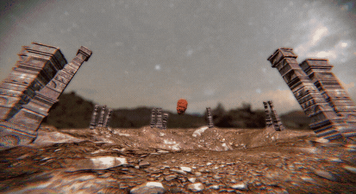

# Circus Demo

Fifty thousand glowing pills drift through an animated curl noise field among
ancient pillars, watched through a free flying camera. A port of the original
Pill Engine "Floating Pills" demo to the current engine.

## Running

From `modules`:

```powershell
$env:PROJECT_PATH = "../examples/circus_demo"
cargo run --package pill_standalone --features rendering
```

## Controls

| Input | Action |
| --- | --- |
| W / A / S / D | Fly forward, left, back, right |
| E / Q | Fly up, down |
| Left Shift | Sprint |
| Right mouse drag | Look around |
| T / G | Widen, narrow the field of view |
| O / P | Curl noise scale up, down |
| L / K | Attraction to the centre up, down |
| M / N | Damping up, down |
| V / B | Curl epsilon up, down |

The tuning keys log the field's new values to the host log.

## Assets

Meshes and textures live in `res` with a `.meta` file beside each, which holds
the asset's guid and import settings (normal maps are read as `Normal`).
Materials are files in `res/materials`, bound to the PBR chain's shader. The
level draws `pillars`, `ground` and `dark` (the pills).

The night sky is `sky.material`: the renderer's equirect skybox shader over
`textures/clear_night.hdr`, imported as `Equirect`. Its `skybox_exposure`,
`skybox_tint` and `skybox_rotation` (degrees) can be tuned live. To use a
cubemap instead, set the texture's `texture_type` to `Cubemap` and the
material's shader to `a6dfb611b11dfb57c5039dd8b6fc1a46`. The remaining
materials from the original demo (`fabric`, `stones`, `organic`, `yellow`,
`blue`, `white`, `grid`, `wood`) are kept and ready to use. Edit any of them in
the editor or by hand, and the running demo picks up the change.

## Showcase

<p align="center">
  
</p>
