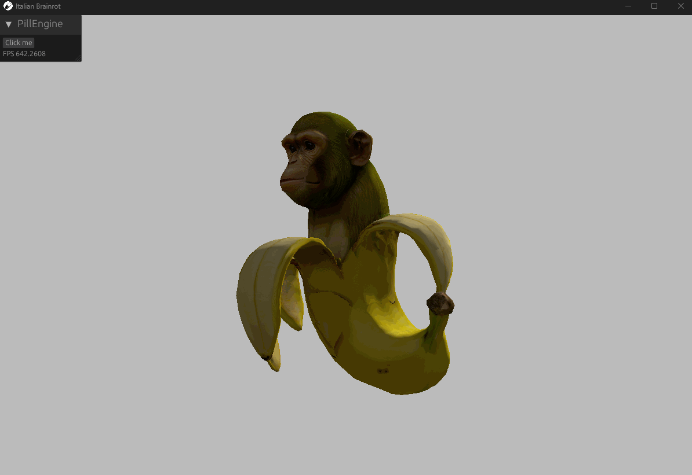

# Italian Brainrot

A current-ECS port of the original Pill Engine demo. It displays three rotating
Chimpanzini Bananini models with lit, unlit, and cartoon/posterized materials.

## Running

From `modules`:

```powershell
$env:PROJECT_PATH = "../examples/italian_brainrot"
cargo run --package pill_standalone --features rendering
```

There are no controls.

## Assets

The original OBJ model, PNG texture, source shaders, configuration, and showcase
GIF are preserved in `res` and `media`. Runtime WGSL shaders were added for the
current `pill_master_renderer` backend.

`AssetLoader::Path` resolves paths relative to this project's `res` directory,
so textures and shaders use the same path-based declarations as the original
engine. `AssetLoader::Bytes` is available for embedded assets.

## Showcase

<p align="center">
  
</p>

## Attribution

Chimpanzini Bananini 3D model by [Aizenx](https://sketchfab.com/Aizenx).
